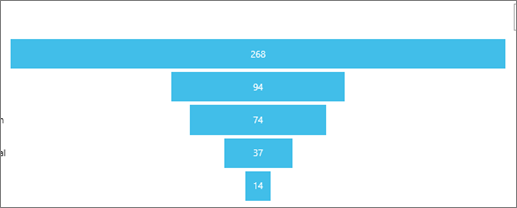
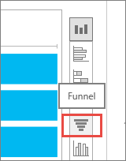
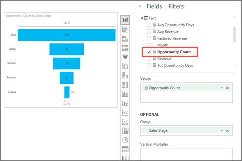
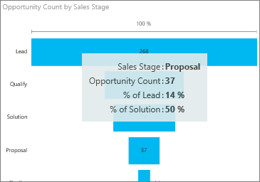
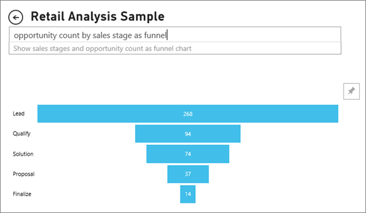

<properties 
   pageTitle="Tutorial: Funnel charts in Power BI"
   description="Tutorial: Funnel charts in Power BI"
   services="powerbi" 
   documentationCenter="" 
   authors="pcw3187" 
   manager="mblythe" 
   editor=""
   tags=""/>
 
<tags
   ms.service="powerbi"
   ms.devlang="NA"
   ms.topic="article"
   ms.tgt_pltfrm="NA"
   ms.workload="powerbi"
   ms.date="10/14/2015"
   ms.author="v-pawrig"/>
# Tutorial: Funnel charts in Power BI

A Funnel Chart helps you visualize a linear process that has sequential connected stages. For example, a sales funnel that tracks customers through stages: Lead \> Qualified Lead \> Prospect \> Contract \> Close.  At a glance, the shape of the funnel conveys the health of the process you're tracking.

Each funnel stage represents a percentage of the total. So, in most cases, a Funnel Chart is shaped like a funnel -- with the first stage being the largest, and each subsequent stage smaller than its predecessor.  A pear-shaped funnel is also useful -- it can identify a problem in the process.  But typically, the first stage, the "intake" stage, is the largest.

>**NOTE**: This tutorial applies to the Power BI service and not to Power BI Desktop. 

## When to use a Funnel Chart

Funnel Charts are a great choice:

-   when the data is sequential and moves through at least 4 stages.

-   when the number of "items" in the first stage is expected to be greater than the number in the final stage.

-   to calculate potential (revenue/sales/deals/etc.) by stages.

-   to calculate and track conversion and retention rates.

-   to reveal bottlenecks in a linear process.

-   to track a shopping cart workflow.

-   to track the progress and success of click-through advertising/marketing campaigns.
  
## Working with Funnel Charts

Funnel Charts:

-   Can be pinned from reports and from Q&A.

-   Can be sorted.

-   Support multiples.

-   Can be highlighted and cross-filtered by other visualizations on the same report page.

-   Can be used to highlight and cross-filter other visualizations on the same report page.

## Create a basic Funnel Chart

We'll create a Funnel Chart that shows the number of opportunities we have in our sales stages.

These instructions use the Opportunity Tracking Sample. To follow along, [download the sample](http://support.powerbi.com/knowledgebase/articles/514904), sign in to Power BI and select **Get Data \> Samples \> Opportunity Analysis Sample \> Connect**.

1. Start on a [blank report page ](http://support.powerbi.com/knowledgebase/articles/474804)in [Editing View](http://support.powerbi.com/knowledgebase/articles/443094)and select the **SalesStage** \> **Sales Stage** field.  

	

2. [Convert the chart](http://support.powerbi.com/knowledgebase/articles/444663)to a Funnel. Notice that **Sales Stage** is in the **Group** well and **Count of Sales Stage** is in the **Values** well. Power BI created the Value for us, but we're going to use a different one. 

	

3. Remove **Count of Sales Stage**, and, from the **Fields** pane, select **Fact** \> **Opportunity Count**.

	

4. Hovering over a bar displays a wealth of information.

	-   The name of the stage

	-   Number of opportunities currently in this stage

	-   Overall conversion rate (% of Lead) 

	-   Stage-to-stage (aka Drop Rate) which is the % of the previous stage (in this case, Proposal Stage/Solution Stage)

	

5. [Add the Funnel as a dashboard tile](http://support.powerbi.com/knowledgebase/articles/425669). 

6. [Save the report](http://support.powerbi.com/knowledgebase/articles/444112).

## Create an advanced Funnel Chart

Sometimes it's not the numbers that are important, but the trends.  Let's look at our Opportunity Count funnel chart by month and compare conversion rates (by sales stage).

1.  To make this easier to see, copy the funnel chart to a blank page in the report.

2.  In the **Fields** pane, drag **Fact** \> **Month** to the **Verticle Multiples** well.

Instead of a perfectly-shaped funnel chart each month, we see many different shapes.  A next step might be to compare this to previous years and months to determine whether we need to focus more attention on lead generation and/or sales closure in certain times of the year. 

## Highlighting and cross-filtering

For information about using the Filters pane, see [Add a filter to a report](http://support.powerbi.com/knowledgebase/articles/464704).

Highlighting a bar in a Funnel cross-filters the other visualizations on the report page... and vice versa.

1.  On the Funnel, select the **Proposal** bar. This highlights the other visualizations on the page. 

    

    >**TIP**:  Use CTRL to multi-select. 

2.  In the "Factored Revenue by Opportunity" chart, highlight the **Large** bar to cross-filter the other visualizations on the page, including the Funnel chart.

## Create a Funnel Chart in Q&A

Highlight the dashboard that has at least one visualization pinned from the "Opportunity Tracking" dataset.  When you type a question in Q&A, Power BI searches for answers in all the datasets that are associated with (have tiles pinned to) the selected dashboard. For more information see, [Power BI - basic concepts](http://support.powerbi.com/knowledgebase/articles/487029).

1.  Highlight a dashboard that has at least one tile pinned from the Opportunity Tracking dataset.

2.   Begin typing your question in the Q&A question box.

    

    Be sure to add "as funnel" so Power BI knows which visualization type you'd prefer.

## See also:

[Add a visualization to a report](https://powerbi.uservoice.com/knowledgebase/articles/441777)

[Pin a visualization to a dashboard](http://support.powerbi.com/knowledgebase/articles/430323)

[Power BI - Basic Concepts](http://support.powerbi.com/knowledgebase/articles/487029)

