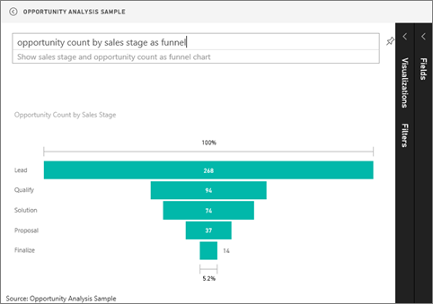

<properties
   pageTitle="Tutorial: Funnel charts in Power BI"
   description="Tutorial: Funnel charts in Power BI"
   services="powerbi"
   documentationCenter=""
   authors="mihart"
   manager="mblythe"
   editor=""
   tags=""/>

<tags
   ms.service="powerbi"
   ms.devlang="NA"
   ms.topic="article"
   ms.tgt_pltfrm="NA"
   ms.workload="powerbi"
   ms.date="03/04/2016"
   ms.author="mihart"/>
# Tutorial: Funnel charts in Power BI

A Funnel Chart helps you visualize a linear process that has sequential connected stages. For example, a sales funnel that tracks customers through stages: Lead \> Qualified Lead \> Prospect \> Contract \> Close.  At a glance, the shape of the funnel conveys the health of the process you're tracking.

Each funnel stage represents a percentage of the total. So, in most cases, a Funnel Chart is shaped like a funnel -- with the first stage being the largest, and each subsequent stage smaller than its predecessor.  A pear-shaped funnel is also useful -- it can identify a problem in the process.  But typically, the first stage, the "intake" stage, is the largest.

## When to use a Funnel Chart

Funnel Charts are a great choice:

-   when the data is sequential and moves through at least 4 stages.

-   when the number of "items" in the first stage is expected to be greater than the number in the final stage.

-   to calculate potential (revenue/sales/deals/etc.) by stages.

-   to calculate and track conversion and retention rates.

-   to reveal bottlenecks in a linear process.

-   to track a shopping cart workflow.

-   to track the progress and success of click-through advertising/marketing campaigns.

## Working with Funnel Charts

Funnel Charts:

-   Can be pinned from reports and from Q&A.

-   Can be sorted.

-   Support multiples.

-   Can be highlighted and cross-filtered by other visualizations on the same report page.

-   Can be used to highlight and cross-filter other visualizations on the same report page.

## Create a basic Funnel Chart

We'll create a Funnel Chart that shows the number of opportunities we have in our sales stages.

These instructions use the Opportunity Tracking Sample. To follow along, [download the sample](powerbi-sample-downloads.md), sign in to Power BI and select **Get Data \> Samples \> Opportunity Analysis Sample \> Connect**.

1. Start on a [blank report page ](powerbi-service-add-a-page-to-a-report.md)in [Editing View](powerbi-service-interact-with-a-report-in-editing-view.md) and select the **SalesStage** \> **Sales Stage** field.  

	

2. [Convert the chart](powerbi-service-change-the-type-of-visualization-in-a-report.md) to a Funnel. Notice that **Sales Stage** is in the **Group** well. 

3. From the **Fields** pane, select **Fact** \> **Opportunity Count**.

	

4. Hovering over a bar displays a wealth of information.

	-   The name of the stage

	-   Number of opportunities currently in this stage

	-   Overall conversion rate (% of Lead) 

	-   Stage-to-stage (aka Drop Rate) which is the % of the previous stage (in this case, Proposal Stage/Solution Stage)

	

5. [Add the Funnel as a dashboard tile](powerbi-service-dashboard-tiles.md). 

6. [Save the report](powerbi-service-save-a-report.md).

## Highlighting and cross-filtering

For information about using the Filters pane, see [Add a filter to a report](powerbi-service-add-a-filter-to-a-report.md).

Highlighting a bar in a Funnel cross-filters the other visualizations on the report page... and vice versa. To follow along, add a few more visuals to the report page that contains the Funnel chart.

1.  On the Funnel, select the **Proposal** bar. This cross-highlights the other visualizations on the page. 

    

    >**TIP**:  Use CTRL to multi-select. 

2.  In the "Factored Revenue by Opportunity" chart, highlight the **Large** bar to cross-filter the other visualizations on the page, including the Funnel chart.

3. To set preferences for how visuals cross-highlight and cross-filter each other, see [Visual interactions in Power BI](powerbi-service-visual-interactions.md)

## Create a Funnel Chart in Q&A

Highlight the dashboard that has at least one visualization pinned from the "Opportunity Tracking" dataset.  When you type a question in Q&A, Power BI searches for answers in all the datasets that are associated with (have tiles pinned to) the selected dashboard. For more information see, [Power BI - basic concepts](powerbi-service-basic-concepts.md).

1.  Highlight a dashboard that has at least one tile pinned from the Opportunity Tracking dataset.

2.   Begin typing your question in the Q&A question box.

    

    Be sure to add "as funnel" so Power BI knows which visualization type you'd prefer.

## See also

[Add a visualization to a report](powerbi-custom-visuals-add-to-report.md)

[Visualization types in Power BI](powerbi-service-visualization-types-for-reports-and-q-and-a.md)

[Pin a visualization to a dashboard](powerbi-service-pin-a-tile-to-a-dashboard-from-a-report.md)

[Power BI - Basic Concepts](powerbi-service-basic-concepts.md)
