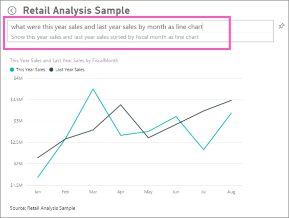

<properties 
   pageTitle="Tutorial: use Power BI Q&A with the Retail Analysis sample"
   description="Tutorial: use Power BI Q&A with the Retail Analysis sample"
   services="powerbi" 
   documentationCenter="" 
   authors="pcw3187" 
   manager="mblythe" 
   editor=""
   tags=""/>
 
<tags
   ms.service="powerbi"
   ms.devlang="NA"
   ms.topic="article"
   ms.tgt_pltfrm="NA"
   ms.workload="powerbi"
   ms.date="10/14/2015"
   ms.author="v-pawrig"/>
# Tutorial: use Power BI Q&A with the Retail Analysis sample

[← Q&A in Power BI](https://support.powerbi.com/knowledgebase/topics/70394-q-a-in-power-bi)

Sometimes the fastest way to get an answer from your data is to ask a question using natural language.  In this tutorial we'll look at 2 different ways of creating the same visualization: building it in a report and asking a question with Q&A.  

1. From your Power BI workspace, select **Get Data** \> **Samples** \> **Retail Analysis Sample**.

	

2. The dashboard contains an area chart tile for "Last Year Sales and This Year Sales."  Select this tile. 

	-   If this tile was created with Q&A, selecting the tile will open Q&A. 

	-   But this tile was created in a report, so the report opens to the page that contains this visualization.

3. Open the report in Editing View by selecting **Edit Report**.

	

4. Select the area chart and review the settings in the **Fields** pane.  The report creator built this chart by selecting these 3 values and organizing them in the **Values** and **Axis** wells.

	

How would we go about creating this same line chart using Q&A?

1.  Navigate back to your Power BI workspace.

2.  Using natural language, type something like this into the question box:

    **what were this year sales and last year sales by month as line chart**

    As you type your question, Q&A picks the best visualization to display your answer; and the visualization changes dynamically as you modify the question. Also, Q&A helps you format your question with suggestions, auto-complete, and spelling corrections.

    When you finish typing your question, the result is the exact same chart\* that we saw in the report.  But creating it this way was much faster!

    >**NOTE**:  Area chart is temporarily not supported in Q&A but will be added soon. 

    

3.  To pin the chart to your dashboard, select the pin icon .

## See Also:

[Power BI - Basic Concepts](http://support.powerbi.com/knowledgebase/articles/487029-power-bi-preview-basic-concepts)

[Get started with Power BI](http://support.powerbi.com/knowledgebase/articles/430814-get-started-with-power-bi)

[What type of questions can I ask Q&A?](http://support.powerbi.com/knowledgebase/articles/474566-q-a-in-power-bi)

[Q&A in Power BI](http://support.powerbi.com/knowledgebase/articles/474566-q-a-in-power-bi)

[Make your data work well with Q&A in Power BI](http://support.powerbi.com/knowledgebase/articles/474690-make-your-data-work-well-with-q-a)

[Ask the right questions of Salesforce data in Power BI](http://support.powerbi.com/knowledgebase/articles/475138-ask-the-right-questions-of-salesforce-data)

[preparing a workbook for Q&A](http://support.powerbi.com/knowledgebase/articles/474690-how-to-make-q-a-work-with-your-data)

[pinning a tile to the dashboard from Q&A](http://support.powerbi.com/knowledgebase/articles/424874-pin-a-tile-to-a-dashboard-from-the-question-box)

