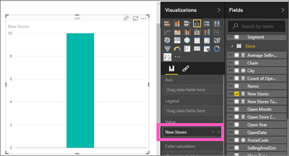
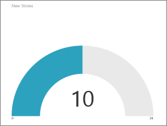
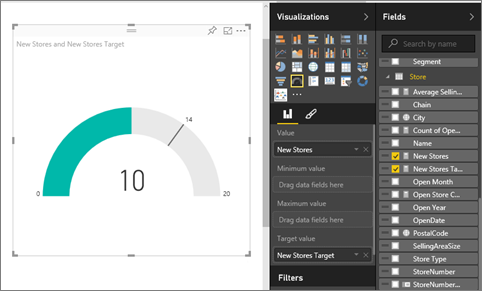
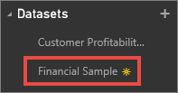

<properties
   pageTitle="Tutorial: Radial Gauge charts in Power BI"
   description="Tutorial: Radial Gauge charts in Power BI"
   services="powerbi"
   documentationCenter=""
   authors="mihart"
   manager="mblythe"
   editor=""
   tags=""/>

<tags
   ms.service="powerbi"
   ms.devlang="NA"
   ms.topic="article"
   ms.tgt_pltfrm="NA"
   ms.workload="powerbi"
   ms.date="11/30/2015"
   ms.author="mihart"/>

# Tutorial: Radial Gauge charts in Power BI

A Radial Gauge chart has a circular arc and displays a single value that measures progress toward a goal/KPI.  The goal, or target value, is represented by the line (needle). Progress toward that goal is represented by the shading.  And the value that represents that progress is shown in bold inside the arc. All possible values are spread evenly along the arc, from the minimum (left-most value) to the maximum (right-most value).

In the example below, we are a car retailer, tracking our Sales team's average sales per month. Our goal is 140 and represented by the black needle.  The minimum possible average sales is 0 and we've set the maximum as 200.  The blue shading shows that we're currently averaging approximately 120 sales this month. Luckily, we still have another week to reach our goal.

## When to use a Radial Gauge

Radial Gauges are a great choice to:

-   show progress toward a goal.

-   represent a percentile measure, like a KPI.

-   show the health of a single measure.

-   display information that can be quickly scanned and understood.

## Create a basic Radial Gauge

These instructions use the Retail Analysis Sample. To follow along, [download the sample](powerbi-sample-downloads.md), sign in to Power BI and select **Get Data \> Excel Workbook \>  Connect \> Retail Analysis Sample**.**xlsx**. 

1.  [Open a blank report page](powerbi-service-add-a-page-to-a-report.md).

2. Start in [Editing View](powerbi-service-interact-with-a-report-in-editing-view.md) and select the **New Stores** measure.  Measures are identified by the calculator icon .

    

2.  Convert the chart to a Gauge.

    By default, Power BI creates a Gauge chart where the current value is assumed to be halfway between 0 and the target value.  Since I currently have 10 stores, Power BI creates a Gauge chart where the minimum value is 0, the current value is the halfway point, and the maximum value is set to double the current value (20).

    

3.  Select the target value. Drag **New Stores Target** to the **Target Value** well. Power BI adds a needle to represent our target value of 14.

    

4.  [Add the Gauge chart as a dashboard tile](powerbi-service-dashboard-tiles.md). 

5.  [Save the report](powerbi-service-save-a-report.md).

## Add a Maximum Value to a Radial Gauge

In the task above, Power BI used the Value field to automatically set minimum (start) and maximum (end or target).  But you can also manually set the minimum and maximum values.

These instructions use the [Financial Sample.](http://go.microsoft.com/fwlink/?LinkID=521962)

### Step 1: Open the Financial Sample Excel file.

1.  Open the file in Power BI by selecting **Get Data \> Files **and browsing to the location where you saved the file. The Financial Sample is added to your workspace navigation pane under **Datasets**.

    

2.  Select **Financial Sample** to open it in Explore mode.

### Step 2: Create a Gauge to track Gross Sales and Cost of Goods Sold (COGS)

1.  In the **Fields** pane, select **Gross Sales**.

    

2.  Change the aggregation to **Average**.

    

3.  Select the Gauge icon  to convert the Column Chart to a Gauge.

4.  Drag **COGS** to the **Target Value** well.

5.  Change the aggregation to **Average**.

    

    By default, Power BI creates a Gauge chart where the current value (in this case, Average of Gross Sales) is assumed to be at the halfway point on the gauge. Since the Average Gross Sales is $180,000, the start value (Minimum) is set to 0 and the end value (Maximum) is set to double the current value.

    Notice that we've exceeded our target.

### Step 3: Add a maximum value

But what if you want to set your own maximum value?  Let's say that instead of using double the current value as the maximum possible value, you want to set it to the highest Gross Sales number in your dataset? 

1.  Drag **Gross Sales** from the **Fields** list to the **Maximum Value** well.

2.  Change the aggregation to **Maximum**.

    

    The Gauge is redrawn with a new end value, 1.21 million in gross sales.

## See also

[Reports in Power BI](powerbi-service-reports.md)

[Visualization types in Power BI](powerbi-service-visualization-types-for-reports-and-q-and-a.md)

[Add a visualization to a report](https://powerbi.uservoice.com/knowledgebase/articles/441777)

[Pin a visualization to a dashboard](powerbi-service-pin-a-tile-to-a-dashboard-from-a-report.md)

[ Power BI - Basic Concepts](powerbi-service-basic-concepts.md)
