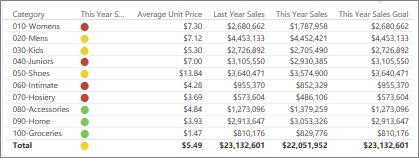

<properties
   pageTitle="Table visualizations in reports and dashboards (Tutorial)"
   description="Tips for working with table visualizations in Power BI reports and dashboards, including how to resize column widths."
   services="powerbi"
   documentationCenter=""
   authors="mihart"
   manager="mblythe"
   backup=""
   editor=""
   tags=""
   featuredVideoId=""
      qualityFocus=""
   qualityDate=""/>

<tags
   ms.service="powerbi"
   ms.devlang="NA"
   ms.topic="article"
   ms.tgt_pltfrm="NA"
   ms.workload="powerbi"
   ms.date="02/14/2017"
   ms.author="mihart"/>

# Working with tables in Power BI reports and dashboards (Tutorial)

A table is a grid that typically contains related data in a logical series of rows and columns. It may also contain headers and a row for totals. Tables work well with quantitative comparisons among items where there are many categories. For example, this table displays 5 different measures for **Category**.

##  When to use a table
Tables are a great choice:

-  to see detailed data and exact values

- to compare actual values

-  to display data in a tabular format

-   to display numerical data by categories   

>[AZURE.NOTE] If a table has too many values, consider converting it to a matrix and/or using drilldown.

##  Create a table  

To follow along, sign in to Power BI and select **Get Data > Samples > Retail Analysis Sample**. We'll create the table pictured above to display sales values by item category.

1.  Select **Item** > **Category**.  Power BI automatically creates a table that lists all the categories.

  

2.  Select **Sales > Average Unit Price** and **Sales > Last Year Sales** and **Sales > This Year Sales** and choose all 3 options (Value, Goal, Status).   

3. In the Visualizations pane, locate the **Values** well and drag-and-drop the values until the order of your chart columns matches the first image on this page.  Your Values well should look like this.

    

4. Pin the table to the dashboard by selecting the pin icon  

##  Adjust the column width of a table
Sometimes Power BI will truncate a column heading in a report and on a dashboard. To show the entire column name, hover over the space to the right of the heading to reveal the double arrows, select and drag.

## See also

[Dashboards in Power BI service](powerbi-service-dashboards.md)

[Power BI reports](powerbi-service-reports.md)

[Power BI - Basic Concepts](powerbi-service-basic-concepts.md)

More questions? [Try the Power BI Community](http://community.powerbi.com/)
