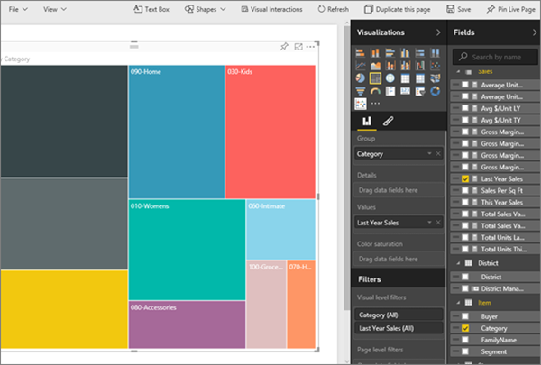
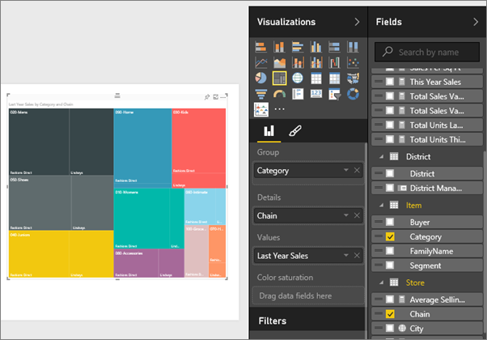
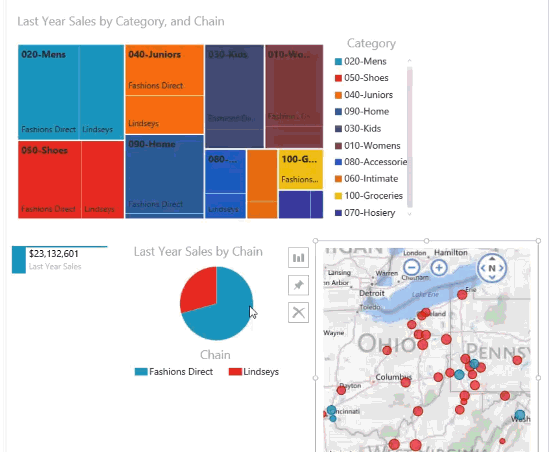

<properties
   pageTitle="Tutorial: Treemaps in Power BI"
   description="Tutorial: Treemaps in Power BI"
   services="powerbi"
   documentationCenter=""
   authors="mihart"
   manager="mblythe"
   editor=""
   tags=""/>

<tags
   ms.service="powerbi"
   ms.devlang="NA"
   ms.topic="article"
   ms.tgt_pltfrm="NA"
   ms.workload="powerbi"
   ms.date="03/03/2016"
   ms.author="mihart"/>

# Tutorial: Treemaps in Power BI  

Treemaps display hierarchical data as a set of nested rectangles.  Each level of the hierarchy is represented by a colored rectangle (often called a "branch") containing other rectangles ("leaves").  The space inside each rectangle is allocated based on the quantitative value being measured, with the rectangles arranged in size from top left (largest) to bottom right (smallest).

For example, if I'm analyzing my sales, I might have top-level rectangles (branches) for the clothing categories: **Urban**, **Rural**, **Youth**, and **Mix**.  My category rectangles would contain smaller rectangles (leaves) for the clothing manufacturers within that category, and these smaller rectangles would be sized and shaded based on the number eaten.  In the **Urban** branch above, lots of Maximus clothing was sold, less Natura and Fama, and very little Leo.  So, the **Urban** branch of my Treemap would have the largest rectangle for Maximus (in the top left corner), slightly-smaller rectangles for Natura and Fama, lots of other rectangles representing all the other fruit eaten, and a tiny rectangle for Leo.  And I could compare the number of items eaten across  the other food groups by comparing the size and shading of each leaf node; the larger the rectangle and the darker the shading, the higher the value.

## When to use a Treemap  
Treemaps are a great choice:

-   to display large amounts of hierarchical data.

-   when a bar chart can't effectively handle the large number of values.

-   to show the proportions between each part and the whole.

-   to show the pattern of the distribution of the measure across each level of categories in the hierarchy.

-   to show attributes using size and color coding.

-   to spot patterns, outliers, most-important contributors, and exceptions.

## Create a basic Treemap  
These instructions use the Retail Analysis Sample. To follow along,  [download the sample](powerbi-sample-downloads.md), sign in to Power BI and select **Get Data \> Excel Workbook \>  Connect \> Retail Analysis Sample**.**xlsx**.

1.  Start in [Editing View](powerbi-service-interact-with-a-report-in-editing-view.md) and select the **Sales** > **Last Years Sales** measure.   

2.  Convert the chart to a Treemap.  

3.  Drag **Item** > **Category** to the **Group** well. Power BI creates a Treemap where the size of the rectangles reflect total sales and the color represents the category.  In essence you've created a hierarchy that visually describes the relative size of total sales by category.  The **Mens** category has the highest sales and the **Hosiery** category has the lowest.
  

4.  Drag **Store** > **Chain** to the **Details** well to complete your Treemap. You can now compare last year's sales by category and chain.   

5. Hover over a **Chain** area to reveal the tooltip for that portion of the **Category**.  For example, hovering over **Lindseys** in the **040-Juniors** rectangle reveals the tooltip for Lindsey's portion of the Juniors category.  

5.  [Add the Treemap as a dashboard tile (pin the visual)](powerbi-service-dashboard-tiles.md). 

6.  [Save the report](powerbi-service-save-a-report.md).

## Highlighting and cross-filtering  
For information about using the Filters pane, see [Add a filter to a report](powerbi-service-add-a-filter-to-a-report.md).

Highlighting a Category or Details in a Treemap cross-highlights and cross-filters the other visualizations on the report page... and vice versa. To follow along, either add some visuals to the same page or copy/paste the Treemap to a report page that already has other visuals. 

1.  On the Treemap, select either a Category or a Chain within a Category.  This cross-highlights the other visualizations on the page. Selecting **050-Shoes**, for example, shows me that last year's sales for shoes was $3,640,471 with $2,174,185 of that coming from Fashions Direct.  
    

2.  In the **Last Year Sales by Chain** pie chart, select the **Fashions Direct** slice.  
    
    
3. To manage how charts cross-highlight and cross-filter each other, see [Visualization interactions in a Power BI report](powerbi-service-visual-interactions.md)

## See also  
[Reports in Power BI](powerbi-service-reports.md)  
[Add a visualization to a report](https://powerbi.uservoice.com/knowledgebase/articles/441777)  
[Visualization types in Power BI](powerbi-service-visualization-types-for-reports-and-q-and-a.md)
[ Pin a visualization to a dashboard](powerbi-service-pin-a-tile-to-a-dashboard-from-a-report.md)  
[Power BI - Basic Concepts](powerbi-service-basic-concepts.md)  
[Try it out -- it's free!](https://powerbi.com/)  
