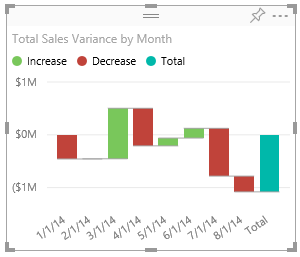

<properties
   pageTitle="Tutorial: Waterfall charts in Power BI"
   description="Tutorial: Waterfall charts in Power BI"
   services="powerbi"
   documentationCenter=""
   authors="mihart"
   manager="mblythe"
   editor=""
   tags=""/>

<tags
   ms.service="powerbi"
   ms.devlang="NA"
   ms.topic="article"
   ms.tgt_pltfrm="NA"
   ms.workload="powerbi"
   ms.date="01/23/2016"
   ms.author="mihart"/>
# Tutorial: Waterfall charts in Power BI

A waterfall chart shows a running total as values are added or subtracted. It's useful for understanding how an initial value (for example, net income) is affected by a series of positive and negative changes.

The columns are color coded so you can quickly tell increases and decreases. The initial and the final value columns often [start on the horizontal axis](https://support.office.com/article/Create-a-waterfall-chart-in-Office-2016-for-Windows-8de1ece4-ff21-4d37-acd7-546f5527f185#BKMK_Float "start on the horizontal axis"), while the intermediate values are floating columns. Because of this "look", waterfall charts are also called bridge charts.

<iframe width="560" height="315" src="https://www.youtube.com/embed/maTzOJSRB3g?list=PL1N57mwBHtN0JFoKSR0n-tBkUJHeMP2cP" frameborder="0" allowfullscreen></iframe>

## When to use a Waterfall Chart

Waterfall Charts are a great choice:

-   when you have changes for the measure across time series or different categories

-   to audit the major changes contributing to the total value

-   to plot your company's annual profit by showing various sources of revenue and arrive at the total profit (or loss).

-   to illustrate the beginning and the ending headcount for your company in a year

-   to visualize how much money you make and spend each month, and the running balance for your account. 

## Create a Waterfall Chart

To follow along, sign in to Power BI and select **Get Data \> Samples \> Retail Analysis Sample**. 

1. From the "Retail Analysis Sample" dashboard, select the **Total Stores** tile to open the "Retail Analysis Sample" report.

2. Select **Edit Report** to open the report in Editing View.

3. [Add a new report page](powerbi-service-add-a-page-to-a-report.md).

4. Create a waterfall chart that displays this year's sales and sales goal by month.

	1.  From the **Fields** pane, select **Sales \> Total Sales Variance**.

	2.  Convert the chart to a **Waterfall**. 

        

	3.  If **Total Sales Variance** isn't in the **Y Axis** area, drag it there.

	4.  Select **Time** \> **Month** to add it to the **Category** well. 

    

## Highlighting and cross-filtering

For information about using the Filters pane, see [Add a filter to a report](powerbi-service-add-a-filter-to-a-report.md).

Highlighting a column in a Waterfall Chart cross-filters the other visualizations on the report page... and vice versa. However, the Total column does not trigger highlighting or respond to cross-filtering.

## See also

[Reports in Power BI](powerbi-service-reports.md)

[Visualization types in Power BI](powerbi-service-visualization-types-for-reports-and-q-and-a.md)

[Visualizations in Power BI reports](powerbi-service-visualizations-for-reports.md)

[Power BI - Basic Concepts](powerbi-service-basic-concepts.md)
