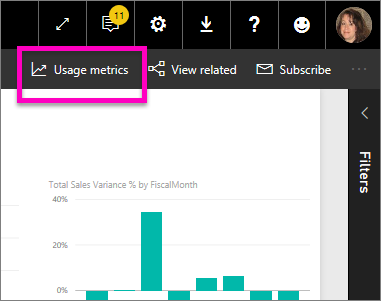
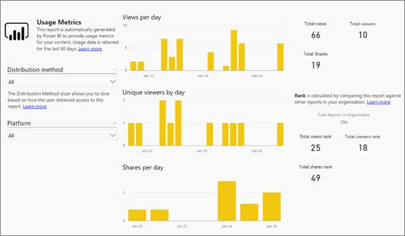
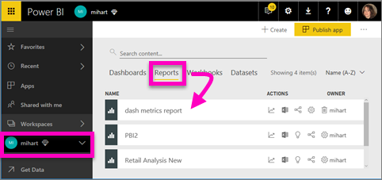
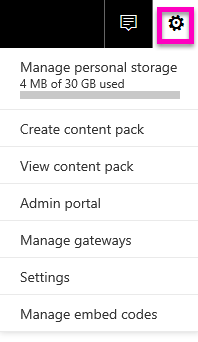
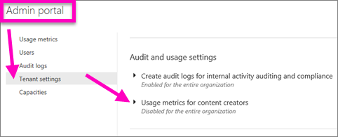
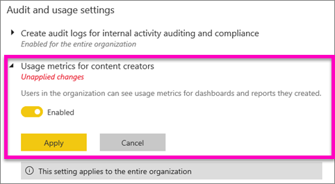

<properties
   pageTitle="Usage metrics for dashboards and reports"
   description="Documentation on how to view usage metrics for Power BI dashboards and reports"
   services="powerbi"
   documentationCenter=""
   authors="mihart"
   manager="erikre"
   backup=""
   editor=""
   tags=""
   featuredVideoId=""
   qualityFocus="no"
   qualityDate=""/>

<tags
   ms.service="powerbi"
   ms.devlang="NA"
   ms.topic="article"
   ms.tgt_pltfrm="NA"
   ms.workload="powerbi"
   ms.date="05/16/2017"
   ms.author="mihart"/>

# Usage metrics for dashboards and reports

##    Why are usage metrics important to me?
If you create dashboards and reports, usage metrics help you understand their impact. When you run usage metrics you'll discover how those dashboards and reports are being used throughout your organization. Knowing how your content is being used helps you demonstrate your impact and prioritize your efforts. Your usage metrics may show that one of your reports is used daily by a huge segment of the organization and it may show that a dashboard you created isn't being viewed at all. This type of feedback is invaluable in guiding your work efforts.

>**NOTE**: The Usage metrics feature captures usage information from all users, both Free and Pro. However, a Pro license is required to access the usage metrics data. 

## About the Usage Metrics report
Usage metrics are provided on all dashboards and reports. To get access to this usage metrics data for a particular dashboard or report, you must:
•	Have edit access to that dashboard or report
•	Have a Pro license 

When you select **Usage metrics** or the icon , Power BI generates a pre-built report with usage metrics for that content for the last 90 days.  The report looks very similar to the Power BI reports you're already familiar with, but it's designed to be informational -- not interactive.  To dig down into the report data, or to build your own reprts against the dataset, use **Save as** (see below). 

The Usage Metrics report won't show up in **Recent**, **Workspaces**, **Favorites**, or other content lists. It cannot be added to an app. If you pin a tile from the usage metrics report to a dashboard, that dashboard cannot be added to an app.

##    Open a Usage Metrics report for a dashboard or report

1. Start in the workspace that contains the dashboard or report. 

2. From either the workspace content list or from the dashboard or report itself, select the icon for **Usage metrics**  .

    

    

3. The very first time you do this, Power BI creates the usage metrics report and lets you know when it's ready.

        

4. Select **View usage metrics** to open the results.    
  

##    What metrics are reported?

|Metric  |Dashboard  |Report  |Description    |
|---------|---------|---------|---------|
|Distribution method slicer | yes  | yes        |  How users got access to the content. There are 3 possible methods: users ca access the dashboard or report by being members of an [app workspace](powerbi-service-the-new-power-bi-experience.md), by having the content [shared with them](powerbi-service-share-unshare-dashboard.md), or by installing a content pack/app.  Note that views through an app are counte as "content pack."  |
|Platforms slicer     | yes    | yes |  Was the dashboard or report accessed via the Power BI service (powerbi.com) or a mobile device? Mobile includes all our iOS, Android, and Windows apps.    |
|Report page slicer    | no    | yes    | If the report has more than 1 page, slice the report by the page(s) that was viewed.    |
|Views per day     |   yes         |  yes       | Total number of views per day - a view is defined as a user loading a report page or dashboard.   |
|Unique viewers per day     |   yes      |   yes      | Number of *different* users who viewed the dashboard or report (based on the AAD user account).
|Shares per day     |   yes      |  no       | Number of times the dashboard was shared with another user or group.
|Total views     |   yes      |   yes      | Number of views in the past 90 days.
|Total viewers     |   yes      |  yes       | Number of unique viewers in the past 90 days.
| Total shares    | yes    | no   | Number of times the dashboard or report was shared in the past 90 days.
|Total in organization| yes   | yes   | Count of all dashboards or reports in the entire organization which had at least one view.  Used to calculate rank.   |
|Rank: Total views    | yes   |  yes  | For total views of all dashboards or reports in the organization over the past 90 days, where does this dashboard or report rank. 
| Rank: Total viewers   | yes   | yes   | For total unique viewers of all dashboards or reports in the organization over the past 90 days, where does this dashboard or report rank.|
|Rank: Total shares    | yes   |  no  | For total shares of all dashboards in the organization over the past 90 days, where does this dashboard or report rank.

###    Dashboard Usage Metrics report

###    Report Usage Metrics report

##    Save the Usage Metrics report as a full-featured Power BI report
Use **Save as** to convert the usage metrics report to a full-featured Power BI report that can be customized and shared. 

When Power BI creates the full-featured report, it also creates a new dataset **made up of all the dashboards and reports contained in the current workspace** (the workspace that contains the report or dashboard you ran usage metrics on). For example, if workspace named "Sales" contains a dashboard, and you go to that dashboard’s usage metrics report, and then choose the **Save as** option, you will get access to a dataset with usage metrics for all dashboards contained in workspace "Sales".

You have the option to either open and customize the report, starting with what was included in the usage metrics report or you can open the dataset and start with a blank report canvas. Either way you'll have access to usage metrics for all datasets in the current workspace.

1. From the usage metrics report, select **File > Save As**. Power BI converts the usage metrics report into a full-featured Power BI report.

    

2. Open the report in Editing view and [interact with it as you would with any other Power BI report](powerbi-service-interact-with-a-report-in-editing-view.md). For example, add new pages and build new visualizations, add filters, format the fonts and colors, etc.

    

4. The new report is saved in the current workspace and also added to the **Recent** content list.

    

##    Enable usage metrics - Power BI administrator
Usage metrics reports are a feature that the Power BI or Office 365 administrator can turn on or off. 

1. Open the Admin portal by selecting the gear icon in the top-right-corner of Power BI service and choosing **Admin portal**. 

    

2. From the Admin portal, select **Tenant settings** and choose **Usage metrics for content creators**.

    

3. Enable (or disable) usage metrics and select **Apply**.

    

##    Considerations and limitations
Q:    I can't run usage metrics on a dashboard or report
A:    You can only see usage metrics for content you own or have permissions to edit.

Q:    I can't run usage metrics on any content at all.    
A1:    Admins have the option to turn off this feature for their organization.  Contact your Admin to see if this is the case.    
A2:    Usage metrics is a Power BI Pro feature.

Q:    The data doesn't seem up-to-date. For example, distribution methods don't show up, report pages are missing, etc.
A:    It can take up to 24 hours for data to update.

## Next steps

[Favorite a dashboard](powerbi-service-favorite-dashboards.md)

More questions? [Try the Power BI Community](http://community.powerbi.com/)
