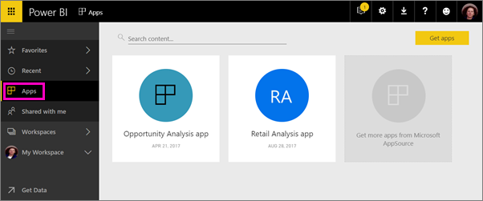
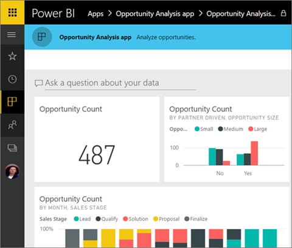
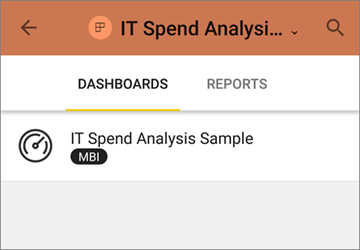

<properties 
   pageTitle="What are apps in Power BI?"
   description="Apps are a collection of dashboards and reports built to deliver key metrics to an organization."
   services="powerbi" 
   documentationCenter="" 
   authors="maggiesMSFT" 
   manager="erikre" 
   editor=""
   tags=""
   qualityFocus="no"
   qualityDate=""/>
 
<tags
   ms.service="powerbi"
   ms.devlang="NA"
   ms.topic="article"
   ms.tgt_pltfrm="NA"
   ms.workload="powerbi"
   ms.date="08/31/2017"
   ms.author="maggies"/>

# What are apps in Power BI?

An app is a collection of dashboards and reports built to deliver key metrics, all in one place. You can have apps internal to your organization, and also [apps for external services](powerbi-content-packs-services.md) such as Google Analytics and Microsoft Dynamics CRM. Apps are easy to find and install in the Power BI service ([https://powerbi.com](https://powerbi.com)). After you install them, you can view them in your browser or mobile device. 

With apps you automatically get all the updates the app author makes. The author also controls how often the data is scheduled to refresh, so you don't need to worry about keeping up to date.

Planning to author an app? See [Create and distribute apps in Power BI](powerbi-service-create-apps.md) for more information.

## Video: What are apps?

<iframe width="640" height="360" src="https://www.youtube.com/embed/Ey5pyrr7Lk8?showinfo=0" frameborder="0" allowfullscreen></iframe>

## Licenses for apps

There are two licensing options for viewing apps.

* Option 1: All business users in your organization need Power BI Pro licenses to view apps. 
* Option 2: Free users in your organization can view app content if the app resides in a Power BI Premium capacity. Read [What is Power BI Premium?](powerbi-premium.md) for details.

## Install an app

You can find and install apps two different ways. The app author can send you a direct link to an app, or you can search for it in AppSource, where you see all the apps that you can access.

### Get a direct link to an app

The easiest way to install a new app is to get a direct link from the app author. Power BI creates an installation link, which the author can then send to you.

- When you click the link in email, the Power BI service ([https://powerbi.com](https://powerbi.com)) opens. You confirm you want to install the app and it opens to the app content list.

     

- On your iOS or Android mobile device, when you click the link in email, the app installs automatically and opens the app content list. 

     

### Get the app from Microsoft AppSource

You can also find and install apps that you have access to from Microsoft AppSource. 

1. Select **Apps**  > **Get apps**. 

     

3. In AppSource under **My organization**, you can search to narrow the results and find the app you're looking for.

     

2. Select **Get it now** to add it to your Apps page. 

Now you can explore the data in the dashboards and reports in the app.

## Next steps
- [Create and distribute apps in Power BI](powerbi-service-create-apps.md)
- [Power BI apps for external services](powerbi-content-packs-services.md)
- Questions? [Try asking the Power BI Community](http://community.powerbi.com/)
