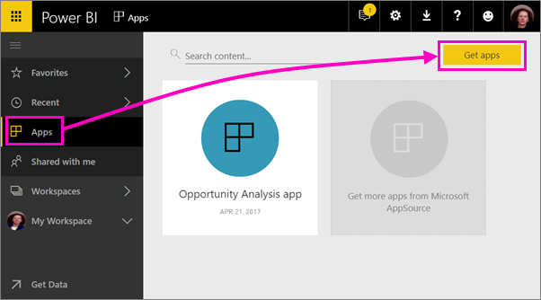
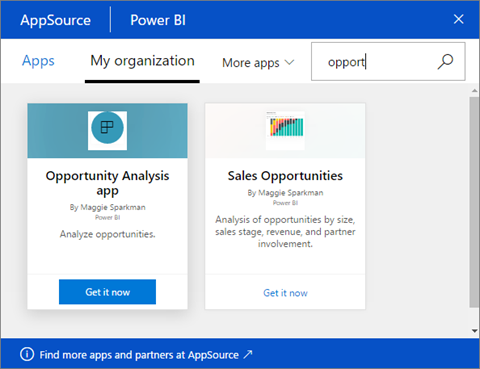
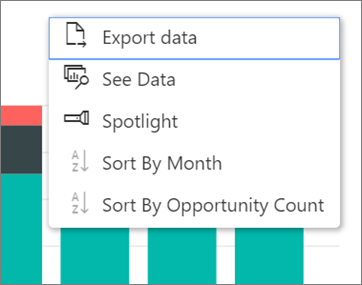

<properties 
   pageTitle="Install and use apps in Power BI"
   description="In Power BI, apps bring related dashboards and reports together, all in one place."
   services="powerbi" 
   documentationCenter="" 
   authors="maggiesMSFT" 
   manager="erikre" 
   editor=""
   tags=""
   qualityFocus="monitoring"
   qualityDate="10/02/2017"/>
 
<tags
   ms.service="powerbi"
   ms.devlang="NA"
   ms.topic="article"
   ms.tgt_pltfrm="NA"
   ms.workload="powerbi"
   ms.date="10/02/2017"
   ms.author="maggies"/>

# Install and use apps in Power BI

In Power BI, *apps* bring related dashboards and reports together, all in one place. People in your organization can create and distribute apps with key business information. [External services](powerbi-content-packs-services.md) you may already use, such as Google Analytics and Microsoft Dynamics CRM, also offer Power BI apps. 

Apps are easy to find and install in the Power BI service ([https://powerbi.com](https://powerbi.com)) and on your mobile device. After you install an app, you don't have to remember the names of a lot of different dashboards because they're all together in the app, in your browser or on your mobile device.

With apps, whenever the app author releases updates, you automatically see the changes. The author also controls how often the data is scheduled to refresh, so you don't need to worry about keeping it up to date. 
Planning to author an app? See [Create and distribute apps in Power BI](powerbi-service-create-apps.md) for more information.

## Install an app

You can install apps two different ways. The app author can send you a direct link to an app, or you can search for it in AppSource, where you see all the apps that you can access. In Power BI on your mobile device, you can only install it from a direct link, and not from AppSource. 

### Get a direct link to an app

The easiest way to install a new app is to get a direct link from the app author. Power BI creates an installation link, which the author can send to you.

**On your computer** When you click the link in email the Power BI service ([https://powerbi.com](https://powerbi.com)) opens in a browser. You confirm you want to install the app and it opens to the app landing page.

**On your iOS or Android mobile device** When you click the link in email, the app installs automatically and opens the app content list. 

### Get the app from Microsoft AppSource

You can also find and install any apps that you have access to from Microsoft AppSource. 

1. Select **Apps**  > **Get apps**. 

     

3. In AppSource under **My organization**, you can search to narrow the results and find the app you're looking for.

     

2. Select **Get it now** to add it to your Apps page. 

## Interact with an app

Now you can explore the data in the dashboards and reports in the app. You have access to all the standard Power BI interactions such as filtering, highlighting, sorting, and drilling down. Read about [interacting with reports in Power BI](powerbi-service-interact-with-a-report-in-reading-view.md). 

You can't save changes you make, but you can always [export the data to Excel ](powerbi-service-export-data.md) from a table or other visual in a report.

## Next steps
- [Create and distribute apps in Power BI](powerbi-service-create-apps.md)
- [Power BI apps for external services](powerbi-content-packs-services.md)
- Questions? [Try asking the Power BI Community](http://community.powerbi.com/)
