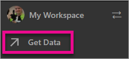

<properties
   pageTitle="Spark on HDInsight with DirectQuery"
   description="Spark on HDInsight with DirectQuery"
   services="powerbi"
   documentationCenter=""
   authors="guyinacube"
   manager="erikre"
   backup=""
   editor=""
   tags=""
   qualityFocus="no"
   qualityDate=""/>

<tags
   ms.service="powerbi"
   ms.devlang="NA"
   ms.topic="article"
   ms.tgt_pltfrm="NA"
   ms.workload="powerbi"
   ms.date="11/04/2016"
   ms.author="asaxton"/>

# Spark on HDInsight with DirectQuery

Spark on Azure HDInsight with DirectQuery allows you to create dynamic reports based on data and metric you already have in your Spark cluster. With DirectQuery, queries are sent back to your Azure HDInsight Spark cluster as you explore the data in the report view. This experience is suggested for users who are familiar with the entities they connect to.

> [AZURE.WARNING] Automatic tile refresh has been disabled for dashboard tiles built on Spark based datasets. You can select **Refresh Dashboard Tiles** to refresh manually. Reports are not impacted and should remain up-to-date. 

-   Every action such as selecting a column or adding a filter will send a query back to the database – before selecting very large fields, consider choosing an appropriate visual type.
-   Q&A is not available for DirectQuery datasets.
-   Schema changes are not picked up automatically.
-   Groups are only available with [Power BI Pro](powerbi-power-bi-pro-content-what-is-it.md).

These restrictions and notes may change as we continue to improve the experiences. The steps to connect are detailed below.  Additional documentation can be found at [Use BI tools with Apache Spark on Azure HDInsight](https://azure.microsoft.com/documentation/articles/hdinsight-apache-spark-use-bi-tools/)

1. Select **Get Data** at the bottom of the left navigation pane.

 	

2. Select **Databases & More**.

 	

3. Select the **Spark on HDInsight** connector and choose **Connect**.

 	

4. Enter the name of the **server** you want to connect to, as well as your **username** and **password**. The server is always in the form \<clustername\>.azurehdinsight.net, see more details about finding these values below.

 	

     

5. Once connected, you'll see a new dataset with named “SparkDataset”. You can also access the dataset through the placeholder tile that is created.

 	

6. Drilling into the dataset, you can explore all of the tables and columns in your database. Selecting a column will send a query back to the source, dynamically creating your visual. These visuals can be saved in a new report, and pinned back to your dashboard.

## Finding your Spark on HDInsight parameters

The server is always in the form \<clustername\>.azurehdinsight.net, and can be found in the Azure portal.

The username and password can also be found in the Azure portal.

## Troubleshooting

If you're hitting issues executing queries against your cluster, verify the application is still running and restart if necessary.

You can also allocate additional resources within the Azure portal under **Configuration** > **Scale Cluster**:

## See also  

[Get started: Create Apache Spark cluster on HDInsight Linux and run interactive queries using Spark SQL](https://azure.microsoft.com/documentation/articles/hdinsight-apache-spark-jupyter-spark-sql)  
[Get started with Power BI](powerbi-service-get-started.md)  
[Get Data for Power BI](powerbi-service-get-data.md)  
More questions? [Try the Power BI Community](http://community.powerbi.com/)