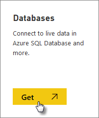
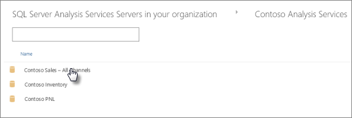

<properties 
   pageTitle="SQL Server Analysis Services Tabular data in Power BI"
   description="SQL Server Analysis Services Tabular data in Power BI"
   services="powerbi" 
   documentationCenter="" 
   authors="v-anpasi" 
   manager="mblythe" 
   editor=""
   tags=""/>
 
<tags
   ms.service="powerbi"
   ms.devlang="NA"
   ms.topic="article"
   ms.tgt_pltfrm="NA"
   ms.workload="powerbi"
   ms.date="09/28/2015"
   ms.author="v-anpasi"/>
# SQL Server Analysis Services Tabular data in Power BI

In Power BI, there are two ways you can connect to SQL Server Analysis Services Tabular model data. In Get data, you can connect to a SQL Server Analysis Services server, or you can [connect to an Excel workbook](http://support.powerbi.com/knowledgebase/articles/424871) that already connects to an Analysis Services server. If your Excel workbook has reports based on your tabular data, you’ll be able to explore and edit them right in Power BI.

  **Important:** 

-   In order to connect to a tabular model, a Power BI Analysis Services Connector must be installed and configured by an administrator. For more information, see [Configure a Power BI Analysis Services Connector](https://powerbi.uservoice.com/knowledgebase/articles/471577-create-an-analysis-services-connector).

-   When you use the Connector, your data remains on-premises.  The reports you create based on that data are saved in the Power BI service. 

-   Q&A natural language querying is not currently available for on-premises tabular data.  Only cloud-based datasets are supported for Q&A.

 NOTE: Groups are only available with [Power BI Pro](https://support.powerbi.com/knowledgebase/articles/685479).

## To connect to a tabular model from Get data

1.  In **My Workspace**, click **Get data**.

	

2.  Select **Databases & More.**

	

3.  Click **SQL Server Analysis Services** connector. \> **Connect**. 

	

4.  Select a server. If you don't see any servers listed here, it likely means a Power BI Analysis Services Connector is not installed in your organization. Check with your administrator.

	  

5.  Select the tabular model you want to connect to.

	

After you connect to the model, it will appear in your Power BI site in **My Workspace/Datasets**. 

 

If you pin visuals from a report to the dashboard, the pinned tiles are automatically refreshed every 10 minutes. If the data in your on-premises Analysis Services Tabular server is updated, the tiles will get auto-updated after 10 minutes.

## More about tabular models

Tabular models are in-memory databases in [SQL Server Analysis Services](http://www.microsoft.com/server-cloud/solutions/business-intelligence/analysis.aspx). Using state-of-the-art compression algorithms and a multi-threaded query processor, the Analysis Services in-memory analytics engine delivers fast access to tabular model objects and data by reporting client applications such as Microsoft Excel and Microsoft Power BI.

******High performance and highly secure**

Tabular model databases can scale to terabytes of data, partitioned for optimized processing. Tabular model databases also provide a highly secure environment for your data, right down to the row-level, using role-based permissions.

**Authoring tabular models**

Tabular models are authored in SQL Server Data Tools – Business Intelligence for Visual Studio (SSDT-BI) using tabular model project templates. You can connect to data from multiple sources, and then enrich the model by adding relationships, calculated columns, measures, KPIs, and hierarchies. Models can then be deployed to an instance of SQL Server Analysis Services where client reporting applications such as Power BI can connect to them. 

******Analysis Services tabular models and Power BI**

If your organization already has SQL Server Analysis Services tabular models on-premises, you can use Power BI to explore, mashup, and visualize data and metrics in them. 

To learn more about SQL Server Analysis Services tabular models, see [Microsoft Business Intelligence](http://www.microsoft.com/server-cloud/solutions/business-intelligence/analysis.aspx).

