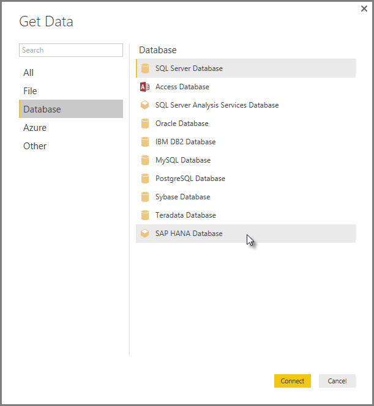
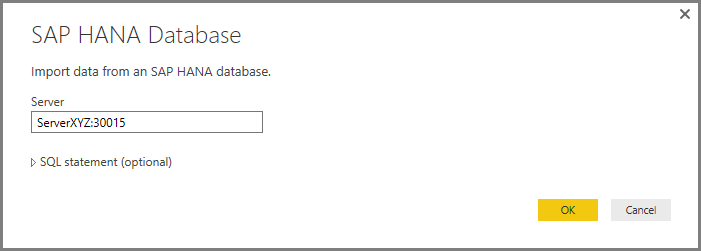

<properties
   pageTitle="Dynamic security for on-premises data connections"
   description="Dynamic security for on-premises data connections"
   services="powerbi"
   documentationCenter=""
   authors="davidiseminger"
   manager="mblythe"
   backup=""
   editor=""
   tags=""
   qualityFocus="no"
   qualityDate=""/>

<tags
   ms.service="powerbi"
   ms.devlang="NA"
   ms.topic="article"
   ms.tgt_pltfrm="NA"
   ms.workload="powerbi"
   ms.date="05/04/2016"
   ms.author="davidi"/>

# Dynamic security for on-premises data connections

This is under construction - don't publish it quite yet!

With Power BI Desktop, you can now access **SAP HANA** databases. To use **SAP HANA**, the SAP HANA ODBC driver must be installed on the local client computer in order for the Power BI Desktop **SAP HANA** data connection to work properly. You can download the SAP HANA ODBC driver from the [SAP download page](https://support.sap.com/swdc).

To connect to a **SAP HANA** database, select **Get Data &gt; Database &gt; SAP HANA Database** as shown in the following image.

When connecting to a SAP HANA database, specify the server name and the port in the format *server:port* - the following image shows an example with a server named ServerXYZ and port 30015.

In this release **SAP HANA** in [DirectQuery](powerbi-desktop-use-directquery.md) mode is supported in Power BI Desktop and the Power BI Service, and you can publish and upload reports that use **SAP HANA** in DirectQuery mode to the Power BI service. You can also publish and upload reports to the Power BI Service when not using **SAP HANA** in DirectQuery mode.

### Supported features for SAP HANA
This release has many capabilities for **SAP HANA**, as shown in the following list:

-   The Power BI connector for **SAP HANA** uses the SAP ODBC driver, to provide the best use experience

-   **SAP HANA** supports both DirectQuery and Import options

-   Power BI supports HANA information models ( such as Analytic and Calc views) and has optimized navigation

-   With **SAP HANA** you can also use the direct SQL feature to connect to Row and Column Tables

-   Includes Optimized Navigation for HANA Models

-   Power BI supports **SAP HANA** Variables and Input parameters

### Limitations of SAP HANA  
There are also a few limitations to using **SAP HANA**, shown below:

-   NVARCHAR strings are truncated to maximum length of 4000 Unicode characters

-   SMALLDECIMAL is not supported

-   VARBINARY is not supported

-   Valid Dates are between 1899/12/30 and 9999/12/31
