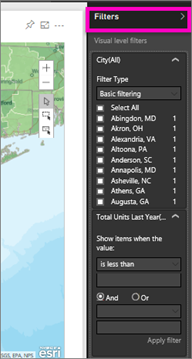
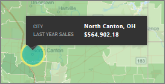
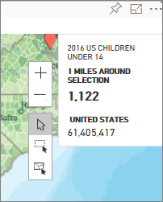

<properties
   pageTitle="Interacting with an ArcGIS map that has been shared with you"
   description="Using ArcGis map in reading view "
   services="powerbi"
   documentationCenter=""
   authors="mihart"
   manager="erikre"
   backup=""
   editor=""
   tags="power bi, service, desktop, mobile"
   featuredVideoId=""
   qualityFocus="monitoring"
   qualityDate="06/23/2017"/>

<tags
   ms.service="powerbi"
   ms.devlang="NA"
   ms.topic="article"
   ms.tgt_pltfrm="NA"
   ms.workload="powerbi"
   ms.date="06/23/2017"
   ms.author="mihart"/>

# Interacting with ArcGIS maps in Power BI

This topic is written from the point of view of a person *consuming* an ArcGIS map in Power BI service, Desktop, or mobile. Once a creator shares an ArcGIS map with you, there are many ways to interact with that map.  To learn more about creating an ArcGIS map, see [ArcGIS maps by esri tutorial](powerbi-service-tutorial-argcis.md).

The combination of ArcGIS maps and Power BI takes mapping beyond the presentation of points on a map to a whole new level. The available options for base maps, location types, themes, symbol styles, and reference layers creates gorgeous informative map visualizations. The combination of authoritative data layers (such as census data) on a map with spatial analysis conveys a deeper understanding of the data in your visualization.

> [!TIP]
> GIS stands for Geographic Information Science.

The example we're using is the same ArcGIS map created in the [ArcGIS maps by esri tutorial](powerbi-service-tutorial-argcis.md). It looks at last year's sales by city and uses a street basemap, bubble symbols to represent size, and a reference layer for average household income. The map contains 3 pins and one drive time radius (in purple).

> [!TIP]
> Visit [esri's page on Power BI](https://www.esri.com/powerbi) to see many examples and read testimonials. And then see esri's [ArcGIS Maps for Power BI Getting Started page](https://doc.arcgis.com/en/maps-for-powerbi/get-started/about-maps-for-power-bi.htm).

 

##    User consent
The first time a colleague shares an ArcGIS map with you, Power BI will display a prompt. ArcGIS Maps for Power BI is provided by [Esri](https://www.esri.com) and your use of ArcGIS Maps for Power BI is subject by Esri's terms and privacy policy. Power BI users wishing to use the ArcGIS Maps for Power BI visuals need to accept the consent dialog.

## Selection tools
ArcGIS Maps for Power BI allows three selection modes.

 Select individual data points.

 Draws a rectangle on the map and selects the contained data points. Use CTRL to select more than one rectangular area.

 Allows boundaries or polygons within reference layers to be used to select contained data points.

> [!NOTE]
> A maximum of 250 data points can be selected at a time.
 

##   Interacting with an ArcGIS map
The features available to you depend on whether you are the *creator* (person who made the map) or the *consumer* (someone shared an ArcGIS map with you). If you are interacting with an ArcGIS map as a consumer (aka [Reading view](powerbi-service-interact-with-a-report-in-reading-view.md)), here are the actions available to you.

- As with other visualization types, you can [pin to dashboards](powerbi-service-pin-a-tile-to-a-dashboard-from-a-report), [view](powerbi-service-reports-see-data.md) and/or [export the underlying data](powerbi-service-export-data.md), and see the map in [Focus mode](powerbi-service-display-dash-in-focus-mode.md) and [Full screen](powerbi-service-dash-and-reports-fullscreen.md).    
- Expand the **Filters** pane to explore the map using filters. When you close the report, the filters you applied are not saved.    
      

- If the map has a reference layer, select locations to display details in a tooltip. Here we've selected Adams County and see data from the average household income reference layer the creator added to the map.

      

    In this case we also get a chart. Select a bar on the chart to dig into the data. Here we see that 79 households in Adams county earn $200,000 or greater.

    

    Select the arrow to display any additional charts.

- Hover over basemap location symbols to display details in a tooltip.     

    > [!TIP]
    > You may have to zoom in to select a specific location.  Otherwise, if there are overlapping locations, Power BI may present you with more than 1 tooltip at a time. Select the arrows to move between the tooltips
    >
    >

- If the creator has added an Infographics layer to the ArcGIS map, you'll see additional data displayed in the upper-right corner of the map.  For example, here the map creator added "Children under 14."

    

## Considerations and Limitations

ArcGIS Maps for Power BI is available in the following services and applications:

<table>
<tr><th>Service/App</th><th>Availability</th></tr>
<tr>
<td>Power BI Desktop</td>
<td>Yes</td>
</tr>
<tr>
<td>Power BI service (PowerBI.com)</td>
<td>Yes</td>
</tr>
<tr>
<td>Power BI mobile applications</td>
<td>Yes</td>
</tr>
<tr>
<td>Power BI publish to web</td>
<td>No</td>
</tr>
<tr>
<td>Power BI Embedded</td>
<td>No</td>
</tr>
<tr>
<td>Power BI service embedding (PowerBI.com)</td>
<td>No</td>
</tr>
</table>

**The ArcGIS map is not showing up**    
In services or applications where ArcGIS Maps for Power BI is not available, the visualization will show as an empty visual with the Power BI logo.

**I'm not seeing all of my addresses on the map**    
When geocoding street addresses, only the first 1500 addresses are geocoded. Geocoding place names or countries is not subject to the 1500 address limit.

**Is there any charge for using ArcGIS Maps for Power BI?**

The ArcGIS Map for Power BI is available to all Power BI users at no additional cost. It is a component provided by **Esri** and your use is subject to the terms and privacy policy provided by **Esri** as noted earlier in this article.

**I'm getting an error message about my cache being full**

This is a bug that is being addressed.  In the meantime, select the link that appears in the error message for instructions on clearing your Power BI cache.

**Can I view my ArcGIS maps offline?**

No, Power BI needs network connectivity to display the maps.

## Next steps    
Getting help: **Esri** provides [comprehensive documentation](https://go.microsoft.com/fwlink/?LinkID=828772) on the feature set of **ArcGIS Maps for Power BI**.

You can ask questions, find the latest information, report issues, and find answers on the Power BI [community thread related to **ArcGIS Maps for Power BI**](https://go.microsoft.com/fwlink/?LinkID=828771).

If you have a suggestion for an improvement, please submit it to [Power BI's ideas list](https://ideas.powerbi.com).

[ArcGIS Maps for Power BI product page](https://www.esri.com/powerbi)
