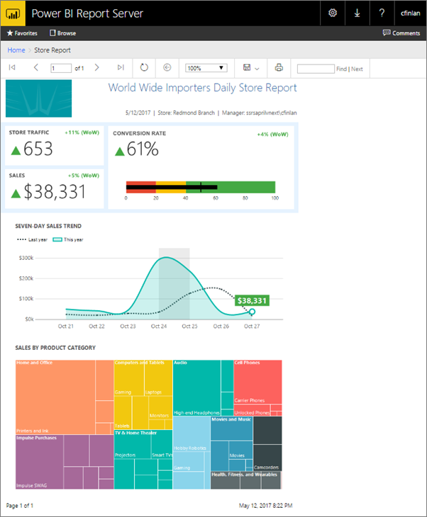

<properties
    pageTitle="Add comments to a report on a report server"
   description="Learn how to add comments to a paginated or a Power BI report on Power BI Report Server or SQL Server Reporting Serices report server."
   services="powerbi"
   documentationCenter=""
   authors="maggiesMSFT"
   manager="erikre"
   backup=""
   editor=""
   tags=""
   qualityFocus="no"
   qualityDate=""/>
<tags
   ms.service="powerbi"
   ms.devlang="NA"
   ms.topic="article"
   ms.tgt_pltfrm="NA"
   ms.workload="powerbi"
   ms.date="05/30/2017"
   ms.author="maggies"/>

# Add comments to a report on a report server

As the name suggests, paginated reports can run to many pages. They're great for reports laid out in a fixed format, and offer precise customization.

You can store and manage paginated reports in the Power BI Report Server web portal, just as you can in the SQL Server Reporting Services (SSRS) web portal. You create and edit them in Report Builder, and then publish them to the web portal just the same. Then report readers in your organization can view them in a browser or in a Power BI mobile app on their mobile device.

## Next steps

There are many great resources for designing reports in Report Builder and in Report Designer in SQL Server Data Tools. The Report Builder tutorials are a good place to start.

- [Report Builder tutorials](https://docs.microsoft.com/sql/reporting-services/report-builder-tutorials)

[User handbook](reportserver-user-handbook-overview.md)  

More questions? [Try asking the Power BI Community](https://community.powerbi.com/)