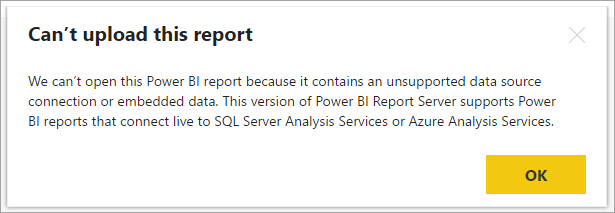

<properties
   pageTitle="Connecting to data sources"
   description="Learn about what data sources you can connect to within Power BI Report Server."
   services="powerbi"
   documentationCenter=""
   authors="guyinacube"
   manager="erikre"
   backup=""
   editor=""
   tags=""
   qualityFocus="no"
   qualityDate=""/>
<tags
   ms.service="powerbi"
   ms.devlang="NA"
   ms.topic="article"
   ms.tgt_pltfrm="NA"
   ms.workload="powerbi"
   ms.date="08/23/2017"
   ms.author="asaxton"/>

# Connecting to data sources

Learn about what data sources you can connect to within Power BI Report Server.

## Power BI Reports

Currently, the only data source supported for Power BI reports are a **live connection to Analysis Services (tabular or multidimensional)**. More data sources will be added in future releases.

### August 2017 preview

The August 2017 preview includes support for non-Analysis Services live connections. This includes imported data.  You can download the August 2017 preview over at [powerbi.com](https://powerbi.microsoft.com/report-server/).

There are a few limitations with using non-Analysis Services live connections.

- Scheduled data refresh is currently not available for reports using imported data.
- DirectQuery data connections are not currently supported.
- Scale-out environments are not officially supported.
- Reports must be smaller than 100 MB in size.

### Cannot upload imported or DirectQuery sources

If you try to publish a Power BI Desktop file that contains anything other than an Analysis Services live connection, you will see the following error.



```
Can't upload this report

We can’t open this Power BI report because it contains an unsupported data source connection or embedded data. This version of Power BI Report Server supports Power BI reports that connect live to SQL Server Analysis Services or Azure Analysis Services.
```

## Other reports

Other report types support the same data sources that are present in SQL Server Reporting Services. For more information, see [Data sources supported by Reporting Services](https://docs.microsoft.com/sql/reporting-services/report-data/data-sources-supported-by-reporting-services-ssrs).

## Next steps

[User handbook](reportserver-user-handbook-overview.md)  
[Quickstart: Paginated reports](reportserver-quickstart-paginated-report.md)  
[Quickstart: Power BI reports](reportserver-quickstart-powerbi-report)

More questions? [Try asking the Power BI Community](https://community.powerbi.com/)