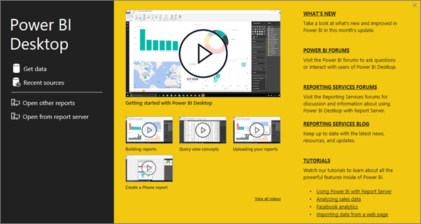
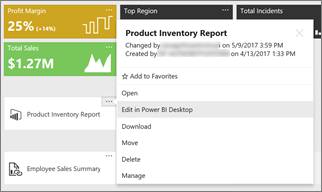
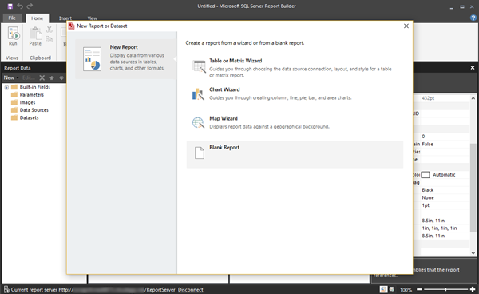
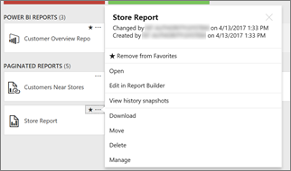
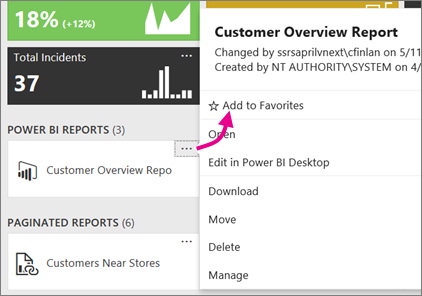
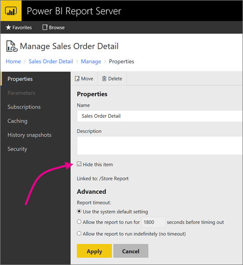
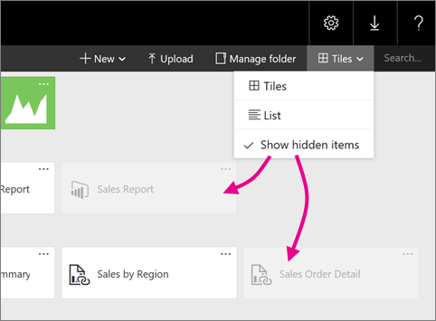
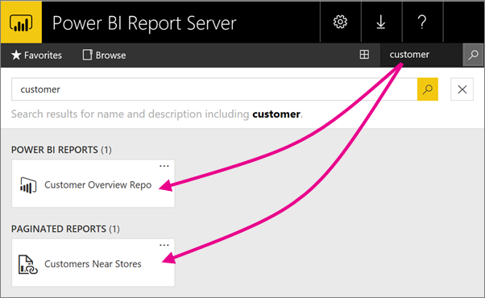

<properties 
   pageTitle="Work in Power BI Report Server"
   description="Read about navigating and working in the Power BI Report Server web portal."
   services="powerbi" 
   documentationCenter="" 
   authors="maggiesMSFT" 
   manager="erikre" 
   backup=""
   editor=""
   tags=""
   qualityFocus="no"
   qualityDate=""/>
<tags
   ms.service="powerbi"
   ms.devlang="NA"
   ms.topic="article"
   ms.tgt_pltfrm="NA"
   ms.workload="powerbi"
   ms.date="05/15/2017"
   ms.author="maggies"/>

# Work in the Power BI Report Server web portal

The Power BI Report Server web portal is an on-premises location for viewing, storing and managing your Power BI, mobile, and paginated reports, and KPIs.

You can view the web portal in any modern browser. In the web portal, reports and KPIs are organized in folders, and you can mark them as favorites. You can also store Excel workbooks there. From the web portal, you can launch the tools you need to create reports:

- **Power BI reports** created with Power BI Desktop: View them in the web portal and the Power BI mobile apps.
- **Paginated reports** created in Report Builder: Modern-looking, fixed-layout documents optimized for printing.
- **KPIs** created and visible right in the web portal.

In the web portal you can browse the report server folders or search for specific reports. You can view a report, its general properties and past copies of the report that are captured in report history. Depending on your permissions, you might also be able to subscribe to reports for delivery to your e-mail inbox or a shared folder on the file system.

## Web portal tasks

You can use the web portal for a number of tasks, including these:

- View, search, print, and subscribe to reports.
- Create, secure, and maintain the folder hierarchy to organize items on the server.
- Configure report execution properties, report history, and report parameters.
- Create shared schedules and shared data sources to make schedules and data source connections more manageable.
- Create data-driven subscriptions to roll out reports to a large recipient list.
- Create linked reports to reuse and re-purpose an existing report in different ways.
- Download and open common tools such as Power BI Desktop (Report Server), Report Builder, and Mobile Report Publisher.
- [Create KPIs](https://docs.microsoft.com/sql/reporting-services/working-with-kpis-in-reporting-services).
- Send feedback or make feature requests.
- [Branding the web portal](https://docs.microsoft.com/sql/reporting-services/branding-the-web-portal)
- [Working with KPIs](https://docs.microsoft.com/sql/reporting-services/working-with-kpis-in-reporting-services)
- [Working with shared datasets](https://docs.microsoft.com/sql/reporting-services/work-with-shared-datasets-web-portal)

## Web portal roles and permissions

The web portal is a web application that runs in a browser. When you start the web portal, the pages, links, and options you see vary based on the permissions you have on the report server. If you're assigned to a role with full permissions, you have access to the complete set of application menus and pages for managing a report server. If you're assigned to a role with permissions to view and run reports, you only see the menus and pages you need for those activities. You can have different role assignments for different report servers, or even for the various reports and folders on a single report server.

## Start the web portal

1. Open your web browser.

    > [AZURE.NOTE] See this list of [supported web browsers and versions](reportserver-browser-support.md).

2. In the address bar, type the web portal URL.

    By default, the URL is *http://[ComputerName]/reports*.

    The report server might be configured to use a specific port. For example, *http://[ComputerName]:80/reports* or *http://[ComputerName]:8080/reports*

    You see that the web portal groups items into these categories:

    - KPIs
    - Mobile reports
    - Paginated reports
    - Power BI Desktop reports
    - Excel workbooks
    - Datasets
    - Data sources
    - Resources

## Create and edit Power BI Desktop reports (.pbix files)

You can view, upload, create, organize, and manage permissions for Power BI Desktop reports in the web portal.

### Create a Power BI Desktop report

1. Select **New** > **Power BI Report**.

    

    The Power BI Desktop app opens.

    

2. Create your Power BI report. See [Quickstart: Power BI reports](reportserver-quickstart-create-power-bi-report.md) for details.

3. Upload your report to the report server.

### Edit an existing Power BI Desktop report

1. Select the ellipsis (**...**) in the upper-right corner of the report tile > **Edit in Power BI Desktop**.

    

    The Power BI Desktop app opens.

2. Make your changes and save... [how?]

## Create and edit paginated reports (.rdl files)

You can view, upload, create, organize, and manage permissions for paginated reports in the web portal.

### Create a paginated report

1. Select **New** > **Paginated Report**.

    The Report Builder app opens.

    

2. Create your paginated report. See [Quickstart: Paginated reports](reportserver-quickstart-create-paginated-report.md) for details.

3. Upload your report to the report server.

### Edit an existing paginated report

1. Select the ellipsis (...) in the upper-right corner of the report tile > **Edit in Report Builder**.

    

    The Report Builder app opens.

2. Make your changes and save.

## Upload and organize Excel workbooks

You can upload, organize, and manage permissions for Power BI Desktop reports and Excel workbooks. They will be grouped together within the web portal.

The workbooks are stored within Power BI Report Server, similar to other resource files. Selecting one of the workbooks downloads it locally to your desktop. You can save changes you’ve made by uploading it to the report server again.

## Manage items in the web portal

Power BI Report Server offers detailed control of the items you store on the web portal. For example, you can set up subscriptions, caching, snapshots, and security on individual paginated reports.

1. Select the ellipsis (...) in the upper-right corner of an item, then select **Manage**.

    

2. Choose the property or other feature you want to set.

    

3. Select **Apply**.

Read more about [working with subscriptions in the web portal](https://docs.microsoft.com/sql/reporting-services/working-with-subscriptions-web-portal).

## Tag your favorite reports and KPIs

You can tag the reports and KPIs that you want to be favorites. They're easier to find because they're all gathered in a single Favorites folder, both in the web portal and in the Power BI mobile apps. 

1. Select the ellipsis (**…**) in the upper-right corner of the KPI or report that you want to make a favorite, and select **Add to Favorites**.

    

2. Select **Favorites** on the web portal ribbon to see it along with your other favorites on the Favorites page in the web portal.

    

    Now in the Power BI mobile apps you see these favorites along with your favorite dashboards from the Power BI service.

    

## Hide or view items in the web portal

You can hide items in the web portal, and you can choose to view hidden items.

### Hide an item

1. Select the ellipsis (...) in the upper-right corner of an item, then select **Manage**.

    

2. Select **Hide this item**.

    

3. Select **Apply**.

### View hidden items

1. Select **Tiles** (or **List**) in the upper-right corner > **Show hidden items**.

    The items appear. They're grayed, but you can still open and edit them.

    

## Search for items

You can enter a search team, and you will see everything you can access. The results are categorized into KPIs, reports, datasets, and other items. You can then interact with the results and add them to your favorites.  

## Move or delete items in List view

By default, the web portal displays its contents in Tile view.

You can switch to List view, where it's easy to move or delete multiple items at a time. 

1. Select **Tiles** > **List**.

    

2. Select the items, then select **Move** or **Delete**.

## Next steps

[User handbook](reportserver-user-handbook-overview.md)  
[Quickstart: Paginated reports](reportserver-quickstart-paginated-report.md)  
[Quickstart: Power BI reports](reportserver-quickstart-powerbi-report)

More questions? [Try asking the Power BI Community](https://community.powerbi.com/)
