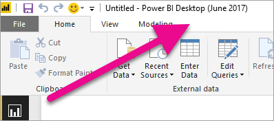

<properties
   pageTitle="Install Power BI Desktop optimized for Power BI Report Server"
   description="Learn how to install Power BI Desktop optimized for Power BI Report Server"
   services="powerbi"
   documentationCenter=""
   authors="guyinacube"
   manager="erikre"
   backup=""
   editor=""
   tags=""
   qualityFocus="no"
   qualityDate=""/>
<tags
   ms.service="powerbi"
   ms.devlang="NA"
   ms.topic="article"
   ms.tgt_pltfrm="NA"
   ms.workload="powerbi"
   ms.date="05/15/2017"
   ms.author="asaxton"/>

# Install Power BI Desktop optimized for Power BI Report Server

Learn how to install Power BI Desktop optimized for Power BI Report Server.

You will need to download and install Power BI Desktop optimized for Power BI Report Server. This is a different release from the Power BI Desktop that is used with the Power BI service. This is needed to make sure that the report server can indirect with a known version of the reports and model. 

> [AZURE.NOTE] Power BI Desktop and Power BI Desktop optimized for Power BI Report Server can be installed side by side.

## Download and install

You can download Power BI Desktop from the [Microsoft download center](https://go.microsoft.com/fwlink/?linkid=837581) or from within the web portal of your report server.

After you download the installer, you can install Power BI Desktop.

## Verify you are using the correct version

You can verify that you are using the correct Power BI Desktop by looking at the launch screen or title bar within Power BI Desktop. The launch screen will indicate *Power BI Report Server*. The title bar will indicated *(Report Server)*.

## File extension association

If you installed both Power BI Desktop and Power BI Desktop optimized for Power BI Report Server on the same machine, the last install of Power BI Desktop will have the file association with .pbix. This means that when you double click on a pbix file, it will launch the Power BI Desktop that was last installed.

If you had Power BI Desktop and then installed Power BI Desktop optimized for Power BI Report Server, all pbix files will open in Power BI Desktop optimized for Power BI Report Server by default. If you would rather Power BI Desktop be the default to launch when opening a pbix file, reinstall Power BI Desktop from the Power BI service.

You can always open the version of Power BI Desktop you want to use first. And then open the file from within Power BI Desktop.

Editing a Power BI report from within Power BI Report Server, or creating a new Power BI report from the web portal, will always open the correct version of Power BI Destop.

## Next steps

Now that you have Power BI Desktop installed, you can start creating Power BI reports.

[Quickstart: Create a Power BI report for Power BI Report Server](reportserver-quickstart-powerbi-report.md)  
[Get started with Power BI Desktop](powerbi-desktop-getting-started.md)  
Guided learning: [Getting started with Power BI Desktop](powerbi-learning-0-2-get-started-power-bi-desktop.md)  
[User handbook overview, Power BI Report Server](reportserver-user-handbook-overview.md)

More questions? [Try asking the Power BI Community](https://community.powerbi.com/)
