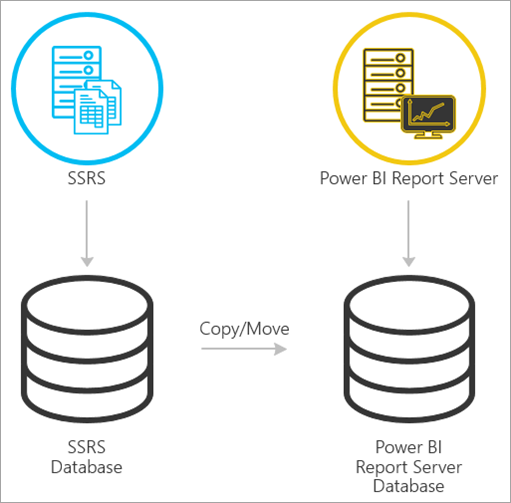
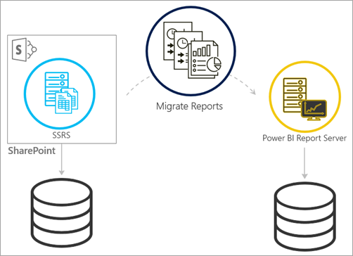

<properties
   pageTitle="Migrate a report server installation"
   description="Learn how to migrate your exising SQL Server Reporting Services instance to an instance of Power BI Report Server."
   services="powerbi"
   documentationCenter=""
   authors="guyinacube"
   manager="erikre"
   backup=""
   editor=""
   tags=""
   qualityFocus="no"
   qualityDate=""/>

<tags
   ms.service="powerbi"
   ms.devlang="NA"
   ms.topic="article"
   ms.tgt_pltfrm="NA"
   ms.workload="powerbi"
   ms.date="05/09/2017"
   ms.author="asaxton"/>
# Migrate a report server installation

Learn how to migrate your exising SQL Server Reporting Services (SSRS) instance to an instance of Power BI Report Server.

Migration is defined as moving application data files to a new Power BI Report Server instance. The following are common reasons why you might migrate your installation:

* You are wanting to move from SQL Server Reporting Services to Power BI Report Server

    > [AZURE.NOTE] There is not an inplace upgrade from SQL Server Reporting Services to Power BI Report Server. A migration is necessary.

* You have a large scale deployment or update requirements
* You are changing the hardware or topology of your installation
* You encounter an issue that blocks upgrade

## Supported versions

For an **SSRS (Native mode)** installation, the following versions are supported for migration.

* SQL Server 2016
* SQL Server 2012
* SQL Server 2008 R2
* SQL Server 2008

For an **SSRS (SharePoint-integrated mode)** installation, the following versions are supported for migration.

* SharePoint 2013 or 2016
* SQL Server 2016
* SQL Server 2014
* SQL Server 2012

## Migrating to Power BI Report Server from SSRS (Native mode)

Migrating from an SSRS (Native mode) instance to Power BI Report Server consists of a few steps.



* Backup database, application and configuration files
* Back up the encryption key
* Clone your report server database hosting your reports
* Install Power BI Report Server. If you are using the same hardware, you can install Power BI Report Server on the same server as the SSRS instance. For more information on installing Power BI Report Server, see [Install Power BI Report Server](reportserver-install-report-server.md).

> [AZURE.NOTE] The instance name for the Power BI Report Server will be *PBIRS*.

* Configure the report server using Report Server Configuration Manager and connect to the cloned database.
* Perform any cleanup needed for the SSRS (Native mode) instance

## Migration to Power BI Report Server from SSRS (SharePoint-integrated mode)

Migrating from an SSRS (SharePoint-integrated mode) to Power BI Report Server is not as straight forward as native mode. While these steps will provide some guidance, you may have other files and assets within SharePoint that will need to be managed outside of these steps. 



You will need to migrate the specific report server content from SharePoint to your Power BI Report Server. This assumes you have already installed Power BI Report Server somehwere in your environment. For more information on installing Power BI Report Server, see [Install Power BI Report Server](reportserver-install-report-server.md).

If you want to copy the report server content from your SharePoint environment to Power BI Report Server, you will need to use tools such as **rs.exe** to copy the content. Below is a sample of what the script would be to copy report server content from SharePoint to Power BI Report Server.

### Sample script

```
Sample Script
rs.exe
-i ssrs_migration.rss -e Mgmt2010
-s http://SourceServer/_vti_bin/reportserver
-v st="sites/bi" -v f="Shared Documents“
-u Domain\User1 -p Password
-v ts=http://TargetServer/reportserver
-v tu="Domain\User" -v tp="Password"
```

## Migrateing from one Power BI Report Server to another

Migrating from one Power BI Reprot Server is the same process as migrating from SSRS (Native-mode).


* Backup database, application and configuration files
* Back up the encryption key
* Clone your report server database hosting your reports
* Install Power BI Report Server. You *cannot* install Power BI Report Server on the same server as the one you are migrating from. For more information on installing Power BI Report Server, see [Install Power BI Report Server](reportserver-install-report-server.md).

> [AZURE.NOTE] The instance name for the Power BI Report Server will be *PBIRS*.

* Configure the report server using Report Server Configuration Manager and connect to the cloned database.
* Perform any cleanup needed for the old Power BI Report Server installation.

## Next steps

[Administrator handbook]  
[Quickstart: Install Power BI Report Server](reportserver-quickstart-install-report-server.md)  
[Script with the rs.exe Utility and the Web Service](https://docs.microsoft.com/sql/reporting-services/tools/script-with-the-rs-exe-utility-and-the-web-service)

More questions? [Try the Power BI Community](http://community.powerbi.com/)

