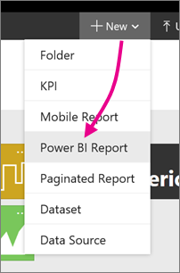
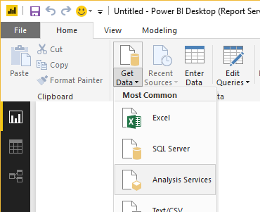
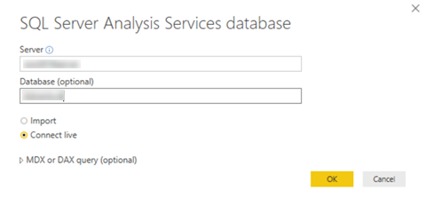
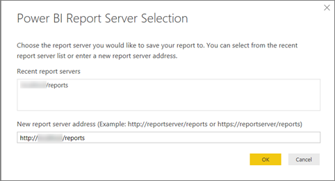
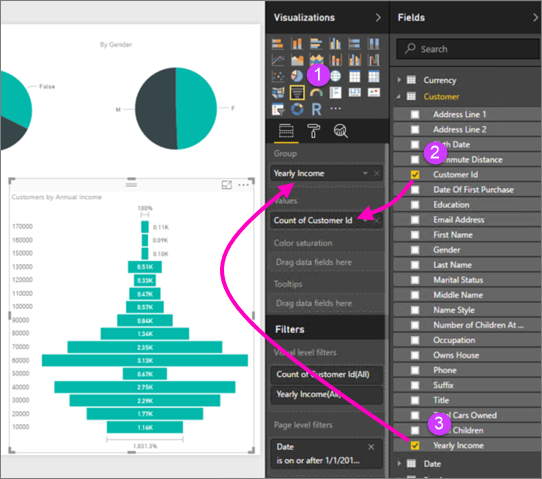
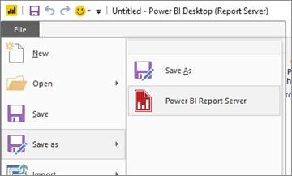
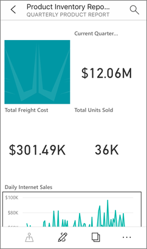

<properties
    pageTitle="Quickstart: Create a Power BI report for Power BI Report Server"
   description="Learn how to create a Power BI report for Power BI Report Server in a few simple steps."
   services="powerbi" 
   documentationCenter="" 
   authors="maggiesMSFT" 
   manager="erikre" 
   backup=""
   editor=""
   tags=""
   qualityFocus="no"
   qualityDate=""/>
<tags
   ms.service="powerbi"
   ms.devlang="NA"
   ms.topic="article"
   ms.tgt_pltfrm="NA"
   ms.workload="powerbi"
   ms.date="09/14/2017"
   ms.author="maggies"/>

# Quickstart: Create a Power BI report for Power BI Report Server

You can store and manage Power BI reports on premises in the Power BI Report Server web portal, just as you can store Power BI reports in the cloud in the Power BI service (https://powerbi.com). You create and edit reports in Power BI Desktop, and publish them to the web portal. Then report readers in your organization can view them in a browser or in a Power BI mobile app on a mobile device.

If you've already created Power BI reports in Power BI Desktop, then you're ready to create Power BI reports for Power BI Report Server. If not, here are four quick steps to get you started.

## Step 1: Install Power BI Desktop (Report Server)

You may already have installed Power BI Desktop to create reports for the Power BI service. We recommend installing the version of Power BI Desktop optimized for Power BI Report Server so you know the server and the app are always in sync. You can have both versions of Power BI Desktop on the same computer.

1. In the Power BI Report Server web portal, select **New** > **Power BI Report**.

    

    If you don't have access to a Power BI Report Server web portal, go to the Microsoft Download Center and download [Microsoft Power BI Desktop](https://go.microsoft.com/fwlink/?linkid=837581) (Optimized for Power BI Report Server - June 2017 GA).

2. At the end of the installation process, check **Start Power BI Desktop now**.

    It starts automatically and you're ready to go. You can tell you have the right version because "Power BI Desktop (Report Server)" is in the title bar.
    
3. If you're not familiar with Power BI Desktop, consider watching the videos on the welcome screen.

    

## Step 2: Select a data source

In the June release of Power BI Report Server, the only data source supported with Power BI Report Server is a live connection to a SQL Server Analysis Services (SSAS)tabular model or multidimensional cube. 

With the August Preview release, you can connect to any data source. Read more about [connecting to data sources](reportserver-connect-data-sources.md).

1. From the welcome screen, select **Get Data**.

    Or on the **Home** tab, select **Get Data**.

2. Select **Analysis Services** (or, in the August Preview release, select any data source).

    

3. Fill in **Server**, and optionally, **Database**. Make sure **Connect live** is selected > **OK**.

    

4. Choose the report server where you'll save your reports.

    

## Step 3: Design your report

Here's the fun part: You get to create visuals that illustrate your data.

For example, you could create a funnel chart of customers and group values by yearly income.

1. In **Visualizations**, select **Funnel chart**.
2. Drag the field to be counted to the **Values** well. If it's not a numeric field, Power BI Desktop automatically makes it a *Count of* the value.
3. Drag the field to group on to the **Group** well.

Read much more about [designing a Power BI report](../powerbi-desktop-report-view.md).

## Step 4: Save your report to the report server

When your report is ready, you save it to the Power BI Report Server you chose in Step 2.

1. On the **File** menu, select **Save as** > **Power BI Report Server**.

    

2. Now you can view it in the web portal.

    

## Considerations and limitations

Reports in Power BI Report Server and in the Power BI service (http://powerbi.com) act almost exactly the same, but a few features are different.

### In a browser 
Power BI Report Server reports support all visualizations, including:

- Custom visuals

Power BI Report Server reports don’t support:

- R visuals
- ArcGIS maps
- Breadcrumbs

### In the Power BI mobile apps
Power BI Report Server reports support all the basic functionality in the [Power BI mobile apps](powerbi-power-bi-apps-for-mobile-devices.md), including:

- [Phone report layout](powerbi-desktop-create-phone-report.md): You can optimize a report for the Power BI mobile apps. On your mobile phone, optimized reports have a special icon, , and layout.

    

Power BI Report Server reports don’t support these features in the Power BI mobile apps:

- R visuals
- ArcGIS maps
- Custom visuals
- Breadcrumbs
- Geofiltering or bar codes

## Next steps

### Power BI Desktop
There are so many great resources for creating reports in Power BI Desktop. These links are a good starting point.

- [Get started with Power BI Desktop](powerbi-desktop-getting-started.md)
- Guided learning: [Getting started with Power BI Desktop](powerbi-learning-0-2-get-started-power-bi-desktop.md)

### Power BI Report Server

- [Install Power BI Desktop optimized for Power BI Report Server](reportserver-install-powerbi-desktop.md)  
- [Power BI Report Server user handbook](reportserver-user-handbook-overview.md)  

More questions? [Try asking the Power BI Community](https://community.powerbi.com/)