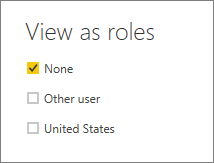
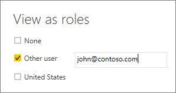

## Validating the role within Power BI Desktop
After you have created your role, you can test the results of the role within Power BI Desktop. To do this, select **View As Roles**.

The **View as roles** dialog allows you to change the view of what you are seeing for that specific user or role. You will see the roles you have created.

You select the role you created and then select **OK** to apply that role to what you are viewing. The reports will only render the data relevant for that role.

You can also select Other user and supply a given user. It is best to supply the User Principal Name (UPN) as that is what the Power BI service will use. Select **OK** and the reports will render based on what that user can see. 

> [!NOTE]
> Within Power BI Desktop, this will only display different results if you are using dynamic security based on your DAX expressions.
> 
> 

