# Administering Power BI in the admin portal

The admin portal enables you to manage the Power BI settings for your organization. The portal includes items such as usage metrics, access to the Microsoft 365 admin center, and tenant settings.

The full admin portal can be accessed by global admins and users who have the Power BI service administrator role. If you're not in one of these roles, you only see **Capacity settings** in the portal. For more information about the Power BI service administrator role, see [Understanding the Power BI admin role](service-admin-role.md).

## How to get to the admin portal

You have to be a global admin or Power BI service admin to access the Power BI admin portal. For more information about the Power BI service administrator role, see [Understanding the Power BI admin role](service-admin-role.md). To get to the Power BI admin portal, follow these steps:

1. Sign in to [Power BI](https://app.powerbi.com) using your admin account credentials.

1. From the page header, select **Settings** > **Admin portal**.

    

There are several sections in the Admin portal. The rest of this article provides information about each of these sections.

* [Usage metrics](#usage-metrics)
* [Users](#users)
* [Audit logs](#audit-logs)
* [Tenant settings](#tenant-settings)
* [Capacity settings](#capacity-settings)
* [Embed codes](#embed-codes)
* [Organizational visuals](organizational-visuals.md#organizational-visuals)
* [Azure connections (preview)](#azure-connections-preview)
* [Workspaces](#workspaces)
* [Custom branding](#custom-branding)
* [Protection metrics](#protection-metrics)
* [Featured content](#featured-content)

## Usage metrics

**Usage metrics** let you monitor Power BI usage for your organization. It also shows which users and groups in your organization are the most active in Power BI.

> [!NOTE]
> The first time you access the dashboard, or after you visit again after a long period of not viewing the dashboard, you'll likely see a loading screen while we load the dashboard.

After the dashboard loads, you see two sections of tiles. The first section includes usage data for individual users and the second section has similar information for groups.

Here's a breakdown of what you can see in each tile:

* Distinct count of all dashboards, reports, and datasets in the user workspace.
  
    

* Most consumed dashboard by number of users who can access it. For example: You have a dashboard that you shared with three users. You also added the dashboard to a content pack that two different users connected to. The dashboard's count would be 6 (1 + 3 + 2).
  
    

* The most popular content users connected to. The content would be anything the users could reach through the Get Data process, such as SaaS content packs, Organizational content packs, files, or databases.
  
    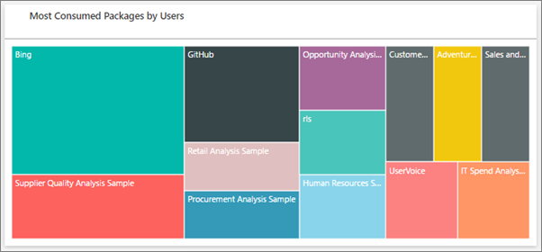

* A view of your top users based on how many dashboards they have, both dashboards they created themselves and dashboards shared to them.
  
    

* A view of your top users based on how many reports they have.
  
    

The second section shows the same type of information, but based on groups. This section lets you see which groups in your organization are most active and what kind of content they're consuming.

With this information, you can get real insights into how people are using Power BI across your organization.

## Control usage metrics

Usage metrics reports are a feature that the Power BI or global administrator can turn on or off. Administrators have granular control over which users have access to usage metrics. They are **On** by default for all users in the organization.

Admins can also determine whether content creators can see per-user data in usage metrics. 

See [Monitor usage metrics for Power BI dashboards and reports](../collaborate-share/service-usage-metrics.md) for details about the reports themselves.

### Usage metrics for content creators

1. In the Admin portal, select **Tenant settings** > **Audit and usage settings** > **Usage metrics for content creators**.

    

1. Enable (or disable) usage metrics > **Apply**.

    

### Per-user data in usage metrics for content creators

By default, per-user data is enabled for usage metrics, and account information is included in the metrics report. If you don't want to include account information for some or all users, disable the feature for specified security groups or for an entire organization. Account information then shows in the report as *Unnamed*.

### Delete all existing usage metrics content

When disabling usage metrics for their entire organization, admins can also choose one or both options to:

- **Delete all existing usage metrics content** to delete all existing reports and dashboard tiles that were built using the usage metrics reports and datasets. This option removes all access to usage metrics data for all users in the organization who may already be using it.
- **Delete all existing per-user data in current usage metrics content** This option removes all access to per-user data for all users in the organization who may already be using it. 

Be careful, because deleting existing usage and per-user metrics content is irreversible.

## Users

You manage Power BI users, groups, and admins in the Microsoft 365 admin center. The **Users** tab provides a link to the admin center.

## Audit logs

You manage Power BI audit logs in the Office 365 Security & Compliance center. The **Audit logs** tab provides a link to the Security & Compliance center. To learn more, see [Track user activities in Power BI](service-admin-auditing.md).

To use audit logs, make sure the [**Create audit logs for internal activity auditing and compliance**](#create-audit-logs-for-internal-activity-auditing-and-compliance) setting is enabled.

## Tenant settings

**Tenant settings** enable fine-grained control over the features that are made available to your organization. If you have concerns around sensitive data, some of our features may not be right for your organization, or you may only want a particular feature to be available to a specific group.

> [!NOTE]
> Tenant settings that control the availability of features in the Power BI user interface can help to establish governance policies, but they're not a security measure. For example, the **Export data** setting doesn't restrict the permissions of a Power BI user on a dataset. Power BI users with read access to a dataset have the permission to query this dataset and might be able to persist the results without using the **Export data** feature in the Power BI user interface.

The following image shows several settings on the **Tenant settings** tab.

> [!NOTE]
> It can take up to 15 minutes for a setting change to take effect for everyone in your organization.

Settings can have one of three states:

* **Disabled for the entire organization**: No one in your organization can use this feature.

    

* **Enabled for the entire organization**: Everyone in your organization can use this feature.

    

* **Enabled for a subset of the organization**: Instead of enabling the feature fo the entire organization, you can apply the setting to **Specific security groups** in your organization who are allowed to use this feature.

    You can also enable a feature for your entire organization, **Except specific security groups**.

    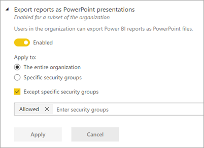

    You can also combine settings to enable the feature only for a specific group of users and also disable it for a group of users. Using this approach ensures that certain users don't have access to the feature even if they're in the allowed group. The most restrictive setting for a user applies.

    

The next few sections provide an overview of the different types of tenant settings.

## Help and support settings

### Publish "Get Help" information

Admins can specify internal URLs to override the destination of links on the Power BI help menu and for license upgrades. If custom URLs are set, users in the organization go to internal help and support resources instead of the default destinations. The following resource destinations can be customized:

* **Learn**. By default, this help menu link targets a [list of all our Power BI learning paths and modules](https://docs.microsoft.com/learn/browse/?products=power-bi). To direct this link to internal training resources instead, set a custom URL for **Training documentation**.

* **Community**. To take users to an internal forum from the help menu, instead of to the [Power BI Community](https://community.powerbi.com/), set a custom URL for **Discussion forum**.

* **Licensing upgrades**. Users with a Power BI (free) license may be presented with the opportunity to upgrade their account to Power BI Pro while using the service. If you specify an internal URL for **Licensing requests**, you redirect users to an internal request and purchase flow and prevent self-service purchase. If you want to prevent users from buying licenses, but are okay with letting users start a Power BI Pro trial, see [Allow users to try Power BI Pro](#allow-users-to-try-power-bi-pro) to separate the buy and try experiences.

* **Get help**. To take users to an internal help desk from the help menu, instead of to [Power BI Support](https://powerbi.microsoft.com/support/), set a custom URL for **Help Desk**.

### Receive email notifications for service outages or incidents

Mail-enabled security groups will receive email notifications if this tenant is impacted by a service outage or incident. Learn more about [Service interruption notifications](service-interruption-notifications.md).

### Allow users to try Power BI Pro

The setting to **Allow users to try Power BI Pro** is enabled by default, and increases your control over how users acquire Power BI Pro licenses. In scenarios where you have blocked self-service purchase, this setting lets users start a Power BI Pro trial. The end user experience depends on how you combine license settings. The table below shows how the upgrade experience from Power BI (free) to Power BI Pro is affected by different setting combinations:

| Self-service purchase setting | Allow user to try Power BI Pro setting | End user experience |
| ------ | ------ | ----- |
| Enabled | Disabled | User can buy a Pro license, but can't start a trial |
| Enabled | Enabled | User can start a free trial of Pro and can upgrade to a paid license |
| Disabled | Disabled | User sees a message to contact the IT admin to request a license |
| Disabled | Enabled | User can start a Pro trial, but must contact the IT admin to get a paid license |

> [!NOTE]
> You can add an internal URL for licensing requests in [Help and support settings](#help-and-support-settings). If you set the URL it overrides the default purchase experience. Users who can buy a license in the scenarios described in the table above are redirected to your internal URL.

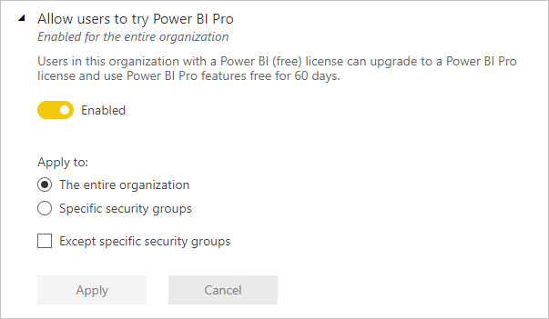

## Workspace settings

In **Tenant settings**, the admin portal has two sections for controlling workspaces:

- Create the new workspace experiences.
- Use datasets across workspaces.
- Block classic workspace creation.

### Create the new workspaces

Workspaces are places where users can collaborate on dashboards, reports, and other content. Admins use the **Create workspaces (new workspace experience** setting to indicate which users in the organization can create workspaces. Admins can allow everybody or nobody in an organization to create new workspace experience workspaces. They can also limit creation to members of specific security groups. Learn more about [workspaces](../collaborate-share/service-new-workspaces.md).

:::image type="content" source="media/service-admin-portal/power-bi-admin-workspace-settings.png" alt-text="Create the new workspace experiences":::

For classic workspaces based on Microsoft 365 Groups, administration continues to occur in admin portal and Azure Active Directory.

> [!NOTE]
> The **Create workspaces (new workspace experience)** setting defaults to allowing only users who can create Microsoft 365 Groups to create the new Power BI workspaces. Be sure to set a value in the Power BI admin portal to ensure appropriate users can create them.

**List of workspaces**

The admin portal has another section of settings about the workspaces in your tenant. In that section, you can sort and filter the list of workspaces and display the details for each workspace. See [Workspaces](#workspaces) in this article for details.

**Publish content packs and apps**

In the admin portal, you also control which users have permissions to distribute apps to the organization. See [Publish content packs and apps to the entire organization](#publish-content-packs-and-apps-to-the-entire-organization) in this article for details.

### Use datasets across workspaces

Admins can control which users in the organization can use datasets across workspaces. When this setting is enabled, users still need the required Build permission for a specific dataset.

:::image type="content" source="media/service-admin-portal/power-bi-admin-datasets-workspaces.png" alt-text="Use datasets across workspaces":::

See [Intro to datasets across workspaces](../connect-data/service-datasets-across-workspaces.md) for more information.

### Block classic workspace creation

Admins can control whether the organization can create classic workspaces. When this setting is enabled, users who create a workspace can only create new workspace experience workspaces. 

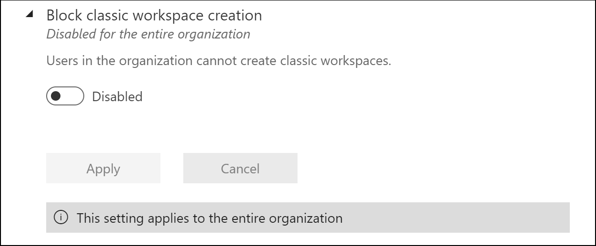

When enabled, newly created Office 365 Groups won't be shown in the Power BI workspaces list. Existing classic workspaces continue to be shown in the list. When the setting is disabled, all Office 365 Groups the user is a member of appear in the workspaces list. Read more about the [new workspace experience workspaces](../collaborate-share/service-new-workspaces.md).

## Export and sharing settings

### Share content with external users

Users in the organization can share dashboards, reports and apps with users outside the organization. Learn more about [sharing externally](../collaborate-share/service-share-dashboards.md#share-a-dashboard-or-report-outside-your-organization).

The following image shows the message that appears when you share with an external user.

  

> [!IMPORTANT]
> This option controls whether users in Power BI can invite external users to become Azure Active Directory B2B (Azure AD B2B) guest users in your organization through Power BI. When enabled, users who have the Guest Inviter role in Azure AD can add external email addresses when sharing reports, dashboards, and Power BI apps. The external recipient is invited to join your organization as an Azure AD B2B guest user. Importantly, when disabling this setting, external users who are already Azure AD B2B guest users in your organization continue to appear in people picker UIs in Power BI and can be given access to items, workspaces, and apps.

### Publish to web

As admin for a Power BI tenant, the **Publish to web** setting gives you options for which users can create embed codes to publish reports to the web. This functionality makes the report and its data available to anyone on the web. Learn more about [publishing to the web](../collaborate-share/service-publish-to-web.md).

> [!NOTE]
> Only Power BI admins can allow creating new publish to web embed codes. Organizations may have existing embed codes. See the [Embed codes](service-admin-portal.md#embed-codes) section of the admin portal to review currently published reports.

The following image shows the **More options (...)** menu for a report when the **Publish to web** setting is enabled.

The **Publish to web** setting in the admin portal gives options for which users can create embed codes.

Admins can set **Publish to web** to **Enabled** and **Choose how embed codes work** to **Allow only existing embed codes**. In that case, users can create embed codes, but they have to contact the Power BI admin to allow them do so.

Users see different options in the UI based on what the **Publish to web** setting is.

|Feature |Enabled for entire organization |Disabled for entire organization |Specific security groups   |
|---------|---------|---------|---------|
|**Publish to web** under report **More options (...)** menu|Enabled for all|Not visible for all|Only visible for authorized users or groups.|
|**Manage embed codes** under **Settings**|Enabled for all|Enabled for all|Enabled for all  * **Delete** option only for authorized users or groups. * **Get codes** enabled for all.|
|**Embed codes** within admin portal|Status reflects one of the following: * Active * Not supported * Blocked|Status displays **Disabled**|Status reflects one of the following: * Active * Not supported * Blocked  If a user isn't authorized based on the tenant setting, status displays **infringed**.|
|Existing published reports|All enabled|All disabled|Reports continue to render for all.|

### Export data

Users in the organization can export data from a tile or visualization. This controls Analyze in Excel, export to .csv, dataset downloads (.pbix), and Power BI Service Live Connect features. Learn more about [exporting data from a tile or visual](../visuals/power-bi-visualization-export-data.md).

>[!NOTE]
> Before the introduction of the Export to Excel setting, this setting also controlled exporting data to Excel files. See the [note under Export to Excel](#export-to-excel) for detail.

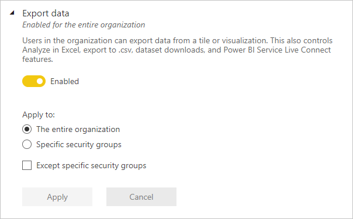

The following image shows the option to export data from a tile.

> [!NOTE]
> Disabling **Export Data** also prevents users from using the [Analyze in Excel](../collaborate-share/service-analyze-in-excel.md) feature, as well as using the Power BI service live connection.

### Export to Excel

Users in the organization can export the data from a visualization to an Excel file.

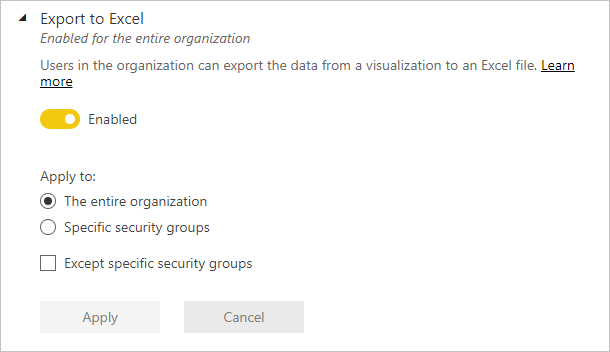

>[!IMPORTANT]
> Before the introduction of the Export to Excel setting, exporting to an Excel file was controlled by the Export data setting. Therefore, on tenants that existed before the introduction of the Export to Excel setting, the first time tenant administrators look at the Export to Excel setting they will see that it has *Unapplied changes*. They must apply these changes in order for the new setting to take effect. Otherwise, exporting to an Excel file will continue to be controlled by the Export data setting.

### Export reports as PowerPoint presentations or PDF documents

Users in the organization can export Power BI reports as PowerPoint files or PDF documents. [Learn more](../consumer/end-user-powerpoint.md)

The following image shows the **File** menu for a report when the **Export reports as PowerPoint presentations or PDF documents** setting is enabled.

### Print dashboards and reports

Users in the organization can print dashboards and reports. [Learn more](../consumer/end-user-print.md)

The following image shows the option to print a dashboard.

The following image shows the **File** menu for a report when the **Print dashboards and reports** setting is enabled.

### Allow external guest users to edit and manage content in the organization

Azure AD B2B guest users can edit and manage content in the organization. [Learn more](service-admin-azure-ad-b2b.md)

The following image shows the option to Allow external guest users to edit and manage content in the organization.

In the admin portal, you also control which users have permissions to invite external users to the organization. See [Share content with external users](#export-and-sharing-settings) in this article for details.

### Email Subscriptions
Users in the organization can create email subscriptions. Learn more about [subscriptions](../collaborate-share/service-publish-to-web.md).

### Featured content

Allow some or all report authors in your organization to feature their content on the Featured section of Power BI Home. New users will see featured content at the top of their Power BI Home page. Featured content moves down the Home page as users add **Favorites**, **frequents**, and **Recents**. 

We recommend starting with a small set of promoters first. Allowing the entire organization to feature content on Home may make it difficult to keep track of all the promoted content. 

After you enable featured content, you can also manage it in the Admin portal. See [Manage featured content](#manage-featured-content) in this article to read about controlling featured content in your domain.

## Content pack and app settings

### Publish content packs and apps to the entire organization

Admins use this setting to decide which users can publish content packs and apps to the entire organization, rather than just specific groups. Learn more about [publishing apps](../collaborate-share/service-create-distribute-apps.md).

The following image shows the **My entire organization** option when creating a content pack.

### Create template apps and organizational content packs

Users in the organization can create template apps and organizational content packs that use datasets built on one data source in Power BI Desktop. Learn more about [template apps](../connect-data/service-template-apps-create.md).

### Push apps to end users

Report creators can share apps directly with end users without requiring installation from [AppSource](https://appsource.microsoft.com). Learn more about [automatically installing apps for end users](../collaborate-share/service-create-distribute-apps.md#automatically-install-apps-for-end-users).

## Integration settings

### Use Analyze in Excel with on-premises datasets

Users in the organization can use Excel to view and interact with on-premises Power BI datasets. [Learn more](../collaborate-share/service-analyze-in-excel.md)

> [!NOTE]
> Disabling **Export Data** also prevents users from using the **Analyze in Excel** feature.

### Use ArcGIS Maps for Power BI

Users in the organization can use the ArcGIS Maps for Power BI visualization provided by Esri. [Learn more](../visuals/power-bi-visualization-arcgis.md)

### Use global search for Power BI (Preview)

Users in the organization can use external search features that rely on Azure Search.

## Featured tables settings

Under **Tenant settings**, the **Allow connections to featured tables** tenant setting lets Power BI admins control who in the organization can use featured tables in the Excel Data Types Gallery. 

:::image type="content" source="media/service-admin-portal/admin-allow-connections-featured-tables.png" alt-text="All connections to featured tables":::

Connections to featured tables are also disabled if the **Export data** tenant setting is set to **Disabled**.

Read more about [Power BI featured tables in Excel](../collaborate-share/service-excel-featured-tables.md).

## Share to Teams tenant setting

The **Share to Teams** setting is in the **Tenant settings** section of the Power BI admin portal. The setting allows organizations to hide the **Share to Teams** buttons in the Power BI service. When set to disabled, users don't see **Share to Teams** buttons in the action bar or context menus when they view reports and dashboards in the Power BI service.

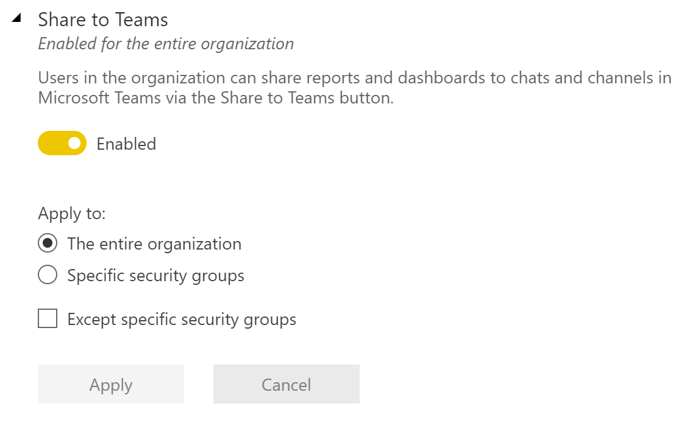

Read more about [sharing Power BI content to Teams](../collaborate-share/service-share-report-teams.md).

## R visuals settings

### Interact with and share R visuals

Users in the organization can interact with and share visuals created with R scripts. [Learn more](../visuals/service-r-visuals.md)

> [!NOTE]
> This setting applies to the entire organization and cannot be limited to specific groups.

## Audit and usage settings

### Create audit logs for internal activity auditing and compliance

Users in the organization can use auditing to monitor actions taken in Power BI by other users in the organization. [Learn more](service-admin-auditing.md)

This setting must be enabled for audit log entries to be recorded. There can be up to a 48 hour delay between enabling auditing and being able to view audit data. If you don't see data immediately, check the audit logs later. There can be a similar delay between getting permission to view audit logs and being able to access the logs.

> [!NOTE]
> This setting applies to the entire organization and cannot be limited to specific groups.

### Usage metrics for content creators

Users in the organization can see usage metrics for dashboards and reports they create. [Learn more](../collaborate-share/service-usage-metrics.md)

### Per-user data in usage metrics for content creators

Usage metrics for content creators will expose display names and email addresses of users who are accessing content. [Learn more](../collaborate-share/service-usage-metrics.md)

Per-user data is enabled for usage metrics by default, and content creator account information is included in the metrics report. If you do not wish to gather this information for all users, you can disable the feature for specified security groups or for an entire organization. Account information for the excluded users will then show in the report as *Unnamed*.

## Dashboard settings

### Data classification for dashboards

Users in the organization can tag dashboards with classifications that indicate dashboard security levels. [Learn more](../create-reports/service-data-classification.md)

> [!NOTE]
> This setting applies to the entire organization and cannot be limited to specific groups.

## Developer settings

### Embed content in apps

Users in the organization can embed Power BI dashboards and reports in Software as a Service (SaaS) applications. Disabling this setting prevents users from being able to use the REST APIs to embed Power BI content within their application. [Learn more](../developer/embedded/embedding.md)

### Allow service principals to use Power BI APIs

Web apps registered in Azure Active Directory (Azure AD) will use an assigned service principal to access Power BI APIs without a signed in user. To allow an app to use service principal authentication its service principal must be included in an allowed security group. [Learn more](../developer/embedded/embed-service-principal.md)

> [!NOTE]
> Service principals inherit the permissions for all Power BI tenant settings from their security group. To restrict permissions, create a dedicated security group for service principals and add it to the 'Except specific security groups' list for the relevant, enabled Power BI settings.

## Dataflow settings

### Create and use dataflows

Users in the organization can create and use dataflows. For an overview of dataflows, see [Self-service data prep in Power BI](../transform-model/service-dataflows-overview.md). To enable dataflows in a Premium capacity, see [Configure workloads](service-admin-premium-workloads.md).

> [!NOTE]
> This setting applies to the entire organization and cannot be limited to specific groups.

## Template apps settings

Three settings control template apps ability to publish or install template apps.

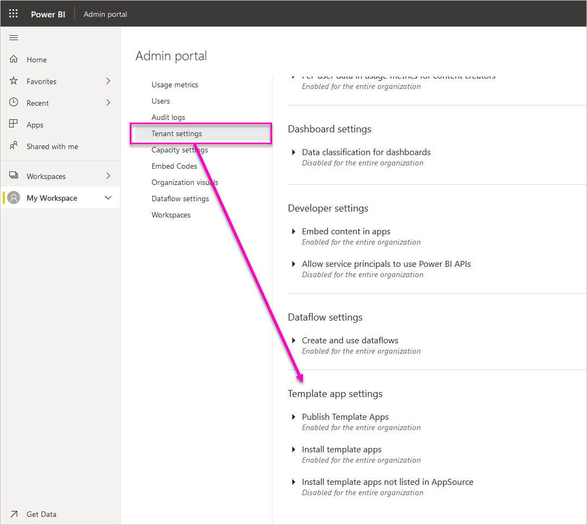

### Publish Template Apps

Users in the organization can create template apps workspaces. Control which users can publish template apps or distribute them to clients outside your organization by way of [AppSource](https://appsource.microsoft.com) or other distribution methods.

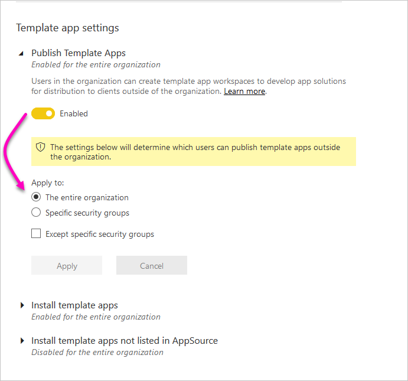

### Install template apps listed on AppSource

Users in the organization can download and install template apps **only** from [AppSource](https://appsource.microsoft.com). Control which specific users or security groups can install template apps from AppSource.

### Install template apps not listed on AppSource

Control which users in the organization can download and install template apps **not listed on [AppSource](https://appsource.microsoft.com)**.

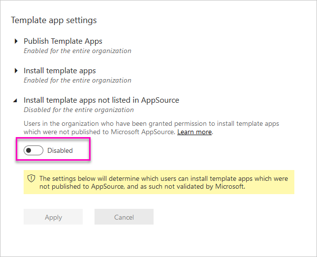

## Capacity settings

### Power BI Premium

The **Power BI Premium** tab enables you to manage any Power BI Premium capacities (EM or P SKU) that have been purchased for your organization. All users within your organization can see the **Power BI Premium** tab, but they only see contents within it if they are assigned as either a *Capacity admin* or a user that has assignment permissions. If a user does not have any permissions, the following message appears.

### Power BI Embedded

The **Power BI Embedded** tab enables you to view your Power BI Embedded (A SKU) capacities that you've purchased for your customer. Since you can only purchase A SKUs from Azure, you [manage embedded capacities in Azure](../developer/embedded/azure-pbie-create-capacity.md) from **the Azure portal**.

For more information about how to manage Power BI Embedded (A SKU) settings, see [What is Power BI Embedded](../developer/embedded/azure-pbie-what-is-power-bi-embedded.md).

## Embed codes

As an administrator, you can view the embed codes that are generated for your tenant to share reports publicly. You can also revoke or delete codes. [Learn more](../collaborate-share/service-publish-to-web.md)

## Organizational visuals

All the Power BI visuals admin settings, including Power BI visuals tenant settings, are described in [Manage Power BI visuals admin settings](organizational-visuals.md).

## Azure connections (preview)

### Tenant-level storage (preview)

By default, data used with Power BI is stored in internal storage provided by Power BI. With the integration of dataflows and Azure Data Lake Storage Gen2 (ADLS Gen2), you can store your dataflows in your organization's Azure Data Lake Storage Gen2 account. For more information, see [Dataflows and Azure Data Lake integration (Preview)](../transform-model/service-dataflows-azure-data-lake-integration.md).

### Workspace-level storage permissions (preview)

By default, workspace admins can't connect their own storage account. This preview feature lets you turn on a setting that allows workspace admins to connect their own storage account.

## Workspaces

As an administrator, you can view the workspaces that exist in your tenant. You can sort and filter the list of workspaces and display the details for each workspace. The table columns correspond to the properties returned by the [Power BI admin Rest API](/rest/api/power-bi/admin) for workspaces. Personal workspaces are of type **PersonalGroup**, classic workspaces are of type **Group**, and the new workspace experience workspaces are of type **Workspace**. For more information, see [Organize work in the new workspaces](../collaborate-share/service-new-workspaces.md).

Admins can also manage and recover workspaces, using either the admin portal or PowerShell cmdlets. 

On the **Workspaces** tab, you see the *state* for each workspace. The following table gives more details about the meaning of those states.

|State  |Description  |
|---------|---------|
| Active | A normal workspace. It doesn't indicate anything about usage or what's inside, only that the workspace itself is "normal". |
| Orphaned | A workspace with no admin user. |
| Deleted | A deleted workspace. For up to 90 days, we maintain enough metadata to restore the workspace if desired. |
| Removing | A workspace in the process of being deleted, but not gone yet. Users can delete their own workspaces, putting things into Removing and eventually Deleted. |

## Custom branding

As an administrator, you can customize the look of Power BI for your whole organization. Currently there are three main options:

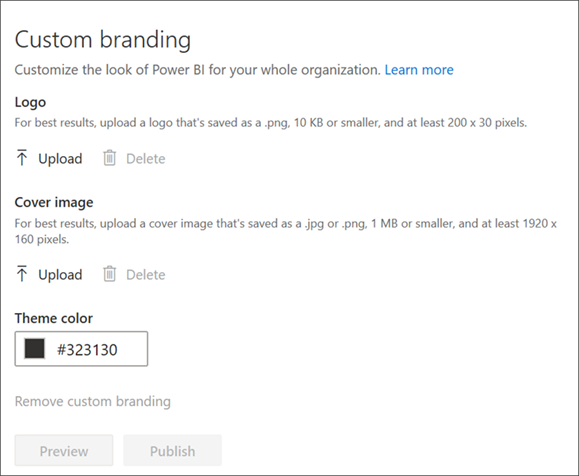

* **Upload Logo**: For best results, upload a logo that's saved as a .png, 10 KB or smaller, and at least 200 x 30 pixels.

* **Upload Cover image**: For best results, upload a cover image that's saved as a .jpg or .png, 1 MB or smaller, and at least 1920 x 160 pixels.

* **Select Theme color**: You are able to select your theme based on a hex #, RGB, value, or from the provided palette.

For more information, see [Custom branding for your organization](https://aka.ms/orgBranding).

## Protection metrics

After you enable information protection for Power BI, data protection metrics are displayed in the admin portal. The report shows how sensitivity labels help protect your content.

## Manage featured content

As tenant admin, you can manage all the reports, dashboards, and apps that have been promoted to the Featured section on Power BI Home across your organization.

- In the Admin portal, select **Featured content**.

Here you see an overview of who featured the content, when it was featured, and all its relevant metadata. If something looks suspicious, or you want to clean up the Featured section, you can delete promoted content as needed.

See [Featured content](#featured-content) in this article for information about enabling featured content.

## Next steps

[Administering Power BI in your Organization](service-admin-administering-power-bi-in-your-organization.md)  
[Understanding the Power BI admin role](service-admin-role.md)  
[Auditing Power BI in your organization](service-admin-auditing.md)  

More questions? [Try asking the Power BI Community](https://community.powerbi.com/)
