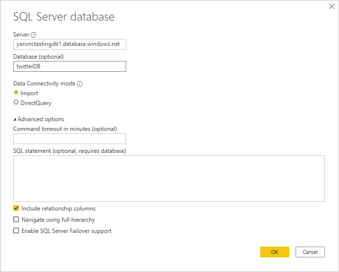

# Data source impact analysis

Data source impact analysis helps you see where your data source is being used throughout your organization. This can be useful when the data source is temporarily or permanently taken offline, and you want to get an idea about who is impacted. It shows you how many workspaces, dataflows, and datasets use the data source, and provides easy navigation to the workspaces where the affected dataflows and datasets are located so that you can investigate further.

Data source impact analysis can also help you spot data duplication in the tenant, such as when a number of different users build similar models on top of the same data source. By helping you discover such redundant datasets and dataflows, data source impact analysis supports the goal of having "a single source of truth".

## Perform data source impact analysis

To perform data source impact analysis:

1. Open [lineage view](service-data-lineage.md) in the workspace that contains the data source you're interested in.
1. Find the data source you're interested in and click the impact analysis button on the data source card.

    
 
The impact analysis side panel opens.

 
* **Data source type**: Indicates the data source type
* **Path to data source**: Path to the data source as defined in Power BI Desktop. For example, in the image above, the path to the SQL server database data source is the connection string "twitterDB-yaronctestingdb1.database.windows.net", as defined in Power BI Desktop (shown below). It consists of the database name "twitterDB" and the server name "yaronctestingdb1.database.windows.net".

    
 
* **Impact summary**: Shows you the number of potentially impacted workspaces, dataflows, and datasets. This count includes workspaces you don't have access to.
* **Usage breakdown**: Shows you, for each workspace, the names of the impacted dataflows and datasets. To further explore the impact on a particular workspace, click the workspace name to open the workspace. Once in the affected workspace, use [dataset impact analysis](service-dataset-impact-analysis.md) to see the usage details about connected reports and dashboards.

## Privacy

In the impact analysis side pane, you only see real names for workspaces, dataflows, and dataflows that you have access to. Items that you don't have access to are listed as Limited access. This is because some item names may contain personal information.
The impact summary counts include all impacted dataflows and datasets, even those that reside in workspaces you don't have access to.

## Limitations

Data source impact analysis is not yet supported for paginated reports, so you will not see if the data source has any direct impact on these kinds of reports in the tenant.

## Next steps

* [Dataset impact analysis](service-dataset-impact-analysis.md)
* [Data lineage](service-data-lineage.md)