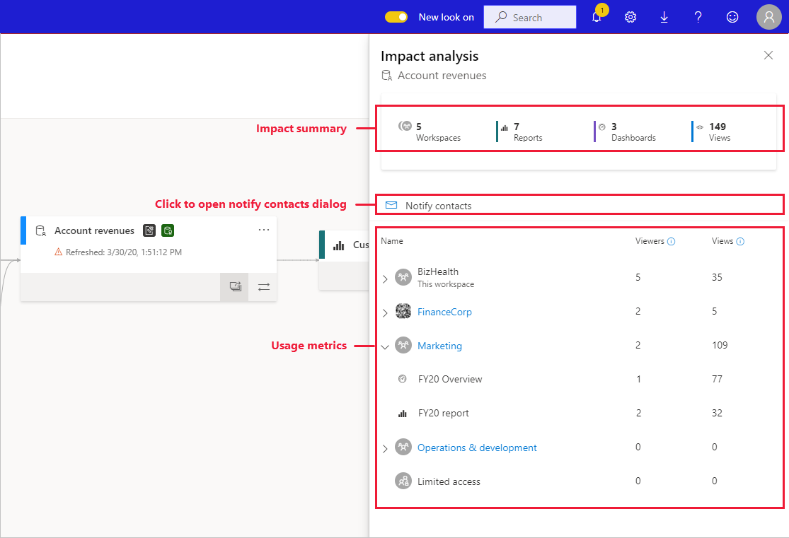

# Data source impact analysis

Data source impact analysis provides you visibility about where your data source is used in the organization. This can be useful when you need to take the data source offline and you want to get an idea about who is going to be impacted.

* It shows you how many workspaces, dataflows, and datasets use the data source, and provides easy navigation to the workspaces where the affected dataflows and datasets are located so that you can investigate further.

Data source impact analysis is easily launched from within [data lineage view](service-data-lineage.md)

## Perform data source impact analysis

To perform data source impact analysis, click the impact analysis button on the data source card.

The impact analysis side panel opens.

* **Data source type**
* **Path to data source**
* The **impact summary** shows you the number of potentially impacted workspaces, reports, and dashboards, as well as the total number of views for all the downstream reports and dashboards that are connected to the dataset.
* The **usage breakdown** that shows you, for each workspace, the names of the impacted dataflows and datasets. To see dataflow and dataset details, click the workspace name to open the workspace.

The usage metrics relate to the last 30 days, excluding the current day. The count includes usage coming via related apps. The metrics help you understand dataset use across the tenant, as well as assess the impact any changes to your dataset may have.

## Privacy

In order to perform impact analysis on a data source, you must have write permissions to it. In the impact analysis side pane, you only see real names for workspaces, dataflows, and dataflows that you have access to. Items that you don't have access to are listed as **Limited access**. This is because some item names may contain personal information.

The impact summary counts includes all impacted dataflows and datasets, even those that reside in workspaces you don't have access to.

## Impact analysis from Power BI Desktop

When you make a change to a dataset in Power BI Desktop and then republish it to the Power BI service, a message shows you how many workspaces, reports, and dashboards are potentially impacted by the change, and asks you to confirm that you want to replace the currently published dataset with the one you modified. The message also provides a link to the full dataset impact analysis in the Power BI service, where you can see more information and take action to mitigate the risks of your change.

> [!NOTE]
> The information shown in the message only indicates potential impact - it does not necessarily indicate that anything has broken. Oftentimes dataset changes have no adverse effect on their downstream reports and dashboards - still, you'll get this message that gives you clarity concerning potential impact.
>
>In the message, the number of workspaces is only shown if more than one workspace contains impacted reports and dashboards.

## Limitations

* Usage metrics are currently not supported for classic and personal workspaces.

## Next steps

* [Intro to datasets across workspaces (preview)](../connect-data/service-datasets-across-workspaces.md)
* [Data lineage](service-data-lineage.md)

