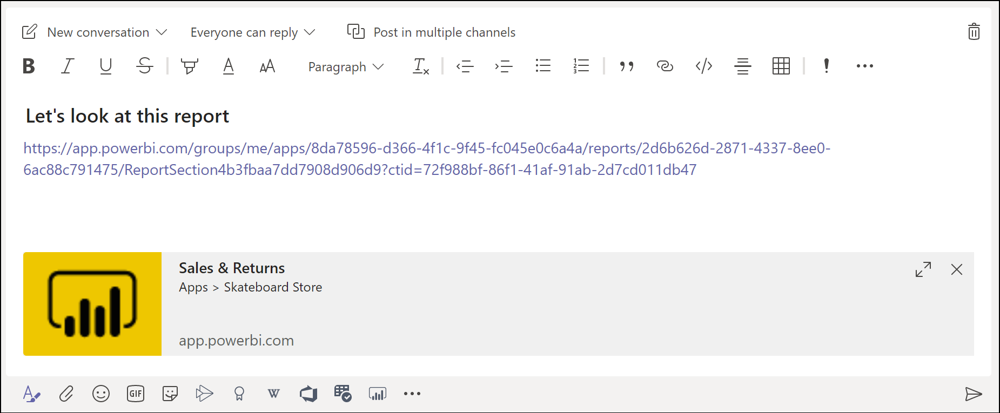
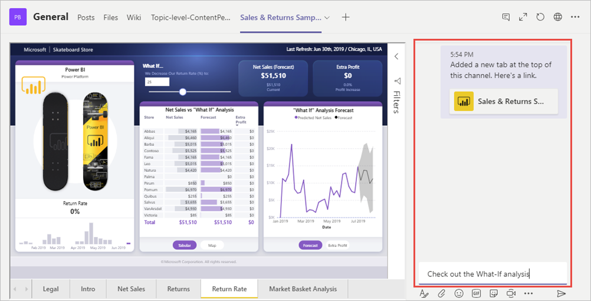

# Collaborate in Microsoft Teams with Power BI

You can easily share and collaborate on interactive Power BI content in Microsoft Teams channels and chats. 

- With the **Power BI** tab for Microsoft Teams, you can embed interactive reports in Microsoft Teams channels and chats. The **Power BI** tab helps your colleagues find your team's data and discuss the data within your team channels. 
- When you paste a link to your reports, dashboards, and apps into the Microsoft Teams message box, the [link preview shows information](service-teams-link-preview.md) about the link. 
- Use [Share to Teams](service-share-report-teams.md) when viewing reports and dashboards in the Power BI service to quickly start conversations in Teams.

## Requirements

For Power BI to work in Microsoft Teams, ensure these general elements:

- Your users have a Power BI Pro license, or the report is contained in a [Power BI Premium capacity (EM or P SKU)](../admin/service-premium-what-is.md) with a Power BI license.
- Users have signed in to the Power BI service to activate their Power BI license.
- Users meet the requirements to use the **Power BI** tab in Microsoft Teams.
- 
For the **Power BI** tab in Microsoft Teams to work, ensure these elements:

- Microsoft Teams has the **Power BI** tab.
- To add a report in Microsoft Teams with the **Power BI** tab, you have at least a Viewer role in the workspace that hosts the report. For information about the different roles, see [Roles in the new workspaces](service-new-workspaces.md#roles-in-the-new-workspaces).
- To see the report in the **Power BI** tab in Microsoft Teams, users must have permission to view the report.
- Users must be Microsoft Teams users with access to channels and chats.

For the **Share to Teams** buttons in Power BI to work, ensure:

- Power BI administrators haven't disabled **Share to Teams** tenant setting in the Power BI admin portal. This setting allows organizations to hide the **Share to Teams** buttons. See the [Power BI admin portal](../admin/service-admin-portal.md#share-to-teams-tenant-setting) article for details.

## Embed your report

Follow these steps to embed your report in a Microsoft Teams channel or chat.

1. Open a channel or chat in Microsoft Teams, and select the **+** icon.

    

1. Select the **Power BI** tab.

    

1. Use the provided options to select a report from a workspace or a Power BI app.

    

1. The tab name updates automatically to match the name of the report name, but you can change it.

1. Select **Save**.

## Reports you can embed on the Power BI tab

You can embed the following types of reports on the **Power BI** tab:

- Interactive and paginated reports.
- Reports in **My workspace**, new workspace experiences, and classic workspaces.
- Reports in Power BI apps.

## Get a link preview

Follow these steps to get a link preview for content in the Power BI service.

1. Copy a link to a report, a dashboard, or an app in the Power BI service. For example, copy the link from the browser address bar.

1. Paste the link in the Microsoft Teams message box. Sign in to the link preview service if prompted. You might need to wait a few seconds for the link preview to load.

    

1. The basic link preview appears after successful sign-in.

    

1. Select the **Expand** icon to show the rich preview card.

    

1. The rich link preview card shows the link and relevant action buttons.

    

1. Send the message.

## Grant access to reports

Embedding a report in Microsoft Teams or sending a link to an item doesn't automatically give users permission to view the report. You need to [allow users to view the report in Power BI](service-share-dashboards.md). You can use a Microsoft 365 Group for your team to make it easier.

> [!IMPORTANT]
> Make sure to review who can see the report within the Power BI service and grant access to those not listed.

One way to ensure everyone in a team has access to reports is to place the reports in a single workspace and give the Microsoft 365 Group for your team access.

## Link previews

Link previews are provided for the following items in Power BI:
- Reports
- Dashboards
- Apps

The link preview service requires your users to sign in. To sign out, select the **Power BI** icon at the bottom of the message box. Then select **Sign out**.

## Start a conversation

When you add a Power BI report tab to Microsoft Teams, Teams automatically creates a tab conversation for the report.

- Select the **Show tab conversation** icon in the upper-right corner.

    

    The first comment is a link to the report. Everyone in that Microsoft Teams channel can see and discuss the report in the conversation.

    

## Known issues and limitations

- Power BI doesn't support the same localized languages that Microsoft Teams does. As a result, you might not see proper localization within the embedded report.
- Power BI dashboards can't be embedded in the **Power BI** tab for Microsoft Teams.
- Users without a Power BI license or permission to access the report see a "Content is not available" message.
- You might have issues if you use Internet Explorer 10. <!--You can look at the [browsers support for Power BI](../consumer/end-user-browsers.md) and for [Microsoft 365](https://products.office.com/office-system-requirements#Browsers-section). -->
- [URL filters](service-url-filters.md) aren't supported with the **Power BI** tab for Microsoft Teams.
- In national clouds, the new **Power BI** tab isn't available. An older version might be available that doesn't support the new workspace experience or reports in Power BI apps.
- After you save the tab, you can't change the tab name through the tab settings. Use the **Rename** option to change it.
- Single sign-on isn't supported for the link preview service.
- Link previews don't work in meeting chat or private channels.

## Next steps

- [Share directly to Teams from the Power BI service](service-share-report-teams.md)
- [Create and distribute an app in Power BI](service-create-distribute-apps.md)
- [What is Power BI Premium?](../admin/service-premium-what-is.md)

More questions? [Try asking the Power BI Community](https://community.powerbi.com/).
