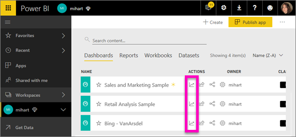
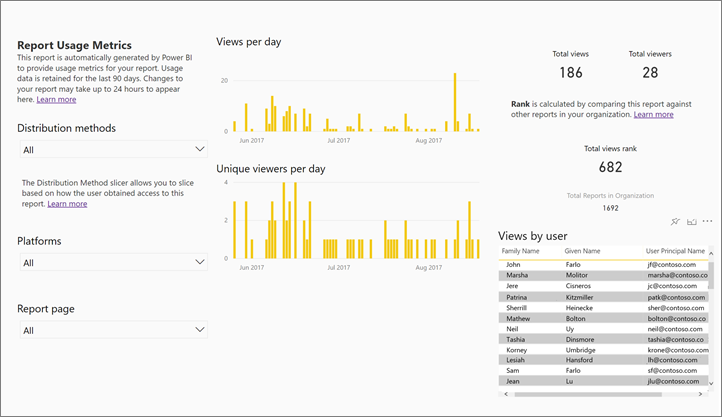
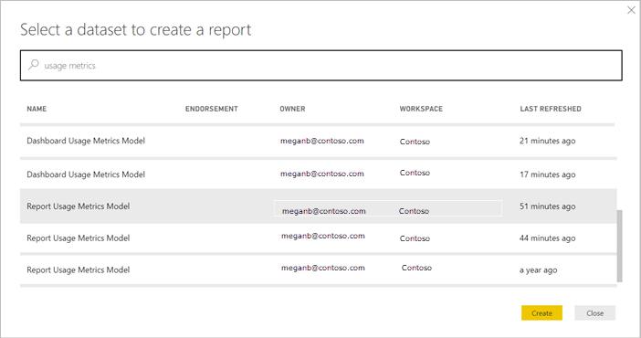
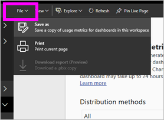
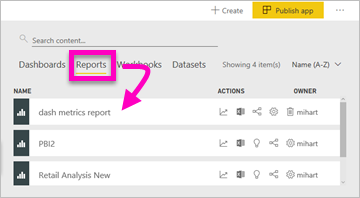
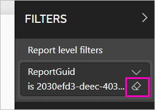

# Monitor usage metrics for Power BI dashboards and reports

If you create dashboards and reports, usage metrics help you understand their impact. When you run either dashboard usage metrics or report usage metrics, you discover how those dashboards and reports are being used throughout your organization, who's using them, and for what purpose.  

Usage metrics reports are read-only. However, you can copy a usage metrics report. Copying creates a standard Power BI report that you can edit. You can also build your own reports in Power BI Desktop based on the underlying dataset, which contains usage metrics for all dashboards or all reports in a workspace. To begin with, the copied report shows metrics just for the selected dashboard or report. You can remove the default filter and have access to the underlying dataset, with all the usage metrics of the selected workspace. You may even see the names of specific users, if your admin has allowed that.

> [!NOTE]
> Usage metrics track usage of reports that are embedded in SharePoint Online. However, usage metrics don't track dashboards and reports embedded via the “user owns credentials” or “app owns credentials” flow. Usage metrics also don't track usage of reports embedded via [publish to web](service-publish-to-web.md).

## Why usage metrics are important

Knowing how your content is being used helps you demonstrate your impact and prioritize your efforts. Your usage metrics may show that one of your reports is used daily by a huge segment of the organization and it may show that a dashboard you created isn't being viewed at all. This type of feedback is invaluable in guiding your work efforts.

You can only run usage metrics reports in the Power BI service. However, if you save a usage metrics report or pin it to a dashboard, you can open and interact with that report on mobile devices.

## Prerequisites

- You need a Power BI Pro license to run and access the usage metrics data. However, the usage metrics feature captures usage information from all users, regardless of the license they're assigned.
- To access usage metrics for a particular dashboard or report, you must have edit access to that dashboard or report.
- Your Power BI admin has to have enabled usage metrics for content creators. You Power BI admin may have also enabled collecting per-user data in usage metrics. Read about how to [enable these options in the admin portal](admin/service-admin-portal.md#control-usage-metrics). 

## View a Usage Metrics report

1. Start in the workspace that contains the dashboard or report.
2. From either the workspace content list or from the dashboard or report itself, select the icon for **Usage metrics**  .

    

    
3. The first time you do this, Power BI creates the usage metrics report and lets you know when it's ready.

    
4. To see the results, select **View usage metrics**.

    Usage metrics are a powerful ally as you work to deploy and maintain Power BI dashboards and reports. Wondering which pages of your report are most useful, and which ones you should phase out? Slice by **Report page** to find out. Wondering if you should build a mobile layout for your dashboard? Slice by **Platforms** to discover how many users are accessing your content via the mobile apps vs. via web browser.

5. Optionally, hover over a visualization and select the pin icon to add the visualization to a dashboard. Or, from the top menu bar, select **Pin Live Page** to add the entire page to a dashboard. From the dashboard you can monitor the usage metrics more easily or share them with others.

    > [!NOTE]
    > If you pin a tile from a usage metrics report to a dashboard, you can't add that dashboard to an app.

### Dashboard Usage Metrics report

### Report Usage Metrics report

## About the Usage Metrics report

When you select **Usage metrics** or the icon  next to a dashboard or report, Power BI generates a pre-built report with usage metrics for that content for the last 90 days.  The report looks similar to the Power BI reports you're already familiar with. You can slice based on how your end users received access, whether they accessed via the web or mobile app, etc. As your dashboards and reports evolve, so too will the usage metrics report, which updates every day with new data.  

Usage metrics reports don't show up in **Recent**, **Workspaces**, **Favorites**, or other content lists. They can't be added to an app. If you pin a tile from a usage metrics report to a dashboard, you can't add that dashboard to an app.

To dig into the report data, or to build your own reports against the underlying dataset, you have two options: 

- Make a copy of the report in the Power BI service. See [Save a copy of the Usage Metrics report](#save-a-copy-of-the-usage-metrics-report) later in this article for details.
- Connect to the dataset from Power BI Desktop. For every workspace, the dataset has the name "Report Usage Metrics Model." See [Establish a connection to a published dataset](desktop-report-lifecycle-datasets.md#establish-a-power-bi-service-live-connection-to-the-published-dataset) for details.

    

## Which metrics are reported?

| Metric | Dashboard | Report | Description |
| --- | --- | --- | --- |
| Distribution method slicer |yes |yes |How users got access to the content. There are 3 possible methods: users can access the dashboard or report by being members of a [workspace](consumer/end-user-experience.md), by having the content [shared with them](service-share-dashboards.md), or by installing a content pack/app.  Note that views through an app are counted as "content pack." |
| Platforms slicer |yes |yes |Was the dashboard or report accessed via the Power BI service (powerbi.com) or a mobile device? Mobile includes all our iOS, Android, and Windows apps. |
| Report page slicer |no |yes |If the report has more than 1 page, slice the report by the page(s) that was viewed. If you see a list option for "Blank," that means a report page was recently added (within 24 hours the actual name of the new page appears in the slicer list) and/or report pages have been deleted. "Blank" captures these types of situations. |
| Views per day |yes |yes |Total number of views per day - a view is defined as a user loading a report page or dashboard. |
| Unique viewers per day |yes |yes |Number of *different* users who viewed the dashboard or report (based on the AAD user account). |
| Views per user |yes |yes |Number of views in the past 90 days, broken down by individual users. |
| Shares per day |yes |no |Number of times the dashboard was shared with another user or group. |
| Total views |yes |yes |Number of views in the past 90 days. |
| Total viewers |yes |yes |Number of unique viewers in the past 90 days. |
| Total shares |yes |no |Number of times the dashboard or report was shared in the past 90 days. |
| Total in organization |yes |yes |Count of all dashboards or reports in the entire organization which had at least one view in the past 90 days.  Used to calculate rank. |
| Rank: Total views |yes |yes |For total views of all dashboards or reports in the organization over the past 90 days, where does this dashboard or report rank. |
| Rank: Total shares |yes |no |For total shares of all dashboards in the organization over the past 90 days, where does this dashboard or report rank. |

## Save a copy of the Usage Metrics report

Use **Save as** to convert the usage metrics report to a regular Power BI report that you can customize to meet your specific needs. You can also use Power BI Desktop to build custom usage metrics reports based on the underlying dataset. See [Establish a connection to a published dataset](desktop-report-lifecycle-datasets.md#establish-a-power-bi-service-live-connection-to-the-published-dataset) for details.

Better yet, the underlying dataset includes the usage details for all dashboards or reports in the workspace. This opens up more possibilities. You could, for example, create a report that compares all dashboards in your workspace based on usage. Or you could create a usage metrics dashboard for your Power BI app by aggregating usage across all the content distributed within that app.  See how to remove the filter and [see all usage metrics for the workspace](#see-all-workspace-usage-metrics) later in this article.

### Create a copy of the usage report

When you create a copy of the read-only, pre-built usage report, Power BI creates an editable copy of the report. At first glance, it looks the same. However, you can now open the report in Editing view, add new visualizations, filters, and pages, modify or delete existing visualizations, and so on. Power BI saves the new report in the current workspace.

1. From the pre-built usage metrics report, select **File > Save As**. Power BI creates an editable Power BI report, saved in the current workspace.

    
2. Open the report in Editing view and [interact with it as you would with any other Power BI report](service-interact-with-a-report-in-editing-view.md). For example, add new pages and build new visualizations, add filters, format the fonts and colors, etc.

    
3. The new report is saved to the **Reports** tab in the current workspace, and added to the **Recent** content list.

    

## See *all* workspace usage metrics

To see the metrics for all the dashboards or for all the reports in the workspace, you have to remove a filter. By default, the report is filtered to display metrics for only the dashboard or report that you used to create it.

1. Select **Edit report** to open the new editable report in Editing view.

    
2. In the Filters pane, locate the **Report level filters** bucket and remove the filter by selecting the eraser next to **ReportGuid**.

    

    Now your report displays metrics for the entire workspace.

## Power BI admin controls for usage metrics

Usage metrics reports are a feature that the Power BI or Office 365 administrator can turn on or off. Administrators have granular control over which users have access to usage metrics; they are **On** by default for all users in the organization.

> [!NOTE]
> Only admins for the Power BI tenant can see the Admin portal and edit settings. 

By default, per-user data is enabled for usage metrics, and content consumer account information is included in the metrics report. If admins don’t want to expose this information for some or all users, they can disable the feature for specified security groups or for an entire organization. Account information then shows in the report as *Unnamed*.

When disabling usage metrics for their entire organization, admins can use the **delete all existing usage metrics content** option to delete all existing reports and dashboard tiles that were built using the usage metrics reports. This option removes all access to usage metrics data for all users in the organization who may already be using it. Deleting existing usage metrics content is irreversible.

See [Control usage metrics](admin/service-admin-portal.md#control-usage-metrics) in the Admin portal article for details on these settings. 

## Usage metrics in national clouds

Power BI is available in separate national clouds. These clouds offer the same levels of security, privacy, compliance and transparency as the global version of Power BI, combined with a unique model for local regulations on service delivery, data residency, access, and control. Due to this unique model for local regulations, usage metrics aren't available in national clouds. For more information, see [national clouds](https://powerbi.microsoft.com/clouds/).

## Considerations and limitations

### Discrepancies between audit logs and usage metrics

It's important to understand that differences can occur when comparing usage metrics and audit logs, and why. *Audit logs* are collected using data from the Power BI service, and *usage metrics* are collected on the client. Aggregate counts of activities in audit logs may not always match usage metrics, because of the following:

* Usage metrics may sometimes undercount activities due to inconsistent network connections, ad blockers, or other issues that can disrupt sending the events from the client.
* Certain types of views aren't included in usage metrics, as described earlier in this article.
* Usage metrics may sometimes overcount activities, in situations where the client refreshes without the need for a request being sent back to the Power BI service.

### Other considerations

You need to view the content in your workspace, from within that workspace, at least once. If there are no views of the content from the workspace itself at least once, data isn't correlated from the application views in the Usage Metrics Report. To unblock the processing of data for this report, just view the content from your workspace at least once.

## Frequently asked questions

In addition to potential differences between usage metrics and audit logs, the following questions and answers about usage metrics may be helpful for users and administrators:

**Q:**    I can't run usage metrics on a dashboard or report

**A:**    You can only see usage metrics for content you own or have permissions to edit.

**Q:**    Do usage metrics capture views from embedded dashboards and reports?

**A:**    Usage metrics currently don't support capturing usage for embedded dashboards, reports, and the [publish to web](service-publish-to-web.md) flow. In those cases, we recommend using existing web analytics platforms to track usage for the hosting app or portal.

**Q:**    I can't run usage metrics on any content at all.

**A1:**    Admins can turn off this feature for their organization.  Contact your admin to see if this is the case.

**A2:**    Usage metrics is a Power BI Pro feature.

**Q:**    The data doesn't seem up to date. For example, distribution methods don't show up, report pages are missing, etc.

**A:**    It can take up to 24 hours for data to update.

**Q:**    There are four reports in the workspace but the usage metrics report only displays three.

**A:**    The usage metrics report only includes reports (or dashboards) that have been accessed in the past 90 days.  If a report (or dashboard) doesn't show up, likely it hasn't been used in more than 90 days.

## Next steps

[Administering Power BI in the admin portal](admin/service-admin-portal.md)

More questions? [Try the Power BI Community](https://community.powerbi.com/)
