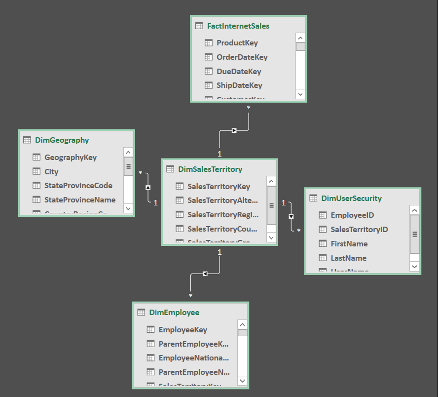
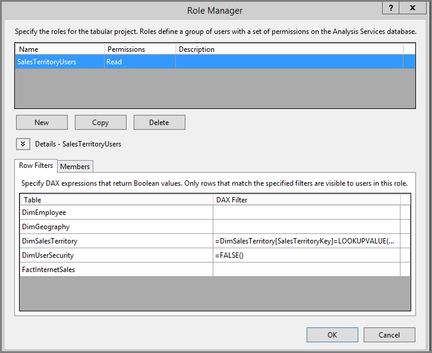
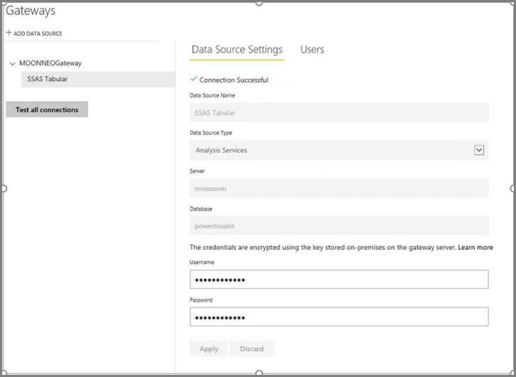
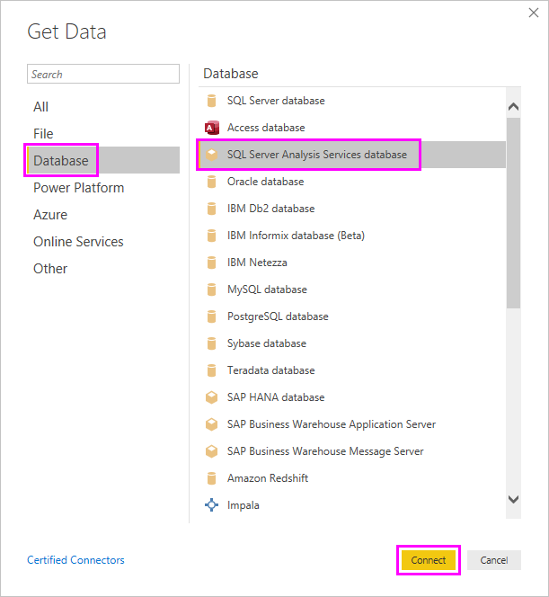

# Implement row-level security in an Analysis Services tabular model

Using a sample dataset to work through the steps below, this tutorial shows you how to implement [**row-level security**](../admin/service-admin-rls.md) in an *Analysis Services Tabular Model* and use it in a Power BI report.

* Create a new security table in the [AdventureworksDW2012 database](https://github.com/Microsoft/sql-server-samples/releases/tag/adventureworks)
* Build the tabular model with necessary fact and dimension tables
* Define user roles and permissions
* Deploy the model to an *Analysis Services tabular* instance
* Build a Power BI Desktop report that displays data tailored to the user accessing the report
* Deploy the report to *Power BI service*
* Create a new dashboard based on the report
* Share the dashboard with your coworkers

This tutorial requires the [AdventureworksDW2012 database](https://github.com/Microsoft/sql-server-samples/releases/tag/adventureworks).

## Task 1: Create the user security table and define data relationship

You can find many articles describing how to define row-level dynamic security with the *SQL Server Analysis Services (SSAS) tabular* model. For our sample, we use [Implement Dynamic Security by Using Row Filters](/analysis-services/tutorial-tabular-1200/supplemental-lesson-implement-dynamic-security-by-using-row-filters).

The steps here require using the AdventureworksDW2012 relational database.

1. In AdventureworksDW2012, create the `DimUserSecurity` table as shown below. You can use [SQL Server Management Studio (SSMS)](/sql/ssms/download-sql-server-management-studio-ssms) to create the table.

   

1. Once you create and save the table, you need to establish the relationship between the `DimUserSecurity` table's `SalesTerritoryID` column and the `DimSalesTerritory` table's `SalesTerritoryKey` column, as shown below.

   In SSMS, right-click **DimUserSecurity**, and select **Design**. Then select **Table Designer** > **Relationships...**. When done, save the table.

   

1. Add users to the table. Right-click **DimUserSecurity** and select **Edit Top 200 Rows**. Once you've added users, the `DimUserSecurity` table should appear similar to the following example:

   

   You'll see these users in upcoming tasks.

1. Next, do an *inner join* with the `DimSalesTerritory` table, which shows the user associated region details. The SQL code here does the inner join, and the image shows how the table then appears.

    ```sql
    select b.SalesTerritoryCountry, b.SalesTerritoryRegion, a.EmployeeID, a.FirstName, a.LastName, a.UserName from [dbo].[DimUserSecurity] as a join [dbo].[DimSalesTerritory] as b on a.[SalesTerritoryID] = b.[SalesTerritoryKey]
    ```

   The joined table shows who is responsible for each sales region, thanks to the relationship created in Step 2. For example, you can see that *Rita Santos* is responsible for *Australia*.

## Task 2: Create the tabular model with facts and dimension tables

Once your relational data warehouse is in place, you need to define the tabular model. You can create the model using [SQL Server Data Tools](/sql/ssdt/sql-server-data-tools) (SSDT). For more information, see [Create a New Tabular Model Project](/analysis-services/tutorial-tabular-1400/as-lesson-1-create-a-new-tabular-model-project).

1. Import all the necessary tables into the model as shown below.

    

1. Once you've imported the necessary tables, you need to define a role called *SalesTerritoryUsers* with Read permission. Select the **Model** menu in SQL Server Data Tools, and then select **Roles**. In **Role Manager**, select **New**.

1. Under **Members** in the **Role Manager**, add the users that you defined in the `DimUserSecurity` table in [Task 1](#task-1-create-the-user-security-table-and-define-data-relationship).

    

1. Next, add the proper functions for both `DimSalesTerritory` and `DimUserSecurity` tables, as shown below under **Row Filters** tab.

    

1. The `LOOKUPVALUE` function returns values for a column in which the Windows user name matches the one the `USERNAME` function returns. You can then restrict queries to where the `LOOKUPVALUE` returned values match ones in the same or related table. In the **DAX Filter** column, type the following formula:

    ```dax
        =DimSalesTerritory[SalesTerritoryKey]=LOOKUPVALUE(DimUserSecurity[SalesTerritoryID], DimUserSecurity[UserName], USERNAME(), DimUserSecurity[SalesTerritoryID], DimSalesTerritory[SalesTerritoryKey])
    ```

    In this formula, the `LOOKUPVALUE` function returns all values for the `DimUserSecurity[SalesTerritoryID]` column, where the `DimUserSecurity[UserName]` is the same as the current logged on Windows user name, and `DimUserSecurity[SalesTerritoryID]` is the same as the `DimSalesTerritory[SalesTerritoryKey]`.

    > [!IMPORTANT]
    > When using row-level security, the DAX function [USERELATIONSHIP](/dax/userelationship-function-dax) is not supported.

   The set of Sales `SalesTerritoryKey`'s `LOOKUPVALUE` returns is then used to restrict the rows shown in the `DimSalesTerritory`. Only rows where the `SalesTerritoryKey` value is in the IDs that the `LOOKUPVALUE` function returns are displayed.

1. For the `DimUserSecurity` table, in the **DAX Filter** column, add the following formula:

    ```dax
        =FALSE()
    ```

    This formula specifies that all columns resolve to `false`; meaning `DimUserSecurity` table columns can't be queried.

Now you need to process and deploy the model. For more information, see [Deploy](/analysis-services/tutorial-tabular-1200/lesson-13-deploy).

## Task 3: Add Data Sources within your On-premises data gateway

Once your tabular model is deployed and ready for consumption, you need to add a data source connection to your on-premises Analysis Services tabular server.

1. To allow the Power BI service access to your on-premises analysis service, you need an [on-premises data gateway](service-gateway-onprem.md) installed and configured in your environment.

1. Once the gateway is correctly configured, you need to create a data source connection for your *Analysis Services* tabular instance. For more information, see [Manage your data source - Analysis Services](service-gateway-enterprise-manage-ssas.md).

   

With this procedure complete, the gateway is configured and ready to interact with your on-premises Analysis Services data source.

## Task 4: Create report based on analysis services tabular model using Power BI desktop

1. Start Power BI Desktop and select **Get Data** > **Database**.

1. From the data sources list, select the **SQL Server Analysis Services Database** and select **Connect**.

   

1. Fill in your Analysis Services tabular instance details and select **Connect live**. Then select **OK**.
  
   

   With Power BI, dynamic security works only with a live connection.

1. You can see that the deployed model is in the Analysis Services instance. Select the respective model and then select **OK**.

   Power BI Desktop now displays all the available fields, to the right of the canvas in the **Fields** pane.

1. In the **Fields** pane, select the **SalesAmount** measure from the **FactInternetSales** table and the **SalesTerritoryRegion** dimension from the **SalesTerritory** table.

1. To keep this report simple, we won't add any more columns right now. To have a more meaningful data representation, change the visualization to **Donut chart**.

   

1. Once your report is ready, you can directly publish it to the Power BI portal. From the **Home** ribbon in Power BI Desktop, select **Publish**.

## Task 5: Create and share a dashboard

You've created the report and published it to the **Power BI** service. Now you can use the example created in previous steps to demonstrate the model security scenario.

In the role as *Sales Manager*, the user Grace can see data from all the different sales regions. Grace creates this report and publishes it to the Power BI service. This report was created in the previous tasks.

Once Grace publishes the report, the next step is to create a dashboard in the Power BI service called *TabularDynamicSec* based on that report. In the following image, notice that Grace can see the data corresponding to all the sales region.

   

Now Grace shares the dashboard with a colleague, Rita, who is responsible for the Australia region sales.

   

When Rita logs in to the Power BI service and views the shared dashboard that Grace created, only sales from the Australia region are visible.

Congratulations! The Power BI service shows the dynamic row-level security defined in the on-premises Analysis Services tabular model. Power BI uses the `EffectiveUserName` property to send the current Power BI user credential to the on-premises data source to run the queries.

## Task 6: Understand what happens behind the scenes

This task assumes you're familiar with [SQL Server Profiler](/sql/tools/sql-server-profiler/sql-server-profiler), since you need to capture a SQL Server profiler trace on your on-premises SSAS tabular instance.

The session gets initialized as soon as the user, Rita, accesses the dashboard in the Power BI service. You can see that the **salesterritoryusers** role takes an immediate effect with the effective user name as **<EffectiveUserName>rita@contoso.com</EffectiveUserName>**

       <PropertyList><Catalog>DefinedSalesTabular</Catalog><Timeout>600</Timeout><Content>SchemaData</Content><Format>Tabular</Format><AxisFormat>TupleFormat</AxisFormat><BeginRange>-1</BeginRange><EndRange>-1</EndRange><ShowHiddenCubes>false</ShowHiddenCubes><VisualMode>0</VisualMode><DbpropMsmdFlattened2>true</DbpropMsmdFlattened2><SspropInitAppName>PowerBI</SspropInitAppName><SecuredCellValue>0</SecuredCellValue><ImpactAnalysis>false</ImpactAnalysis><SQLQueryMode>Calculated</SQLQueryMode><ClientProcessID>6408</ClientProcessID><Cube>Model</Cube><ReturnCellProperties>true</ReturnCellProperties><CommitTimeout>0</CommitTimeout><ForceCommitTimeout>0</ForceCommitTimeout><ExecutionMode>Execute</ExecutionMode><RealTimeOlap>false</RealTimeOlap><MdxMissingMemberMode>Default</MdxMissingMemberMode><DisablePrefetchFacts>false</DisablePrefetchFacts><UpdateIsolationLevel>2</UpdateIsolationLevel><DbpropMsmdOptimizeResponse>0</DbpropMsmdOptimizeResponse><ResponseEncoding>Default</ResponseEncoding><DirectQueryMode>Default</DirectQueryMode><DbpropMsmdActivityID>4ea2a372-dd2f-4edd-a8ca-1b909b4165b5</DbpropMsmdActivityID><DbpropMsmdRequestID>2313cf77-b881-015d-e6da-eda9846d42db</DbpropMsmdRequestID><LocaleIdentifier>1033</LocaleIdentifier><EffectiveUserName>rita@contoso.com</EffectiveUserName></PropertyList>

Based on the effective user name request, Analysis Services converts the request to the actual `contoso\rita` credential after querying the local Active Directory. Once Analysis Services gets the credential, Analysis Services returns the data the user has permission to view and access.

If more activity occurs with the dashboard, with SQL Profiler you would see a specific query coming back to the Analysis Services tabular model as a DAX query. For example, if Rita goes from the dashboard to the underlying report, the following query occurs.

   

You can also see below the DAX query that is getting executed to populate report data.
   
   ```dax
   EVALUATE
     ROW(
       "SumEmployeeKey", CALCULATE(SUM(Employee[EmployeeKey]))
     )
   
   <PropertyList xmlns="urn:schemas-microsoft-com:xml-analysis">``
             <Catalog>DefinedSalesTabular</Catalog>
             <Cube>Model</Cube>
             <SspropInitAppName>PowerBI</SspropInitAppName>
             <EffectiveUserName>rita@contoso.com</EffectiveUserName>
             <LocaleIdentifier>1033</LocaleIdentifier>
             <ClientProcessID>6408</ClientProcessID>
             <Format>Tabular</Format>
             <Content>SchemaData</Content>
             <Timeout>600</Timeout>
             <DbpropMsmdRequestID>8510d758-f07b-a025-8fb3-a0540189ff79</DbpropMsmdRequestID>
             <DbPropMsmdActivityID>f2dbe8a3-ef51-4d70-a879-5f02a502b2c3</DbPropMsmdActivityID>
             <ReturnCellProperties>true</ReturnCellProperties>
             <DbpropMsmdFlattened2>true</DbpropMsmdFlattened2>
             <DbpropMsmdActivityID>f2dbe8a3-ef51-4d70-a879-5f02a502b2c3</DbpropMsmdActivityID>
           </PropertyList>
   ```

## Considerations

* On-premises row-level security with Power BI is only available with live connection.

* Any changes in the data after processing the model would be immediately available for the users accessing the report with live connection from the Power BI service.
