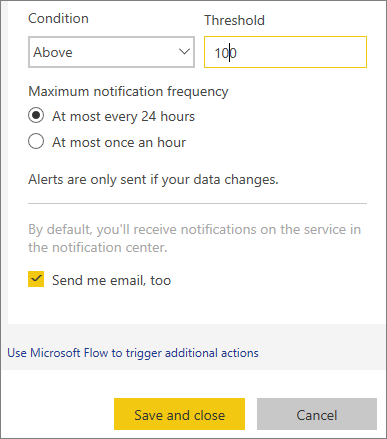
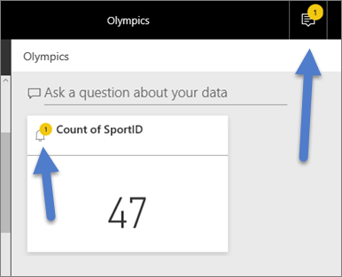
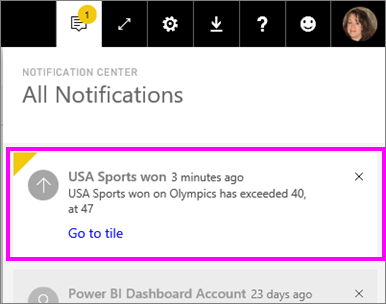

# Tutorial: Set data alerts in Power BI service
Set alerts to notify you when data in your dashboards changes beyond limits you set. Or Else ...  

You can set alerts on tiles if you have a Power BI Pro license, or if a dashboard has been shared with you from a [Premium capacity](../service-premium-what-is.md). Alerts can only be set on tiles pinned from report visuals, and only on gauges, KPIs and cards. Alerts can be set on visuals created from streaming datasets that have been pinned from a report to a dashboard, but cannot be set on streaming tiles created directly on the dashboard using **Add tile** > **Custom streaming data**. 

Only you can see the alerts you set, even if you share your dashboard. Data alerts are fully synchronized across platforms; set and view data alerts [in the Power BI mobile apps](mobile/mobile-set-data-alerts-in-the-mobile-apps.md) and in the Power BI service. 

> [!WARNING]
> Data-driven alert notifications provide information about your data. If you view your Power BI data on a mobile device and that device gets stolen, we recommend using the Power BI service to turn off all data-driven alert rules.
> 

This tutorial covers the following.
> [!div class="checklist"]
> * Who can set alerts
> * Which visuals support alerts
> * Who can see my alerts
> * Do alerts work on Power BI Desktop and mobile
> * How do I create an alert
> * Where will I receive my alerts

If you're not signed up for Power BI, [sign up for a free trial](https://app.powerbi.com/signupredirect?pbi_source=web) before you begin.

## Set data alerts in Power BI service
Watch Amanda add some alerts to tiles on their dashboard. Then follow the step-by-step instructions below the video to try it out yourself.

<iframe width="560" height="315" src="https://www.youtube.com/embed/JbL2-HJ8clE" frameborder="0" allowfullscreen></iframe>

This example uses a card tile from the [Retail Analysis sample](http://go.microsoft.com/fwlink/?LinkId=529778) dashboard.

1. From a dashboard gauge, KPI, or card tile, select the ellipsis.
   
   
2. Select the bell icon , or **Manage alerts**, to add one or more alerts for **Total stores**.
   
1. On the **Manage alerts** pane, select **+ Add alert rule**.  Ensure the slider is set to **On**, and give your alert a title. Titles help you easily recognize your alerts.
   
   
4. Scroll down and enter the alert details.  In this example we'll create an alert that notifies us once a day if the number of total stores goes above 100. Alerts will appear in our Notification center. And we'll have Power BI send us an email as well.
   
   
5. Select **Save and close**.

## Receiving alerts
When the data being tracked reaches one of the thresholds you've set, several things happen. First, Power BI checks to see if it has been more than an hour, or more than 24 hours (depending on the option you selected), since the last alert was sent. As long as the data is past the threshold, you'll get an alert.

Next, Power BI sends an alert to your notification center and, optionally, in email. Each alert contains a direct link to your data. Select the link to see the relevant tile.  

1. If you've set the alert to send you an email, you'll find something like this in your Inbox.
   
   
2. Power BI adds a message to your **Notification center** and adds a new alert icon to the applicable tile.
   
   
3. Open your Notification center to see the alert details.
   
    
   
   > [!NOTE]
   > Alerts only work on data that is refreshed. When data refreshes, Power BI looks to see if an alert is set for that data. If the data has reached an alert threshold, an alert is triggered.
   > 
   > 

## Managing alerts
There are many ways to manage your alerts: From the dashboard tile itself, from the Power BI Settings menu, on an individual tile in the [Power BI mobile app on the iPhone](mobile/mobile-set-data-alerts-in-the-mobile-apps.md) or in the [Power BI mobile app for Windows 10](mobile/mobile-set-data-alerts-in-the-mobile-apps.md).

### From the tile itself
1. If you need to change or remove an alert for a tile, re-open the **Manage alerts** window by selecting the bell icon . All the alerts that you've set for that tile are displayed.
   
    .
2. To modify an alert, select the arrow to the left of the alert name.
   
    .
3. To delete an alert, select the trashcan to the right of the alert name.
   
      

### From the Power BI settings menu
1. Select the gear icon from the Power BI menubar.
   
    .
2. Under **Settings** select **Alerts**.
   
    
3. From here you can turn alerts on and off, open the **Manage alerts** window to make changes, or delete the alert.

## Tips and troubleshooting
* Alerts are currently not supported for Bing tiles, or card tiles with date/time measures.
* Alerts only work with numeric data types.
* Alerts only work on data that is refreshed. They do not work on static data.
* Alerts will only work on streaming datasets if you build a KPI/card/gauge report visual and then pin that visual to the dashboard.

## Clean up resources
Instructions for deleting alerts are explained above. In brief, select the gear icon from the Power BI menubar. Under **Settings** select **Alerts** and delete the alert.

> [!div class="nextstepaction"]
> [Set data alerts on your mobile device](mobile/mobile-set-data-alerts-in-the-mobile-apps.md)

