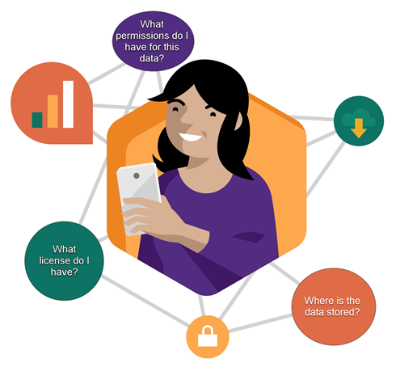
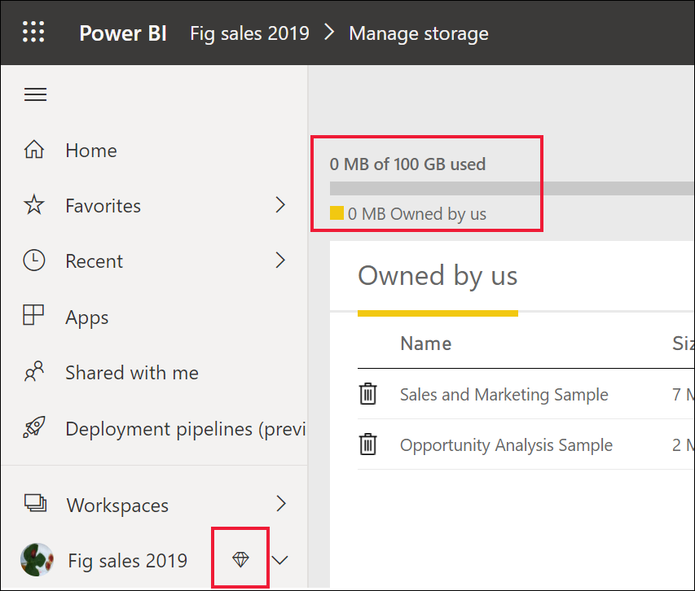

# Using the Power BI service as a *consumer*

[!INCLUDE[consumer-appliesto-ynnn](../includes/consumer-appliesto-ynnn.md)]

As a [*consumer*](end-user-consumer.md), you use the Power BI service to explore reports and dashboards in order to make data-backed business decisions. If you've been using Power BI for a while, or have been chatting with your *designer* colleagues, you've probably discovered that there are some features that only work if you have a certain type of license,  subscription, or permissions. 

What you can do in the Power BI service depends on three things:
1.    the type of license and subscription you are using
2.    where content is stored
3.    the roles and permissions you're assigned

In this article we describe the capabilities of each license and subscription type and how *where content is stored* can affect *what you can do with it*. You'll also learn how to look up your license and subscription and figure out where your content is stored. For more information about roles and permissions, see [workspace roles](end-user-workspaces.md).

## Licenses

Each user of the Power BI service is using either a *free* license or a *Pro* license. If you're a Power BI *consumer*, then you're probably using a free license that was assigned to you by your administrator. 

It is possible to have more than one license at the same time.  The service always delivers you an experience equal to the best license you currently have. 

## Premium subscription

Premium is an *organizational* subscription that provides two ways to store Power BI content: in *shared capacity* or in *dedicated capacity*.  When an admin or a Pro user assigns a [workspace](end-user-workspaces.md) to *dedicated capacity*, they can grant free users access to that workspace. Within that workspace, those free users can collaborate with Pro users. For more information, see [workspace permissions and roles.](end-user-workspaces.md) 

For more info about capacity, see [What is Microsoft Power BI Premium?](../service-premium-what-is.md).

## Find out which license and subscription you have
There are several ways to look up your Power BI license and subscription information. 

First, determine which user license you have.

- Certain versions of Microsoft Office include a Power BI Pro license.  To see if your version of Office includes Power BI, visit [your Microsoft **My account** page](https://portal.office.com/account) and select **Subscriptions**.

    This first user, Pradtanna, has Office 365 E5, which includes a Power BI Pro license.

    

    This second user, Zalan, has a Power BI free license. 

    

Next, check to see if you are part of an organization that has a Premium subscription. Either of the users above, Pro or free, could belong to an organization that has a Premium subscription.  Let's check for our second user, Zalan.  

We can determine whether Zalan's organization has a Premium subscription by looking up the amount of storage available. 

- In the Power BI service, select **My workspace** and then select the cog icon from the upper right corner. Choose **Manage personal storage**.

    

    If you see more than 10 GB, then you are a member of an organizational that has a Premium subscription. The image below shows that Zalan's organization has up to 100 GB of storage.  

    

    As a *consumer* in an organization with a Premium subscription, as long as the *designer* places the workspace in dedicated capacity, Zalan has the ability to view shared content, collaborate with colleagues, work with apps, and more. The extent of his permissions is set by his Power BI administrator and by the content designer. Notice that a Pro user has already shared a workspace with Zalan. The diamond icon indicates that this workspace is stored in dedicated capacity. 

   

## Putting it all together

When an organization purchases a Premium subscription, the administrator typically assigns Pro licenses to the employees who will be creating and sharing content. And the administrator assigns free licenses to everyone who will be consuming that content. The Pro users create [app workspaces](end-user-workspaces.md) and add content (dashboards, reports, apps) to those workspaces. To allow free users to collaborate in those workspaces, the admin or Pro user saves the workspaces in *dedicated capacity*.    
 

|License type  |shared capacity  |dedicated capacity  |
|---------|---------|---------|
|**Free**     |  Create content for yourself. Try out the Power BI service.  1     |   Free users can view and interact with content created by Pro users. Free and Pro users can collaborate without requiring the free users to have Pro accounts.      |
|**Pro**     |  Collaborate with other Pro users by creating and sharing content.        |  Collaborate with free and Pro users by creating and sharing content.       |

1 See [Considerations and troubleshooting](#considerations-and-troubleshooting). 

In the diagram below, the left side represents Pro users who create and share content in app workspaces. 

- **Workspace A** was created in an organization that doesn't have a Premium subscription. 

- **Workspace B** was created in an organization that does have a Premium subscription, though this particular workspace was saved in shared capacity (not dedicated capacity). The workspace does not have the diamond icon.

- **Workspace C** was created in an organization that does have a Premium subscription, and was saved in dedicated capacity. This workspace has a diamond icon.  

    

The Power BI Pro *designer* can share and collaborate with other Pro users in any of the three workspaces. But, the only way the Power BI Pro user can share and collaborate with free users is by using Workspace C, which is in Premium dedicated capacity.  Within the workspace, the designer assigns roles to collaborators. Your role determines what actions you can take within the workspace. Power BI *consumers* are usually assigned the *Viewer* role. To learn more about roles, see [Workspaces for Power BI consumers](end-user-workspaces.md).

## Considerations and troubleshooting
- It is possible to have more than one Power BI license. The Power BI service will always deliver the experience equal to the best license that you currently have. For example, if you have both a Pro and a free license, the Power BI service will use the Pro license.

- If you will be creating and sharing content (dashboards, reports, apps), then you may not be a Power BI *consumer*, but instead be a *designer*. Consider changing to a Pro user license. You can sign up for a free 60 Pro trial either by visiting [powerbi.com](https://powerbi.microsoft.com) or by selecting the upgrade dialog that appears in the Power BI service whenever you attempt to use a Pro feature.

    

  As soon as you've signed up for the free trial, you'll have the same capabilities as a paid Pro user. When the 60-day trial expires, your license changes back to a Power BI free license. After this happens, you no longer have access to features that require a Power BI Pro license. If you'd like to continue with a Pro license, contact your admin about purchasing a Power BI Pro license. If you do not have an admin, visit [the Power BI pricing page](https://powerbi.microsoft.com/pricing/).     

- If you signed up for a free license, it never expires. So if you upgrade to a Pro trial or your organization provides you with a Pro license, and then your trial ends or your organization removes your Pro license, you'd still have the free license to fall back on. 

- 1 A free standalone user license for the Power BI service is perfect for someone exploring or using it for personal data analysis and visualizations using **My workspace**. A free standalone user isn't using Power BI to collaborate with colleagues. Users with free standalone licenses can't view content shared by others or share their own content with other Power BI users. 

    

    All customers with a free standalone license can upgrade to a [free Power BI Pro license trial](../service-self-service-signup-for-power-bi.md). The trial gives you all the power and functionality of a Power BI Pro user.

    

## Next steps
- [Am I a Power BI *consumer*?](end-user-consumer.md)    
- [Learn about workspaces](end-user-workspaces.md)    
- [View Power BI consumer features by license type](end-user-features.md)
