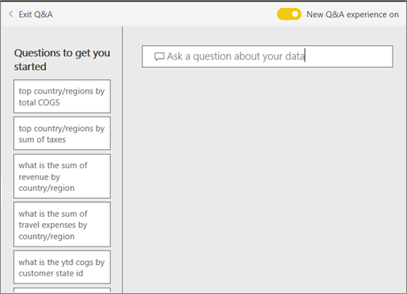
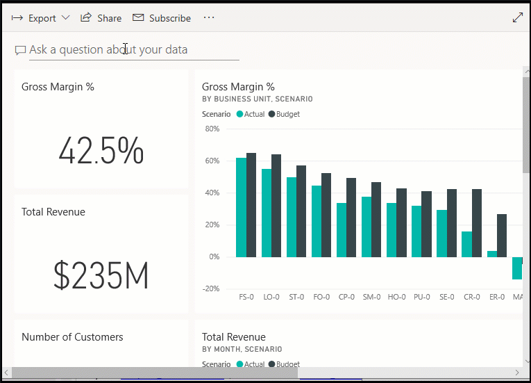

# Q&A for Power BI **consumers**
## What is Q&A?
Sometimes the fastest way to get an answer from your data is to ask a question using natural language. For example, "what were total sales last year."

Use Q&A to explore your data using intuitive, natural language capabilities and receive answers in the form of charts and graphs. Q&A is different from a search engine -- Q&A only provides results about the data in Power BI.

**Power BI Q&A** only supports answering natural language queries asked in English. There is a preview available for Spanish that can be enabled by your Power BI administrator.

**Power BI Q&A** is available with a Pro or Premium license.  [Q&A in the Power BI mobile apps](mobile/mobile-apps-ios-qna.md) and [Q&A with Power BI Embedded](../developer/qanda.md) are covered in separate articles.
>

Asking the question is just the beginning.  Have fun traveling through your data refining or expanding your question, uncovering trust-worthy new information, zeroing in on details and zooming out for a broader view. 
You’ll be delighted by the insights and discoveries you make.

The experience is truly interactive…and fast! Powered by an in-memory storage, response is almost instantaneous.

## Where can I use Q&A?
You'll find Q&A on dashboards in the Power BI service, and at the bottom of the dashboard in Power BI mobile. Unless the designer has given you edit permissions, you'll be able to use Q&A to explore data but won't be able to save any visualizations created with Q&A.

## Use Q&A on a dashboard in the Power BI service
In the Power BI service (app.powerbi.com), a dashboard contains tiles pinned from one or more datasets, so you can ask questions about any of the data contained in any of those datasets. To see what reports and datasets were used to create the dashboard, select **View related** from the menu bar.

## How do I start?
First, get familiar with the content. Take a look at the visuals on the dashboard and in the report. Get a feel for the type and range of data that is available to you. 

For example:

* If a visual's axis labels and values include "sales",  "account", "month", and "opportunities", then you can confidently ask questions such as: "Which *account* has the highest *opportunity*, or show *sales* by month as a bar chart."

* If you have website performance data in Google Analytics, you can ask Q&A about time spent on a web page, number of unique page visits, and user engagement rates. Or, if you’re querying demographic data, you might ask questions about age and household income by location.

Once you're familiar with the data, head back to the dashboard  and place your cursor in the question box. This opens the Q&A screen.

 

Even before you start typing, Q&A displays a new screen with suggestions to help you form your question. You see phrases and complete questions containing the names of the tables in the underlying datasets and may even see complete questions listed if the dataset owner has created featured questions.

You can select any of these to add them to the question box and then refine them to find a specific answer. 

Another way Q&A helps you ask questions is with prompts, auto-complete, and visual cues. 

 

### Which visualization does Q&A use?
Q&A picks the best visualization based on the data being displayed. Sometimes data in the underlying dataset(s) is defined as a certain type or category and this helps Q&A know how to display it. For example, if data is defined as a date type, it is more likely to be displayed as a line chart. Data that is categorized as a city is more likely to be displayed as a map.

You can also tell Q&A which visual to use by adding it to your question. But keep in mind that it may not always be possible for Q&A to display the data in the visual type you requested. Q&A will prompt you with a list of workable visual types.

## Considerations and troubleshooting
**Question**: I don't see Q&A on this dashboard.    
**Answer 1**: If you don't see a question box, first check your settings. To do this, select the cog icon in the upper right corner of your Power BI toolbar.   

Then choose **Settings** > **Dashboards**. Make sure there is a checkmark next to **Show the Q&A search box on this dashboard**.    
  

**Answer 2**: Sometimes the dashboard *designer* or your administrator turns Q&A off. Check with them to see if it's OK to turn it back on.   

**Question**: I'm not getting the results I'd like to see when I type a question.    
**Answer**: Talk to the dashboard *designer*. There are many things the designer can do to improve the Q&A results. For example, the designer can rename columns in the dataset to use terms that are easily understood (`CustomerFirstName` instead of `CustFN`). Since the designer knows the dataset really well, the designer can also come up with helpful questions and add them to the Q&A canvas.

## Next steps
[Q&A tips for Power BI consumers](end-user-q-and-a.md)
