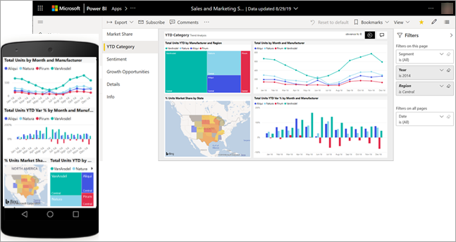
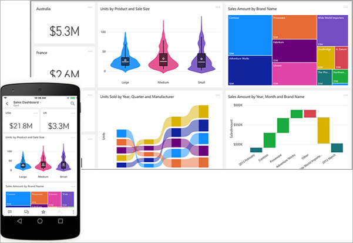
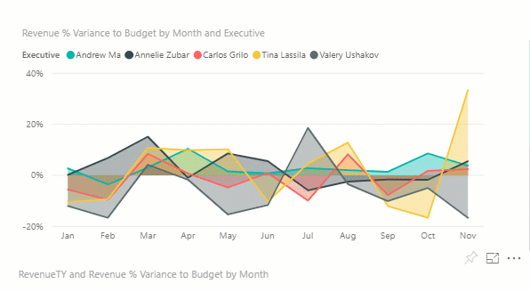

# Quickstart: learn about the Power BI capabilities for *consumers*
In this quickstart, you'll learn how to interact with Power BI to discover data-driven business insights. This article isn't intended to be a deep dive, but rather a quick trip through many of the actions available for Power BI **consumers**.

If you're not signed up for Power BI, [sign up for a free trial](https://app.powerbi.com/signupredirect?pbi_source=web) before you begin.

## What is Power BI? 
Power BI is a collection of software services, apps, and connectors that work together to turn your unrelated sources of data into coherent, visually immersive, and interactive insights. Whether your data is a simple Excel spreadsheet, or a collection of data from different data sources, Power BI lets you easily connect to your data sources, visualize (or discover) what’s important, and share that with anyone or everyone you want. 

## Reading view
Reading view is available in the Power BI service for report *consumers*. When a colleague shares a report, dashboard, or app with you, Reading view is your way to explore and interact with the report. 

Just open the Power BI service, in a browser or on a mobile device. You and your colleagues work from the same trusted apps, dashboards, and reports, that update and refresh automatically, so you’re always working with the freshest content.   

Since the content isn’t static, you can dig in, looking for trends, insights, and other business intelligence. Slice and dice the content, and even ask it questions using your own words. Or, sit back and let your data discover interesting insights for you; send you alerts when data changes, and email reports to you on a schedule you set. All your data, any time, in the cloud or on-premises, from any device. 

Read on to learn about these and more.

## Power BI content
When we use the term "content" in Power BI, we're referring to reports, dashboards, and apps. These are the building blocks you'll use to explore your data and make business decisions. 

> [!NOTE]
> Dashboards, reports, and apps can be viewed and shared on mobile devices, too.

###  Apps

An *app* is a Power BI content type that combines related dashboards and reports, all in one place. An app can have one or more dashboards and one or more reports, all bundled together. Apps are created by Power BI *designers* who distribute and share the apps with *consumers* like you. 

One way to view your apps is to select **Apps** from the nav bar and choose an app to open.

To learn more about viewing apps, see [Power BI apps](end-user-apps.md)

### Reports

A Power BI report is a multi-perspective view into a dataset, with visuals that represent different findings and insights from that dataset. A report can have a single visual or pages full of visuals. Reports are created by Power BI *designers* who distribute and share the reports with *consumers* like you.

To learn how to view reports, see [Power BI reports](end-user-reports.md)

### Dashboards

A Power BI dashboard is a single page, often called a canvas, that uses visualizations to tell a story. Because it is limited to one page, a well-designed dashboard contains only the most-important elements of that story.

The visualizations you see on the dashboard are called tiles and are pinned to the dashboard by report *designers*. In most cases, selecting a tile takes you to the report page where the visualization was created. 

To learn how to view dashboards, see [Power BI dashboards](end-user-dashboards.md)
 
## Interact in the Power BI service

### Collaborate with colleagues
Skip the email. Add a personal comment or start a conversation with colleagues about a dashboard, right there on that dashboard. The comment feature is just one of the ways you can collaborate with others. 

Learn more about [commenting](end-user-comment.md)

### Sit back and let Power BI work for you
Two of the ways that the Power BI service does the work for you is with subscriptions and alerts. 

#### Subscribe to a dashboard (or report)
It's not necessary to open Power BI to monitor a dashboard.  You can subscribe instead, and Power BI will email you a snapshot of that dashboard on a schedule you set. 

.

 Learn more about [Power BI subscriptions](end-user-subscribe.md)

#### Get alerts when your data reaches a threshold
Your data is live, and your visuals update automatically to reflect this. If you want to get notified when data changes above or below a threshold you set, use data alerts. Alerts work on gauges, kpis, and cards.    

Power BI sends you an email when the value increases or decreases past the limit you set.  

Learn more about [Power BI alerts](end-user-alerts.md)

### Use Q&A to ask questions using natural language
Sometimes the fastest way to get an answer from your data is to ask a question using natural language. The Q&A question box is available at the top of your dashboard. For example, "show me count of large opportunities by sales stage as a funnel." 

Learn more about [Power BI Q&A](end-user-q-and-a.md)

### Display details on a visualization
Visuals are made up of datapoints, and by hovering over a datapoint, you can view the details.

### Favorite a dashboard
When you make content a *favorite*,  you'll be able to access it from the nav bar. The  nav bar is visible from just about every area of Power BI. Favorites are typically the dashboards, report pages, and apps that you visit most often.

From the upper right corner of the Power BI service, select **Favorite** or, if not visible, select the **More options** (...) and select **Favorite** from the dropdown. 
   

Take a look at the other actions available in the dropdown.  We don't cover all of these in this article, but we do cover them in other articles.  Learn more by using the Power BI table of contents or **Search** field. 

Learn more about [favorites and featured](end-user-favorite.md)

### Adjust the display dimensions
Reports are viewed on many different devices, with varying screen sizes and aspect ratios.  The default rendering may not be what you want to see on your device.  

To adjust, from the upper right menu bar select **View** and choose one of the display options. 

### See how all the visuals on a page are interconnected
Cross-highlight and cross-filter the related visualizations on a report page. The visualizations on a single report page are all "connected" to each other.  What this means is that if you select one or more values in one visualization, other visualizations that use that same value will change based on your selection.

> 

Learn more about [visual interactions](end-user-interactions.md)

<!-- ###  Open the **Selection** pane
Easily navigate between the visualizations on the report page. 

1. Select **View > Selection pane** to open the Selection pane. Toggle **Selection pane** to On.

    

2. The Selection pane opens on your report canvas. Select a visual from the list to make it active.

     -->

### Zoom in on individual visuals
Hover over a visual and select the **Focus mode** icon . When you view a visualization in Focus mode, it expands to fill the entire report canvas as shown below.

<!-- To display that same visualization without the distraction of menubars, filter pane, and other chrome -- select the **Full Screen** icon from the top menubar    .

 -->

Learn more about [focus mode and full screen mode](end-user-focus.md)

### Sort a visualization
Visuals on a report page can be sorted and saved with your changes applied. 

Hover over a visual to make it active, and select the **More options** (...) to open sorting options.

 

Learn more about [sorting visuals](end-user-search-sort.md)

### Show the data used to create a visualization
A Power BI visualization is constructed using data from underlying datasets. If you're interested in seeing behind-the-scenes, Power BI lets you *display* the data that is being used to create the visual. When you select **Show Data**, Power BI displays the data below (or next to) the visualization.

With a visual active, select the **More options** (...) and choose **Show data**.
   
   

### Export data to Excel
In addition to showing the data that is used to create a visual, you can also export that data and view it in Microsoft Excel. When you export to Excel, you’re creating a separate document, a spreadsheet that isn't part of Power BI. Any changes that you make in the Excel file won’t impact the data in Power BI. Whether you want to take a closer look at the data, or you want to use the data in another application or for another purpose, Power BI gives you that flexibility.

<!-- Exporting isn’t limited to individual visuals; you can export entire reports to PowerPoint or PDF to share with your colleagues.

 -->

This has been a quick overview of just some of the things *consumers* can do with the Power BI service.  

## Clean up resources
- If you connected to an app, from the left navbar, select **Apps** to open the Apps content list. Hover over the app to delete, and select the trashcan icon.

- If you imported or connected to a Power BI sample report, from the left navbar, open **My workspace**. Using the tabs at the top, locate the dashboard, report, and dataset, and select the trashcan icon for each.

## Next steps
[Power BI for consumers](end-user-consumer.md)

