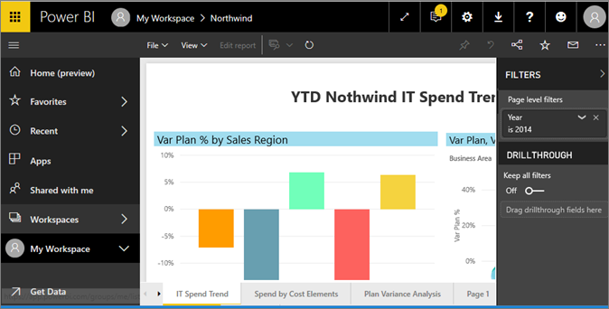
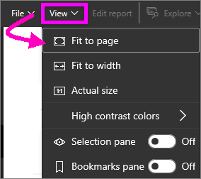
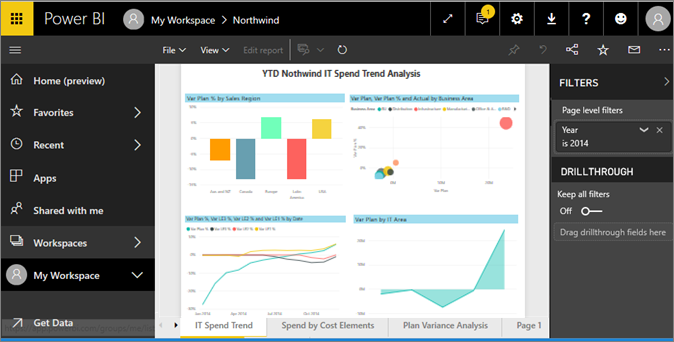
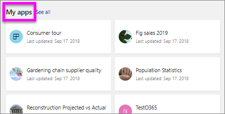
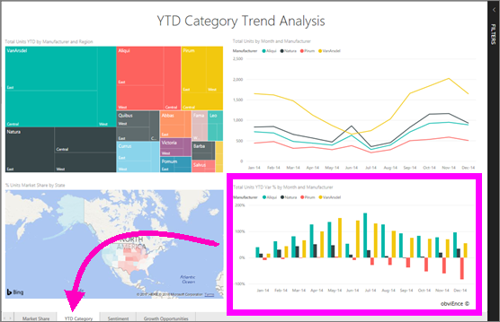

# View a report in Power BI service for *consumers*
A report is one or more pages of visuals. Reports are  created by Power BI *report designers* and [shared with *consumers* directly](end-user-shared-with-me.md) or as part of an [app](end-user-apps.md). 

There are many different ways to open a report and we'll show you two of them: open from the Home page and open from a dashboard. 

<!-- add art-->

## Open a report from your Home page
Let's open a report that's been shared with you directly and then open a report that was shared as part of an app.

   

### Open a report that has been shared with you
Power BI *designers* can share a report directly with you by clicking a **Share** button on their top menu bar. Content that is shared this way shows up in the **Shared with me** container on your left nav bar and in the **Shared with me** section of your Home page.

1. Open Power BI service (app.powerbi.com).

2. From the left navigation bar, select **Home (Preview)** to open your Home page.  

   
   
3. Scroll down until you see **Shared with me**. Look for the report icon . In this screenshot we have two reports: *Financial* and *Northwind*. 
   
   

4. Simply select one of the report *cards* to open the report.

   

5. Notice the tabs along the bottom. Each tab represents a report *page*. We currently have the *IT Spend Trend* page open. Select a different tab to open that report page. 

   

6. Right now we can only see a portion of the report page. To change the display (zoom) of the page, select **View** > **Fit to page**.

   

   

### Open a report that is part of an app
If you've received apps from colleagues or from AppSource, those apps are available from your Home page and from the **Apps** container on your left nav bar. An [app](end-user-apps.md) is a bundle of dashboards and reports.

1. Go back to your Home page by selecting **Home (Preview)** from the left nav bar.

7. Scroll down until you see **My Apps**.

   

8. Select one of the apps to open it. Depending on the options set by the app *designer*, the app will open either a dashboard, a report, or an app content list. If selecting the app:
    - opens the report, you're all set.
    - opens a dashboard, see [Open a report from a dashboard](#Open-a-report-from-a-dashboard), below.
    - opens the app content list, under **Reports** select the report to open it.

## Open a report from a dashboard
Reports can be opened from a dashboard. Most dashboard tiles are *pinned* from reports. Selecting a tile opens the report that was used to create the tile. 

1. From a dashboard, select a tile. In this example we've selected the "Total Units YTD..." column chart tile.

    

2.  The associated report opens. Notice that we're on the "YTD Category" page. This is the report page that contains the column chart we selected from the dashboard.

    

> [!NOTE]
> Not all tiles lead to a report. 
>If you select a tile that was [created with Q&A](../end-user-q-and-a.md), the Q&A screen will open. 
>If you select a tile that was [created using the dashboard **Add tile** widget](../service-dashboard-add-widget.md), several different things may happen.  

##  Still more ways to open a report
As you get more comfortable navigating Power BI service, you'll figure out workflows that work best for you. A few other ways to access reports:
- From the left navpane using **Favorites** and **Recent**    
- Using [View related](end-user-related.md)    
- In an email, when someone [shares with you](../service-share-reports.md) or you [set an alert](../end-user-alerts.md)    
- From your [Notification center](end-user-notification-center.md)    
- and more

## Next steps
There are [so many ways to interact with a report](end-user-reading-view.md).  Start exploring by selecting each tab at the bottom of the report canvas.

