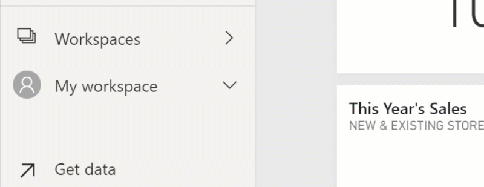
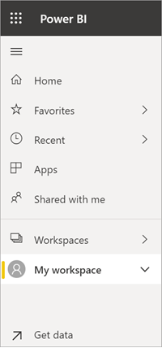

# Navigation: searching, finding, and sorting content in Power BI service

[!INCLUDE [power-bi-service-new-look-include](../includes/power-bi-service-new-look-include.md)]

There are many ways to navigate to your content in the Power BI service. The content is organized within your workspace by type: dashboards and reports.  And the content is also organized by usage: favorites, recent, apps, shared with me, and featured. For one stop navigation, Power BI *Home* organizes content all on one page. These different pathways into your content allow you to quickly find what you need in the Power BI service.  

## Navigation within workspaces

Power BI *consumers* typically have only one workspace: **My workspace**. **My workspace** will contain content if you've downloaded Microsoft samples or created or downloaded your own dashboards, reports, or apps.  

Within **My workspace**, the Power BI service separates your content by type: dashboards, reports, workbooks, and datasets. You'll see this organization when you select a workspace. In this example, **My workspace** contains one dashboards, one report, no workbooks, and one dataset.

________________________________________
## Navigation using the Search field
Use the **My workspace** content view to search, filter and sort your content. In the Search field, type all or part of the name of a dashboard, report, workbook, or owner.  

If you only have a few pieces of content, searching and sorting isn't necessary.  But when you have long lists of dashboards and reports, you'll find searching and sorting extremely helpful. For example, the report list, below, has 83 items. 

You can also sort the content by name or owner. Notice the up arrow to the right of **Name**. We're currently sorting 83 items alphabetically by name, ascending. To change the sort order to descending, select **Name**. The up arrow changes to a down arrow.

Not all columns can be sorted. Hover over the column headings to discover which are able to be sorted.

___________________________________________________________________
## Navigation using the navigation pane
The navigation pane (nav pane) classifies your content in ways that help you find what you need, quickly.  

- Content that is shared with you is available in **Shared with me**.
- Your last-viewed content is available in **Recent**. 
- Your apps can be found by selecting **Apps**.
- **Home** is a single page view of your most important content and suggested content and learning sources.

Additionally, you can tag content as [favorite](end-user-favorite.md) and [featured](end-user-featured.md). Pick the one dashboard or report that you expect to view most often, and set it as your *featured* content. Each time you open the Power BI service, your featured dashboard will display first. Do you have a number of dashboards and apps that you visit often? By setting them as favorites, they'll always be available from your left nav bar.

.

## Considerations and troubleshooting
* For datasets, **Sort by** isn't available by owner.

## Next steps
[Sort visuals in reports](end-user-change-sort.md)

More questions? [Try the Power BI Community](http://community.powerbi.com/)
