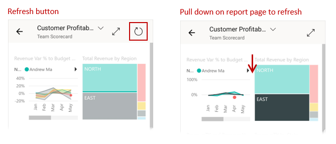
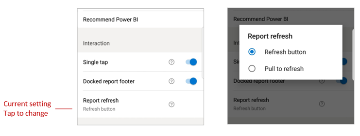

# Configure report interaction settings

## Overview

The Power BI mobile app has a number of configurable "interaction" settings that enable you to control how you interact with your data, and to define how some elements in the Power BI mobile app behave. The table below shows the interaction settings that are currently available and the devices which have them.

|| Android phone | iPhone | Android tablet  | iPad |
|-|:-:|:-:|:-:|:-:|
| [Single versus double tap interaction on report visuals](#single-tap) |✔|✔|||
| [Multi-select versus single select of data points on report visuals](#multi-select) |✔|✔|✔|✔|
| [Docked versus dynamic report footer](#docked-report-footer) |✔|✔|||
| [Button-initiated report refresh versus pull-to-refresh](#report-refresh) |✔||||
|

To get to the interaction settings, tap your profile picture to open the [side panel](./mobile-apps-home-page.md#header), choose **Settings**, and find the **Interaction** section.

The interaction settings are described in the sections below.

## Interaction settings

### Single tap
When you download the Power BI mobile app, it is set for single tap interaction. This means that when you tap in a visual to do some action, such as selecting a slicer item, cross highlighting, clicking on a link or button, etc., the tap both selects the visual and performs the action you wanted.

If you prefer, you can switch off single tap interaction. You then have double-tap interaction. With double tap interaction, you first tap on a visual to select it, and then tap again in the visual to perform your desired action.

### Multi-select

The multi-select option makes it possible to select multiple data points on a report page. When multi-select is turned on, each data point you tap gets added to the other selected data points, with the combined results automatically highlighted in all the visuals on the page. When multi-select is off, when you tap to select a data point, the new selection replaces the current selection.

To unselect a data point, tap it again.

>[!NOTE]
>Multi-select is not supported in Power BI visuals.
>
>Multi-select mode will be supported on Power BI Report Server in the next Report Server release.

### Docked report footer

The docked report footer setting determines whether the report footer remains docked (i.e. fixed and always visible) at the bottom of the report, or hides and reappears based on your actions in the report, such as scrolling.

On Android phones the docked report footer setting is **on** by default, meaning that the report footer is docked and always visible at the bottom of the report. Switch the setting to **off** if you prefer a dynamic report footer that appears and disappears, depending on your actions on the report.

### Report refresh

The report refresh setting defines how you initiate report refreshes. You can choose either to have a refresh button on all report headers, or to use the pull-to-refresh action (pulling down slightly from top to bottom) on the report page to refresh the report. The figure below illustrates the two alternatives. 

On Android phones a refresh button is added by default.

To change the report refresh setting, go to the report refresh item in the interaction settings. The current setting is shown. Tap the value to open a pop-up where you can choose a new value.

## Remote configuration

Interactions can also be configured remotely by an administrator using an MDM tool with an app configuration file. In this way it is possible to standardize the report interaction experience across the organization or for specific groups of users in the organization. See [Configure interaction using mobile device management](./mobile-app-configuration.md) for detail.

## Next steps
* [Interacting with reports](./mobile-reports-in-the-mobile-apps.md#interact-with-reports)
* [Configure interaction using mobile device management](./mobile-app-configuration.md)
