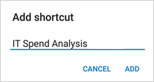
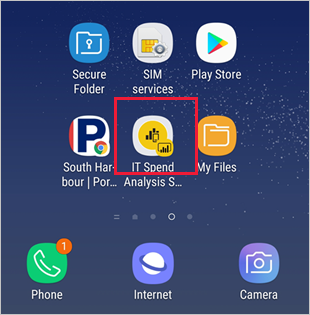
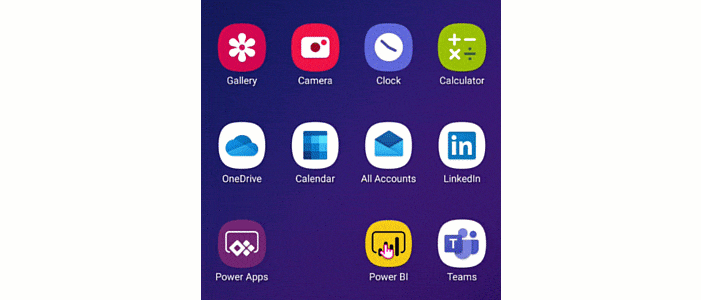
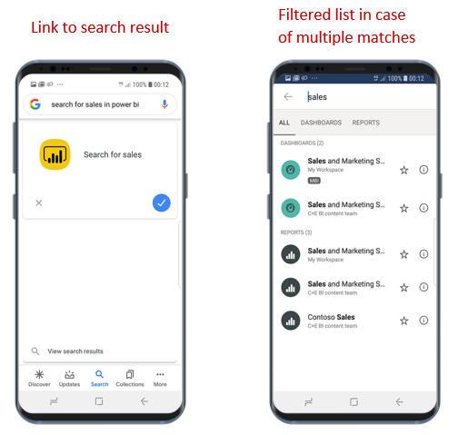

# Direct access with shortcuts and Google Search

Applies to:

|  |  |
|:--- |:--- |
| Android phones |Android tablets |

The Power BI mobile app provides two easy ways to get straight to the reports or dashboards you need, without having to navigate through the app: **shortcuts** and **Google Search**.
 * Shortcuts: You can create a shortcut to any report or dashboard. The report or dashboard doesn't have to be in one of your workspaces - you can also create shortcuts to reports and dashboards that are inside app, or even reports or dashboards that are located on an external (B2B) server.
 * Google Search: You can use Google Search to find and open the Power BI mobile app right to the report or dashboard you are looking for. You don't have to navigate through the app.

In addition to being able to create shortcuts for any report or dashboard, the Power BI mobile app identifies content that you access frequently, and provides very easy ways for you to create shortcuts to those items.

## Create a shortcut to any report or dashboard

You can create shortcuts to any report or dashboard.

1. On the Actions menu, click **More options...** and select **Add shortcut**.

   
 1. An **Add shortcut** dialog will option with the name of your item. You can edit the name if you like. When you're done, tap **ADD**.

    

1. You will be asked to confirm if you want to add the shortcut. You can either long tap the icon or tap **ADD** to add the shortcut to your device's home screen.

   

   
   A shortcut dashboard or report icon will be added to your device's home screen with the name you entered.

   

## Create shortcuts to frequently viewed reports and dashboards

When you open a frequently viewed report or dashboard, a banner displays, suggesting that you create a shortcut to that item.

   
Tap the banner. The Add shortcut dialog will appear. Complete creating the shortcut as described in Step 2 in the [section above](#create-a-shortcut-to-any-report-or-dashboard).

## Use the Power BI mobile app launcher to create a shortcut

You can also use the Power BI mobile app launcher to create shortcuts to frequently accessed items. 

1. Long tap the App launcher to display a quick access menu for frequently viewed items.

1. From the quick access menu you can then either tap an item to open it directly, or you can long tap it and drag a shortcut to the item to your device's home screen.

The animation below illustrates a long tap on the Power BI app launcher to display the quick access menu, and then dragging and dropping a shortcut to a dashboard onto the device's home screen.
   
   

## Use Google Search to open reports and dashboards

If you want to open a specific item and you're not sure where to look for it, you can use Google Search to find the item.

1. In the Google search box, type your search using the form ***search for &lt;search item&gt; in power bi***. For example, **search for sales in power bi**.

2. When items are found, a link to Power BI will be returned.
   * If only one match was found, tapping on the result will open the Power BI mobile app directly on the item you were looking for.
   * If more than one match was found, Power BI will open to the search screen, filtered according to your request. 

## Next steps
* [Interacting with reports](./mobile-reports-in-the-mobile-apps.md#interact-with-reports)
* [Configure interaction using mobile device management](./mobile-app-configuration.md)
