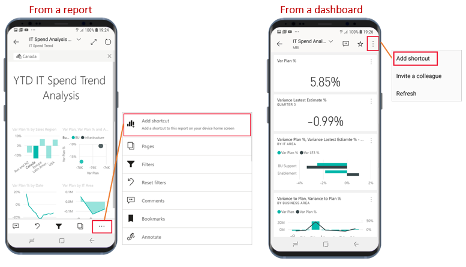
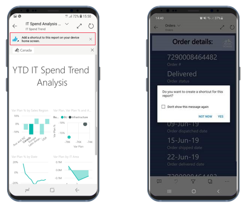
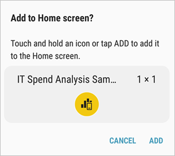
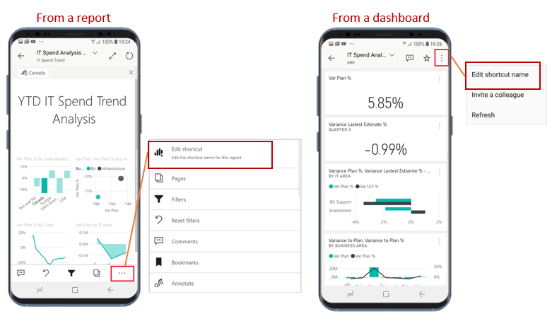
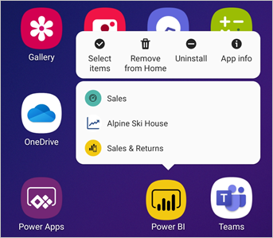

# Direct access with shortcuts and Google Search

Applies to:

|  |  |
|:--- |:--- |
| Android phones |Android tablets |

The Power BI mobile app provides three easy ways to get straight to the reports or dashboards you need, without having to navigate through the app: **home screen shortcuts**, **app launcher shortcuts** and **Google Search**.
 * **Home screen shortcuts**: You can create a shortcut to any report or dashboard and pin it to your device's home screen. The report or dashboard doesn't have to be in one of your workspaces - you can also create shortcuts to reports and dashboards that are inside apps, or even to reports or dashboards that are located on an external (B2B) server.
 * **App launcher shortcuts**: You can get to directly to frequently viewed reports and dashboards just by doing a long tap on the app launcher. A quick access menu provides shortcuts to three frequently viewed items. These items change from time to time - the Power BI mobile app keeps track of what you're viewing often and changes the shortcuts accordingly.
 * **Google Search**: You can use Google Search to find and open the Power BI mobile app right to the report or dashboard you are looking for. You don't have to navigate through the app.

## Create a shortcut to any report or dashboard

You can create shortcuts to any report or dashboard.

1. On the Actions menu, click **More options...** and select **Add shortcut**.

   

   On frequently viewed reports and dashboards, the **Add shortcut** option is also available in a banner that displays when the item is opened.

   

 1. An **Add shortcut** dialog will option with the name of your item. You can edit the name if you like. When you're done, tap **ADD**.

    

1. You will be asked to confirm if you want to add the shortcut. You can either long tap the icon or tap **ADD** to add the shortcut to your device's home screen.

   

   
   A shortcut dashboard or report icon will be added to your device's home screen with the name you entered.

   

## Edit the shortcut name

To edit the name of a shortcut, on the actions menu select **More options...**, and then choose **Edit shortcut name**

 

## Use the Power BI mobile app launcher to access frequently viewed content

You can use the Power BI mobile app launcher to get directly to frequently accessed items.

Long tap the app launcher to display a quick access menu for frequently viewed items. Then tap a shortcut to open the desired item.

You can create a permanent shortcut to any of the listed items just by dragging the desired shortcut icon to your device's home screen.

## Use Google Search to open reports and dashboards

If you want to open a specific item and you're not sure where to look for it, you can use Google Search to find the item.

In the Google search box, search using the form ***search for &lt;search item&gt; in power bi***. For example, **search for sales in power bi**.

* If only one match is found, the Power BI mobile app will open the item you were looking for.
* If more than one match is found, Power BI will open to the search screen, filtered according to your request.

## Next steps
* [Favorites in the Power BI mobile apps](mobile-apps-favorites.md)
