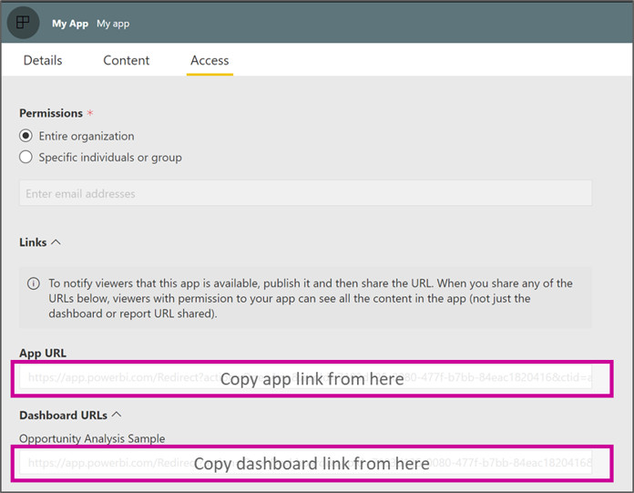

# Create a link to a specific location in the Power BI mobile apps
Use can use links to directly access specific items in Power BI: Report, Dashboard and Tile.

There are mainly two scenarios for using links in Power BI Mobile: 

* To open Power BI from **outside of the app**, and land on specific content (report/dashboard/app). This is usualy an integration scenario, when you want to open Power BI Mobile from other app. 
* To **navigate** inside Power BI. This is usualy when you want to create a custom navigation in Power BI.


## Use links from outside of Power BI
When you use a link from outside of Power BI app, you want to make sure that it will be opened by the app, and if the app is not installed on the device, then to offer the user to install it. We have created a special link format in order to support exactly that. 
This link format, will make sure that the device is using the app to open the link, and if the app is not installed on the device, it will offer the user to go to the store to get it.

The link should start with the following  
```html
https://app.powerbi.com/Redirect?[QUERYPARAMS]
```

> [!IMPORTANT]
> If your content is hosted in special datacenter like Goverment, China, etc. The link should start with the right Power BI address, like ```html app.powerbigov.us``` or  ```html app.powerbi.cn ```   
>

The **QUERY PARAMS** are:
* action (mandatory) = OpenApp / OpenDashboard / OpenTile / OpenReport
* appId = if you want to open a report or dashboard that are part of an app 
* groupObjectId = if you want to open a report or dashboard that are part of workspace (but not my workspace)
* dashboardObjectId = dashboard object id (if action is OpenDashboard or OpenTile)
* reportObjectId = report object id (if action is OpenReport)
* tileObjectId = tile object id (if action is OpenTile)
* reportPage = if you want to open specific report section (if action is OpenReport)
* ctid = item organization id (relevant for B2B scenario. This can omitted if the item belongs to the user's organization).

**Examples:**

* Open app link 
```html
https://app.powerbi.com/Redirect?action=OpenApp&appId=appidguid&ctid=organizationid
```

* Open dashboard that is part of an app 
```html
https://app.powerbi.com/Redirect?action=OpenDashboard&appId=appidguis&dashboardObjectId=dashboardidguid&ctid=organizationid
```

* Open report that is part of a workspace
```html
https://app.powerbi.com/Redirect?Action=OpenReport&reportObjectId=3e19da2d-95ab-43ca-9db2-dc1d6d1c6ef6&groupObjectId=38ccb253-e927-49b3-988b-7fd0ed0ff0b1&reportPage=ReportSection
```

### How to get the right link format

For **apps and reports and dashboard that are part of an app**, the easiest way to get the links is to go to the app workspace and choose "Update app". This will open the publish app experience, and in the Access tab, you will find a **Links** section. Expanding that section and you will see list of the app and all its content links that can be used to access them directly.



For reports and dashboards that are not part of an app, you will to extract the ids from the item URL.

For example, to find the 36-character **dashboard** object id, navigate to the specific dashboard in the Power BI service 

```html
https://app.powerbi.com/groups/me/dashboards/**dashboard guid comes here**?ctid=**organization id comes here**`
```

To find  the 36-character **report** object id, navigate to the specific report in the Power BI service 
```html
https://app.powerbi.com/groups/me/reports/**report guid comes here**/ReportSection3?ctid=**organization id comes here**`
```
The above URL contains also specific report page **"ReportSection3"**.

## Use links inside Power BI

If you want to add link to your report that points to another Power BI item, you can just copy that item URL from the browser address bar. Read more about [how to add a hyperlink to a text box in a report](https://docs.microsoft.com/power-bi/service-add-hyperlink-to-text-box).

## Use report URL with filter
Same as Power BI service, Power BI Mobile apps also support report URL that contains a filter query param. You can open a report in Power BI Mobile app and filter it to specific state. 
For example, this URL opens the Sales report and filter it by Territory

```html
https://app.powerbi.com/groups/me/reports/**report guid comes here**/ReportSection3?ctid=**organization id comes here**&filter=Store/Territory eq 'NC'
```

Read more on [how to build query param to filter reports](https://docs.microsoft.com/power-bi/service-url-filters).

## Next steps
Your feedback helps us decide what to implement in the future, so don’t forget to vote for other features you'd like to see in Power BI mobile apps. 

* [Power BI apps for mobile devices](mobile-apps-for-mobile-devices.md)
* Follow @MSPowerBI on Twitter
* Join the conversation at the [Power BI Community](http://community.powerbi.com/)
* [What is Power BI?](../../power-bi-overview.md)

