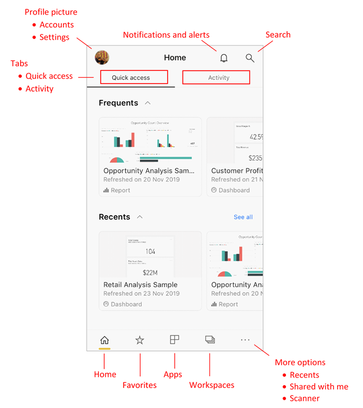
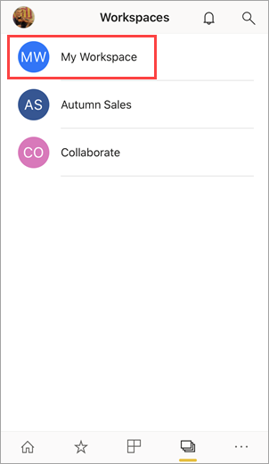
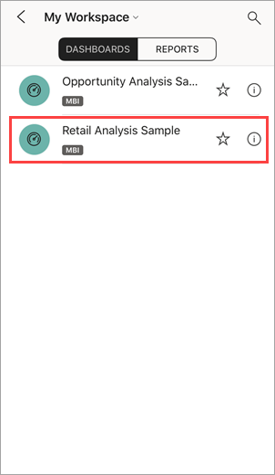
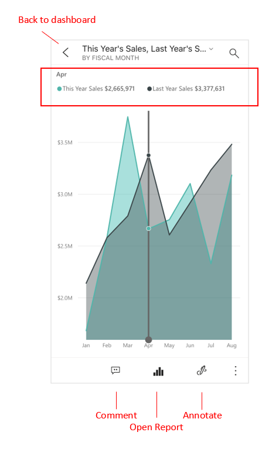
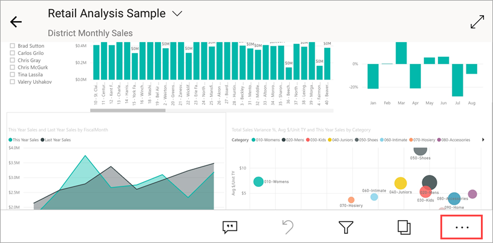
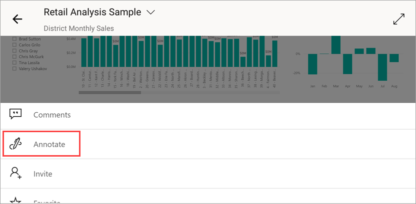
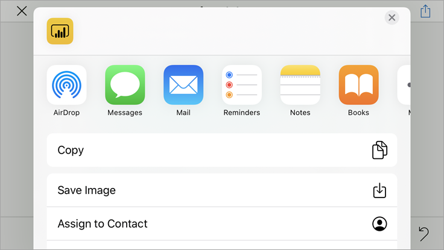
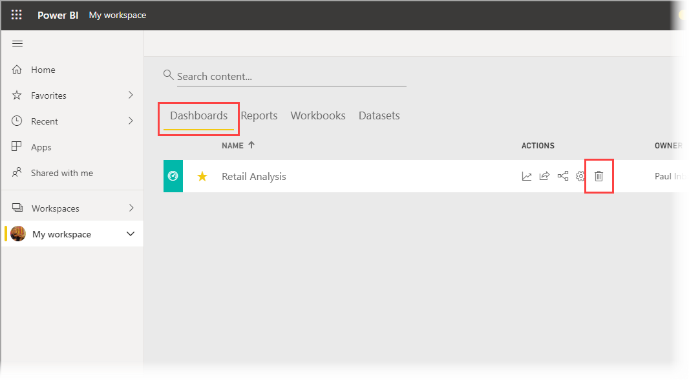
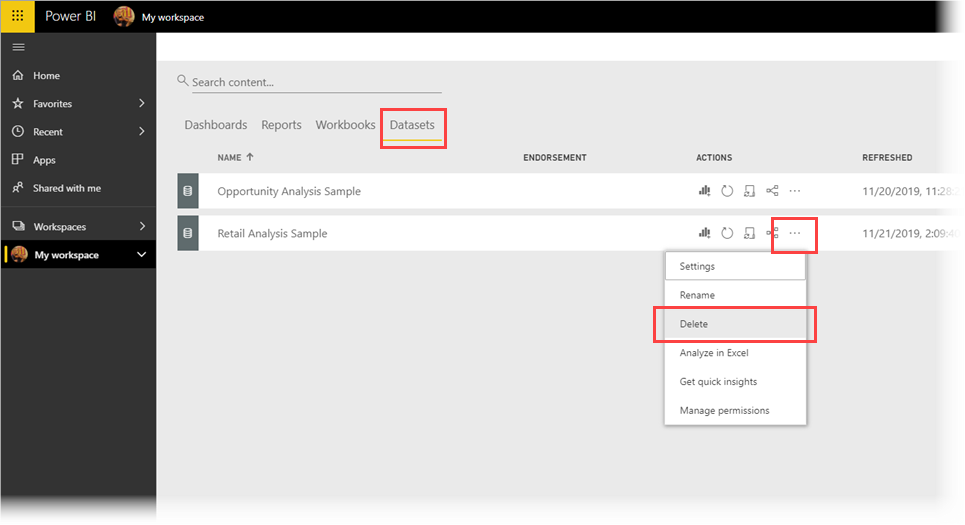

# Quickstart: Explore dashboards and reports in the Power BI mobile apps
In this quickstart, you get a quick tour of the Power BI Mobile app and explore a sample dashboard and report. The images show the Power BI Mobile app for iOS, but you can easily follow along on non-iOS devices.

Applies to:

|  |  |  |  |
|:--- |:--- |:--- |:--- |
| iPhone | iPad | Android | Windows 10 |

A Dashboard is a portal to your company's life cycle and processes. A dashboard is an overview, a single place to monitor the current state of the business. Reports are interactives view of your data, with visuals representing different findings and insights from that data. 

## Prerequisites

### Sign up for Power BI
If you're not signed up for Power BI, [sign up for a free trial](https://app.powerbi.com/signupredirect?pbi_source=web) before you begin.

### Install the Power BI app for your device.

Download the Power BI mobile app from the [App store](https://apps.apple.com/app/microsoft-power-bi/id929738808) (iOS) or [Google play](https://play.google.com/store/apps/details?id=com.microsoft.powerbim&amp;amp;clcid=0x409) (Android)

### Download the Retail Analysis sample
The first step in this quickstart is to download the Retail Analysis sample in the Power BI service. [Learn how to download a sample](./mobile-apps-download-samples.md) into your Power BI account to get started. Be sure to choose the Retail Analysis sample.

Once you've downloaded the Retail Analysis sample to your Power BI account, you are ready to begin this quick tour of the Power BI app for mobile devices.

## View a dashboard on your mobile device
1. On your device, open the Power BI app and sign in with your Power BI account credentials, the same ones you used in the Power BI service in the browser.

    The app opens to the home page.

   

    The home page has two tabs: **Quick access** and **Activity**. 
    * The Quick access tab provides quick access your frequently or recently viewed content. 
    * The Activity tab shows what's happening in your dashboards and reports, was well as latest comments and activities. 

    The home page also has a **navigation bar** across the bottom of the screen to help you get to your content quickly. 
    * **Home**: Jump to the home page
    * **Favorites**: List contents you have marked as favorites.
    * **Apps**: List apps installed in your Power BI account.
    * **Workspaces**: List your workspaces. If My Workspace is your only workspace, shows the contents of My Workspace.
    * **More options (…)**: Displays three other options: 
      * **Recents**: List recently viewed content, categorized by *Visited today*, *Visited this week*.
      * **Shared with me**: List content that is shared with you.
      * **Scanner**: To scan QR codes or upload pictures. Report creators can create QR codes for their reports. Then, when you scan the QR code with this option, you see the tile that the report creator has associated with that code. [Learn more](mobile-apps-scan-barcode-iphone.md).

    At the top of the home page, a **Notifications** button indicates when there is a notification or data alert. Tap the button to see any notifications. Learn more about [Learn more about notifications and alerts](mobile-set-data-alerts-in-the-mobile-apps.md).

    Finally, a **Search** button enables you to look for your dashboards, reports and apps.

1. Now, tap **Workspaces** on the navigation bar.

    The Workspaces page lists your workspaces. If My Workspace is your only workspace, the Workspaces navigation bar button will display the contents of My Workspace directly.

    Tap **My Workspaces**

    

    In My Workspace, you can see lists of your dashboards and reports.

    
   
    A notation below the dashboard names shows how the data in each dashboard is classified. Read more about [data classification in Power BI](../../service-data-classification.md).
    
4. Tap the Retail Analysis Sample dashboard to open it.

    
   
    Power BI dashboards look a little different on your Android phone. All the tiles appear the same width, and they're arranged one after another from top to bottom.

5. Tap the star icon  in the title bar to make this a favorite dashboard.

    When you make a favorite in the mobile app, it's a favorite in the Power BI service, and vice versa.

6. Scroll down and tap the "This Year's Sales, Last Year's Sales" filled line chart.

    

    It opens in focus mode.

7. In focus mode, tap Apr in the chart. You see the values for April displayed at the top of the chart.

    

8. Tap the Report icon  at the bottom of the screen (on Adroid devices this may be at the top of the screen). The report related to this tile opens in landscape mode.

    

9. Tap the yellow "040 - Juniors" bubble in the bubble chart. See how it highlights related values in the other charts? 

    

10. Swipe up to see a toolbar across the bottom, and tap the more options icon.

    

11. Scroll down the list and select **Annotate**.

    

12. On the annotate toolbar, tap the smiley-face icon and and then tap the report page where you'd like to add some smiley faces.
 
    

13. Now tap **Share** in the upper-right corner.

14. Choose the way you'd like to share the report.  

    

    You can share this snapshot with anyone, in or out of your organization. If they're in your organization and have their own Power BI account, they'll be able to open the Retail Analysis sample report, too.

## Clean up resources

After you finish this quickstart, you can delete the Retail Analysis sample dashboard, report, and dataset, if you wish.

1. Open the Power BI service ([Power BI service](https://app.powerbi.com)) and sign in.

2. In the navigation pane, select **Workspaces** > **My Workspace**.

    Notice the yellow star indicating it's a favorite?

3. On the **Retail Analysis Sample** dashboard line, click the more options icon and choose **Delete**.

    

    Do the same for the Retail Analysis Sample's report.

3. On the **Retail Analysis Sample** dataset tab, click the More options (...) icon and choose **Delete**.

    

## Next steps

In this quickstart, you explored a sample dashboard and report on your Android device. Read more about working in the Power BI service. 

> [!div class="nextstepaction"]
> [Quickstart: Getting around in the Power BI service](../end-user-experience.md)

