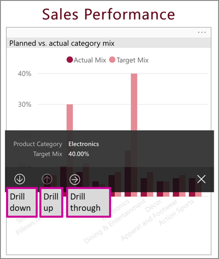
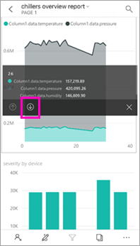
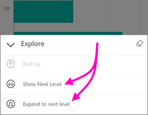
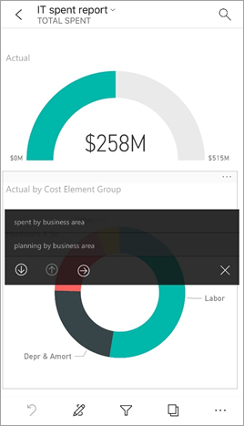
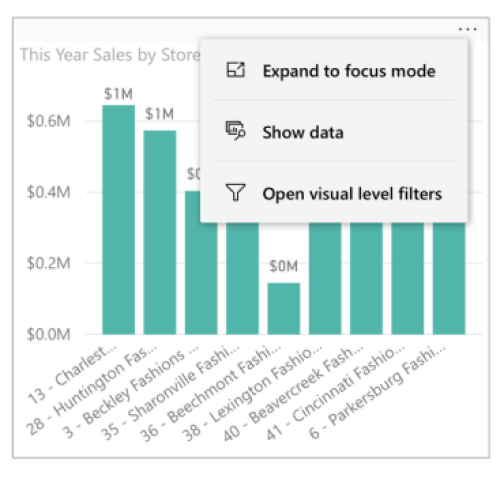
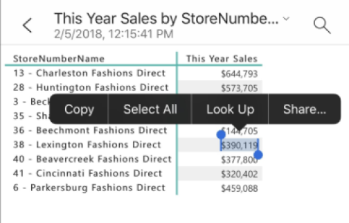

# Explore reports in the Power BI mobile apps
Applies to:

|  |  |  |  |  |
|:--- |:--- |:--- |:--- |:--- |
| iPhones |iPads |Android phones |Android tablets |Windows 10 devices |

A Power BI report is an interactive view of your data, with visuals representing different findings and insights from that data. Viewing reports in the Power BI mobile apps is the third step in a three-step process.

1. [Create reports in Power BI Desktop](../../desktop-report-view.md). You can even [optimize a report for phones](mobile-apps-view-phone-report.md) in Power BI Desktop. 
2. Publish those reports to the Power BI service [(https://powerbi.com)](https://powerbi.com) or [Power BI Report Server](../../report-server/get-started.md).  
3. Then interact with those reports in the Power BI mobile apps.

## Open a Power BI report in the mobile app
Power BI reports are stored in different places in the mobile app, depending on where you got them. They can be in Apps, Shared with me, Workspaces (including My Workspace), or on a report server. Sometimes you go through a related dashboard to get to a report, and sometimes they're listed.

In lists and menus, you will find an icon next to a report name, helping you understand that this item is a report. 
 

There are two icons for reports in Power BI Mobile apps:

*  indicates a report that will be presented in landscape orientation in the app and will look the same as it looks in the browser.

*  indicates a report that has at least one report page that is phone optimized, and therefore will be presentated is portrait. 

Note: Holding your phone in landscape, you will always get the landscpae layout, even if the report page has phone layout. 

To get to a report from a dashboard, tap the ellipsis (...) in the upper-right corner of a tile > **Open report**.
  
  
  
  Not all tiles have the option to open in a report. For example, tiles created by asking a question in the Q&A box don't open reports when you tap them. 
  
## Interacting with reports
Once you have a report opened in the app, you can start working with it. There are many things you can do with your report and its data. In the report footer you will find actions you can preform on the report, and by tapping and long tapping on the data shown in the report you can also slice and dice the data.

### Using tap and long tap
Tap equals to a mouse click. So if you want to cross highlight the report based on a data point, tap on that data point.
Tapping on a slicer value, makes that value selected and slicing the rest of the report by that value. And tapping on a link, button or bookmark will activate it based on the action defined by the author.

You probably noticed that when you tap on a visual, a border appears. On the top-right corner of the border there is ellipsis (...) - this is a menu with actions you can do on that visual.

### Tooltip and Drill actions

If you long tap a data point, you will get a tooltip showing you the values this data point represents. 

And if the report author defined hierarchy in your data, then you will be able to drill down and up from the tooltip, by tapping on the down (or up) arrow. 
If drill through was defined between the tapped data and another report page, a third arrow will appear in the tooltip footer for executing drill through.

## Using actions in report footer
The report footer has actions you can do on the current report page or on the entire report. The footer has quick access to the most useful actions, and all actions can be access from the ellipsis (...).

The actions you can preform from the footer are:
1) Reset the report filter and cross highlight selections back to its original state.
2) Open the conversation pane to view or add comments on this report.
3) Open the filter pane to view and modify the filter currenly appied on the report.
4) List all the pages in this report. Tapping on page name will load and present that page.
Moving between report pages can be done by swiping from the edge of your screen to the center.
5) View all report actions.

## Drill down and up in a visual
If a report author has added drill-down capability to a visual, you can drill down in the visual to see the values that make up one part of it. You [add drill down to a visual](../end-user-drill.md) in Power BI Desktop or the Power BI service. 

* Tap and hold a specific bar or point in a visual to display its tooltip. If it has drill-down, the bottom of the tooltip has arrows you can tap. 
  
  

* To drill back up, tap the up arrow in the tooltip.
  
  

* You can also drill down in all the data points in a visual. Open it in focus mode, tap Explore icon, then choose the show all the next level, or expand to show the current and the next level.

   

## Drill through from one page to another

With *drillthrough*, when you tap a specific part of a visual, Power BI takes you to a different page in the report, filtered to the value you tapped. A report author can define one or more drill-through options, each taking you to a different page. In that case, you can choose which one you want to drill through. In the following example, when you tap the value in the gauge, you can choose between drilling through to **spent by business area** or **planning by business area**.

When you drill through, the back button takes you back to the previous report page.

Read about how to [add drill-through in Power BI Desktop](../../desktop-drillthrough.md).

## Show data and copy values

By selecting the Menu options ellipsis (**...**) in the upper-right corner of a visualization in a phone report, and then selecting **Show data**, you can see the data underlying a visualization.

Long tapping on a cell in the table presented will pop the native select and copy menu, so you will be able to choose the copy data from the table (or the entire table).

## Sort a visual on an iPad or a tablet
* Tap the chart, tap the ellipsis (**...**) and tap the field name.
  
   
* To reverse the sort order, tap the ellipsis (**...**) again, then tap the same field name again.

## Next steps
* [View and interact with Power BI reports optimized for your phone](mobile-apps-view-phone-report.md)
* [Create a version of a report optimized for phones](../../desktop-create-phone-report.md)
* Questions? [Try asking the Power BI Community](http://community.powerbi.com/)

