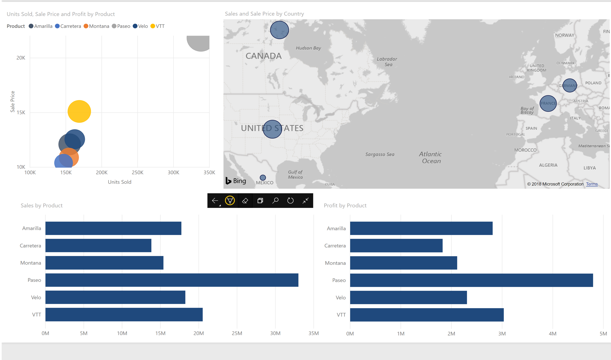

# View reports and dashboards in presentation mode on Surface Hub and Windows 10 devices
You can use presentation mode to display reports and dashboards in full-screen mode on Windows 10 devices and Sureface Hub. 

Presentation amode is useful for displaying Power BI at a meeting or conference, or on a dedicated projector in an office, or even just for maximizing space on a small screen. 

In presentation mode in the Power BI mobile app for Windows 10, all the "chrome" such as the navigation and menu bars is removed to allow you and your team members focus on the data in your report. A toolbar with actions will become available for you and enable you to interact and collaborate with your data while in presentation mode.

You can also [display dashboards and reports in full-screen mode from the Power BI service](../end-user-focus.md) on the web.

> [!NOTE]
> Presentation mode is different from [focus mode for tiles](mobile-tiles-in-the-mobile-apps.md).
> 
> 

## Use presentation mode
In the Power BI mobile app tap the **Full screen** icon  to go to full-screen mode.
The app chorm will disappear and an toolbar will appear on the bottom of the screen or on the right and left sides (depends on your screen size).

From the toolbar you can preform the following actions:

1. Tap the back icon  to go back to your previous page. Long tap on the icon will pop the breadcrumbs windows, allowing you to navigate to the containing folder of your report or dashboard.
2. The ink icon  will let choose a color when you use your Sureface pen to draw and annotate on your report page. 
3. Use the pages icon  to replace the report page you are currently presenting.
4. Tap the search icon  to look for other artifacts in Power BI.
5. To exit presentation mode, tap the icon with two inward-facing arrows  on the toolbar.

You can un-dock the toolbar and drag it to locate it anywhere on the screen. This is useful for large screens, when you want to focus on a specific area in your report and want to have the tools available next to it. Just place your finger on the toolbar and swipe it into the report canvas.

## Next steps
* [Display dashboards and reports in full-screen mode from the Power BI service](../end-user-focus.md)
* Questions? [Try asking the Power BI Community](http://community.powerbi.com/)

