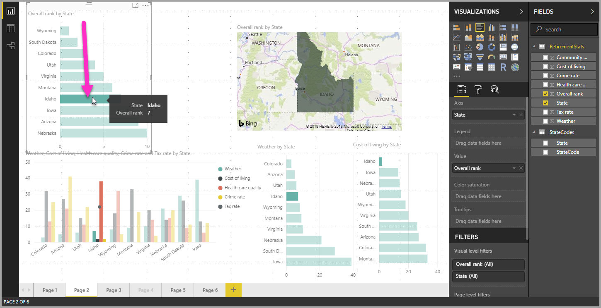

# Multi-select data elements, data points, and visuals in Power BI Desktop

You can select multiple data elements in one visual, multiple data points in a visual, or multiple visuals in a report using Power BI Desktop. The following sections describe each of these in turn.

## Select multiple data points

In Power BI Desktop, you can highlight a data point in a given visual by simply clicking on the data point in the visual. For example, if you have an important bar or chart element, and you want other visuals on the report page to highlight data based on your selection, you can click the data element in one visual and see results reflected in other visuals on the page. This is basic, or single-select highlighting. The following image shows a basic highlight. 

With multi-select, you can now select more than one data point in your **Power BI Desktop** report page, and highlight the results across the visuals on the page. This is equivalent to an **and** statement, or functionality, such as "highlight results for Idaho **and** Virginia". To multi-select data points in visuals, simply use **CTRL+Click** to select multiple data points. The following image shows **multiple data points** selected (multi-select).

This sounds like a simple capability, but it opens up all sorts of opportunities when creating, sharing, and interacting with reports. 

## Select multiple data points or visuals using rectangle select (preview)

You can select multiple data elements in a visual, or multiple visuals in a report, using rectangular select, often also referred to as *lasso select*. 

### Select multiple visuals on the canvas

Select multiple visuals and other report elements by clicking and dragging over the canvas to create a rectangular lasso. All visuals that are entirely encapsulated within the lasso are  selected. If you press the *Ctrl* or *Shift* key (as you multi-select by Ctrl + clicking individual visuals), further lassoing adds visual selections to the current multi-select. 

If a visual is already selected and is lassoed, using *Crtl* or *Shift* toggles off that selection. The lasso does not select single visuals within groups, but can select groups by encapsulating the entire group.

The canvas does not automatically scroll with the rectangular lasso selection. 

### Select multiple data points in a visual

You can select multiple data points within a visual using the same rectangular lasso steps. While holding down the *Ctrl* key, click and drag within a visual to select multiple data points. When you release the mouse button, all points overlapping the selection rectangle are selected, and any previous lasso selections are also preserved. If you lasso select an area that incorporates previously-selected points using *Ctrl* while selecting, those data points are unselected (toggled off); using the lasso has the same effect and *Ctrl*-clicking each point individually. 

When you use the *Shift* key while making a lasso-selection, previous selections are preserved and already-selected data points remain selected. So using *Shift* while performing a lasso-select only adds data points to your selection, rather than toggling data points in the selected area.

You can clear your current selection by clicking an empty space on the plot area without pressing a keyboard key.

For more information on this feature, see the [blog post about the release of this feature](https://powerbi.microsoft.com/blog/power-bi-desktop-august-2020-feature-summary/#_Data_point).

There are a few limitations and considerations for multi-selecting data points within a visual:

* Line, area, scatter chart, and treemap support lasso select
* The maximum number of data points you can select at once is 300
* When viewing a report in the Power BI service, rectangle select is enabled only if the lasso select feature was enabled when the report was saved and published

## Next steps

You might also be interested in the following articles:

* [Use gridlines and snap-to-grid in Power BI Desktop reports](desktop-gridlines-snap-to-grid.md)
* [About filters and highlighting in Power BI reports](power-bi-reports-filters-and-highlighting.md)

