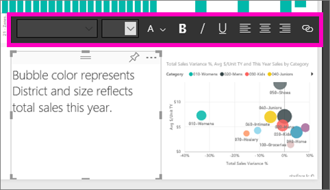

# Add text boxes and shapes to Power BI reports
You can add text boxes and shapes to reports by using the Power BI service and Power BI Desktop. In both cases, you must have editing permissions for the report. If a report has been shared with you in the Power BI service, you won't have editing permissions. 

Watch Will use Power BI Desktop to [add static images to a report](/learn/modules/visuals-in-power-bi/12-formatting), and then follow the steps below to try it out yourself by using the Power BI service instead.
> 
> <iframe width="560" height="315" src="https://www.youtube.com/embed/_3q6VEBhGew" frameborder="0" allowfullscreen></iframe>
> 

## Add a text box to a report
1. Open a report in Editing view.

2. Place your cursor in any blank area on the report canvas and select **Text box** from the top menu.
   
   
3. Type your text into the text box and, optionally, set the format font, color, and text alignment. 
   
   
4. To position the text box, select the grey area at the top and drag. To resize the text box, select and drag any of the outline handles. 
   
   

5. With the text box still selected, add additional formatting in the **Visualizations** pane. In this example, we've formatted the background and border. You can also create an exact size and position for a text box.  

   

6. To close the text box, select any blank space on the report canvas. 

7. Select the pin icon   to pin the text box to a dashboard. 

## Add a shape to a report
1. Place your cursor anywhere on the report canvas and select **Shapes**.
   
   
2. From the dropdown, select a shape to add it to your report canvas. For this example, add an arrow to direct attention to the bubble with the highest total sales variance. 
   
   In the **Format shape** pane, customize your shape. In this example we've created a red arrow with a dark red border, rotated 90 degrees.
   
   
3. To position the shape, select the grey area at the top and drag. To resize the shape, select and drag any of the outline handles. As with the text box, you can also create an exact size and position for a shape.

   > [!NOTE]
   > Shapes cannot be pinned to a dashboard, except as one of the visuals when you [pin a live page](service-dashboard-pin-live-tile-from-report.md). 
   > 
   > 

## Next steps

You might also be interested in the following articles:

* [Add a hyperlink to a text box](service-add-hyperlink-to-text-box.md)
* [Basic concepts for designers in the Power BI service](service-basic-concepts.md)
* [Tips to improve analysis with shapes, images, and icons in Power BI reports](../guidance/report-tips-shapes-images-icons.md)
* More questions? [Try the Power BI Community](https://community.powerbi.com/)
