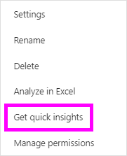
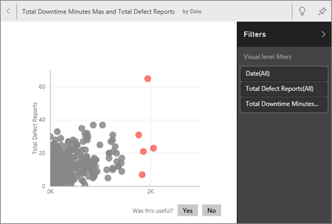
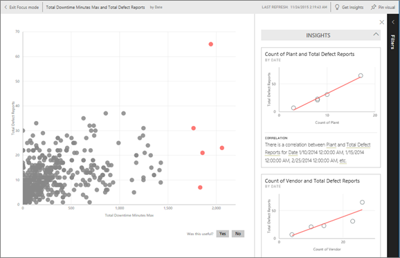

# Generate data insights on your dataset automatically with Power BI
Do you have a new dataset and aren't sure where to start?  Need to build a dashboard quickly?  Want to look for insights you may have missed?

Run quick insights to generate interesting visualizations based on your data. This article explains how to run quick insights on an entire dataset (quick insights). You can also run [quick insights on a specific dashboard tile](../consumer/end-user-insights.md) (scoped insights). You can even run insights on an insight!

> [!NOTE]
> Insights doesn't work with DirectQuery; it only works with data uploaded to Power BI.
> 

We built the insights feature on a growing [set of advanced analytical algorithms](../consumer/end-user-insight-types.md) that we developed with Microsoft Research. We continue to use these algorithms to help more people to find insights in their data in new and intuitive ways. You might also be interested in learning how to [optimize your data for quick insights[(service-insights-optimize.md).

## Run quick insights on a dataset
Watch Amanda run quick insights on a dataset and open an insight in Focus mode. She pins an insight as a tile on her dashboard, then gets insights for a dashboard tile.

<iframe width="560" height="315" src="https://www.youtube.com/embed/et_MLSL2sA8" frameborder="0" allowfullscreen></iframe>

Now it's your turn. Explore insights by using the [Supplier Quality Analysis sample](sample-supplier-quality.md).

1. From the **Datasets** tab, select **More options** (...), and then choose **Get quick insights**.
   
    
   
    
2. Power BI uses [various algorithms](../consumer/end-user-insight-types.md) to search for trends in your dataset.
   
    
3. Within seconds, your insights are ready.  Select **View insights** to display visualizations.
   
    
   
    > [!NOTE]
    > Some datasets can't generate insights because the data isn't statistically significant.  To learn more, see [Optimize your data for insights](service-insights-optimize.md).
    > 
    
4. The visualizations display in a special **Quick Insights** canvas with up to 32 separate insight cards. Each card has a chart or graph plus a short description.
   
    

## Interact with the insight cards

1. Hover over a card and select the pin icon to add the visualization to a dashboard.

2. Hover over a card, select **More options** (...), and then choose **View insights**. 

    The insight screen opens in Focus mode.
   
    
3. In Focus mode you can:
   
   * Filter the visualizations. If the **Filters** pane isn't already open, expand it by select the arrow on the right side of the window.

       
   * Pin the insight card to a dashboard by selecting **Pin visual**.
   * Run insights on the card itself, which is often referred to as *scoped insights*. In the top-right corner, select the lightbulb icon  or **Get Insights**.
     
       
     
     The insight displays on the left. New cards, based solely on the data in that single insight, display along the right.
     
       
4. To return to the original insights canvas, in the top-left corner, select **Exit Focus mode**.

## Next steps
- If you own a dataset, [optimize it for Quick Insights](service-insights-optimize.md).
- Learn about the [types of Quick Insights available](../consumer/end-user-insight-types.md).

More questions? [Try the Power BI Community](https://community.powerbi.com/).
