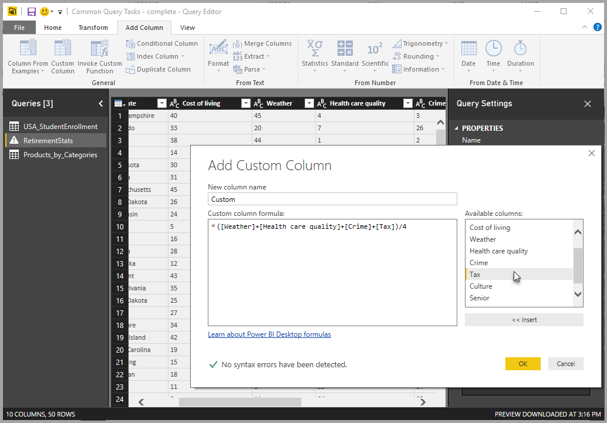
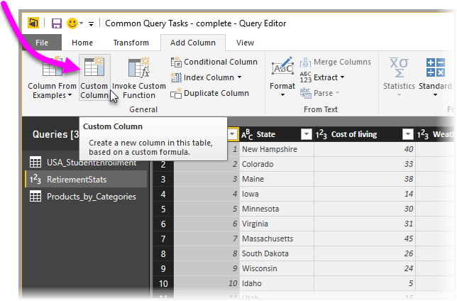
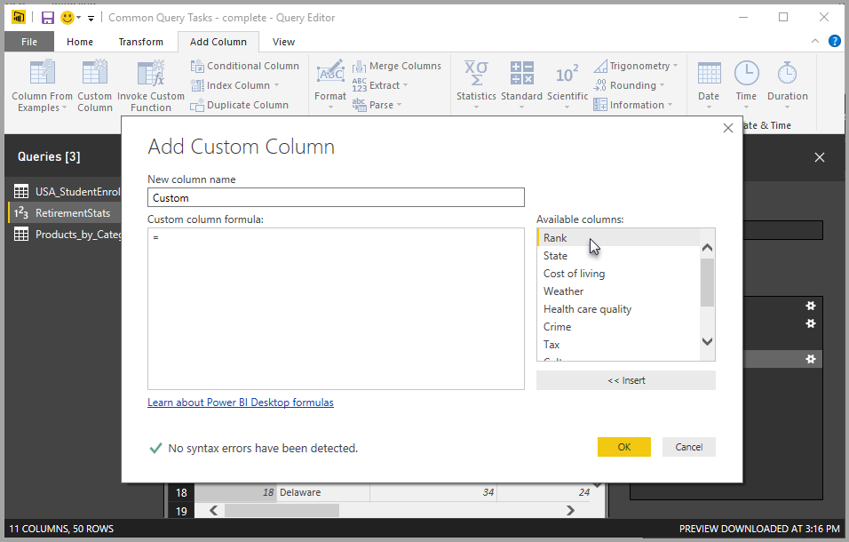
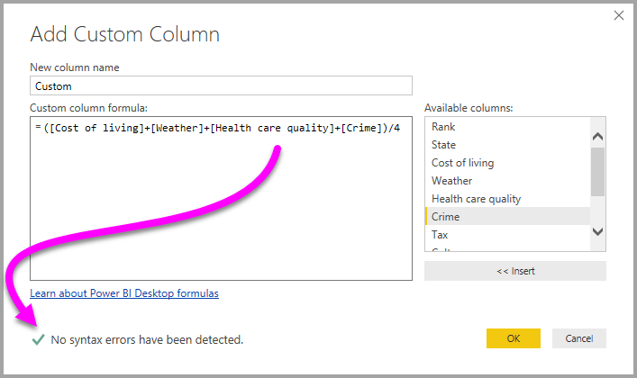
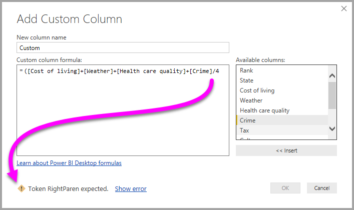
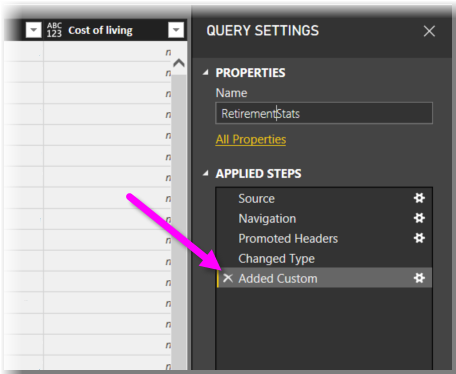
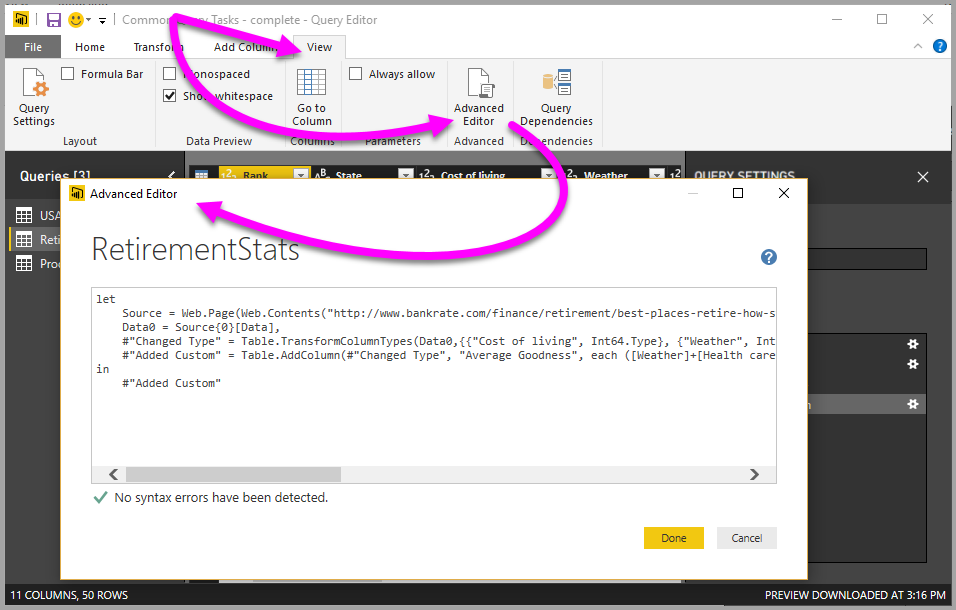

# Add a custom column in Power BI Desktop
You can easily add a new custom column of data to your model by using Query Editor in Power BI Desktop. With Query Editor, you create and rename your custom column to create [PowerQuery M formula queries](https://docs.microsoft.com/en-us/powerquery-m/quick-tour-of-the-power-query-m-formula-language) to define your custom column. The PowerQuery M formula queries have a [comprehensive function reference content set](https://docs.microsoft.com/powerquery-m/power-query-m-function-reference). 

When you create a custom column, Power BI Desktop adds it as an **Applied Step** in the **Query Settings** of the query you create in **Query Editor**. It can be changed, moved, or modified at any time.

## Use Query Editor to add a new custom column
To create a new custom column, follow these steps:

1. Select **Query Editor** from the menu.  

2. From the **Home** ribbon, select **Edit Queries**.

    

    After **Query Editor** is launched and you've loaded some data, you can add a custom column.

3. Select the **Add Column** tab on the ribbon, and then select **Custom Column**.

    

   The **Add Custom Column** window appears.

## The Add Custom Column window
The **Add Custom Column** window has the following features: 
- A list of available fields in the pane on the right.

- The name of your custom column on the top, which you can rename by entering a new name in the text box.

- The [PowerQuery M formula queries](https://docs.microsoft.com/en-us/powerquery-m/power-query-m-function-reference), which you create by building the formula on which your new custom column is defined. 

    

## Create formulas for your custom column

1. Select a field from the **Available columns** list on the right, and then select **Insert** to add them to the custom column formula. You can also add a column by double-clicking in the list.

2. As you enter the formula and build your column, note the  indicator in the bottom of the window. 

   If there aren't any errors, you'll see a green check mark.

   

   If there's a syntax error, you'll see a yellow warning icon, along with a link to where the error occurred in your formula.

   

3. Select **OK**. 

   Power BI adds your custom column to the model, and adds the **Added Custom** step to your query's **Applied Steps**.

    

4. To modify your custom column, double-click the **Added Custom** step in the **Applied Steps** pane. 

    The **Add Custom Column** window appears with the custom column formula you created.

## Use the Advanced Editor for Custom Columns
You can also create a custom column, and modify any step of your query, by using the **Advanced Editor**: 

1. In **Query Editor**, select the **View** tab. 

2. Select **Advanced Editor**.

   The **Advanced Editor** page appears, which gives you full control over your query. 

   

   
## Next steps

- You can create a custom column in other ways, such as creating a column based on examples you provide to **Query Editor**. For more information, see [Add a column from an example in Power BI Desktop](desktop-add-column-from-example.md).

- For Power Query M reference information, see [Power Query M function reference](/powerquery-m/power-query-m-function-reference).

