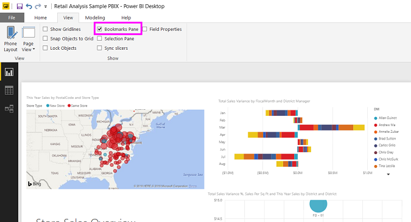
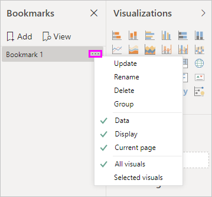
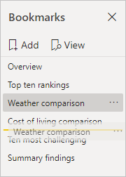
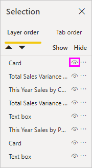
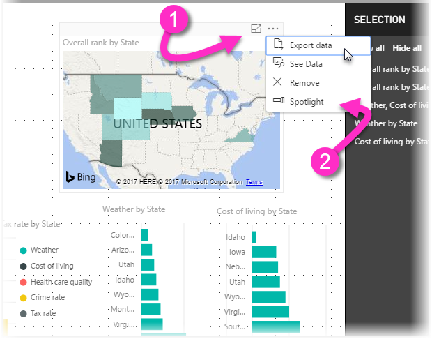
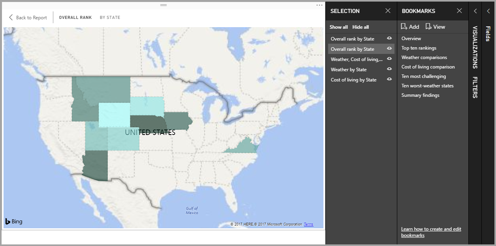
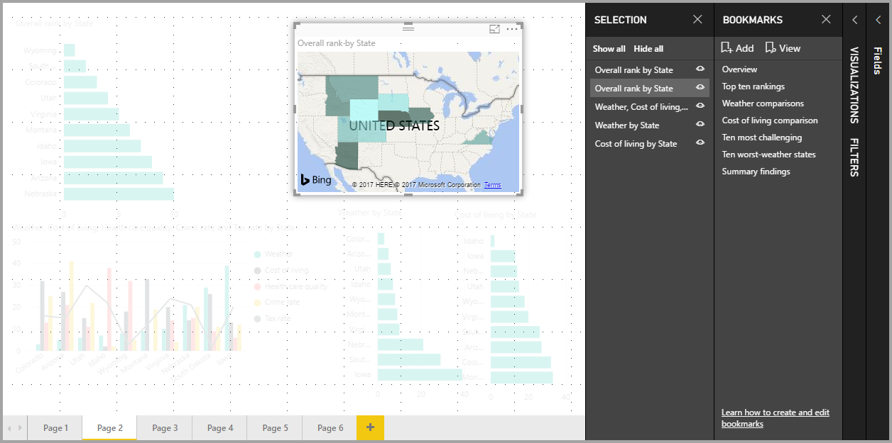
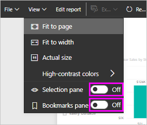

# Use bookmarks to share insights and build stories in Power BI (Preview)
Using **bookmarks** in Power BI you can capture the currently configured view of a report page, including filtering and the state of visuals, and later go back to that state by simply selecting that saved bookmark. 

You can also create a collection of bookmarks, arrange them in the order you want, and subsequently step through each bookmark in a presentation to highlight a series of insights, or the story you want to tell with your visuals and reports. 

There are many uses for bookmarking. You can use them to keep track of your own progress in creating reports (bookmarks are easy to add, delete, and rename), and you can create bookmarks to build a PowerPoint-like presentation that steps through bookmarks in order, thereby telling a story with your report. There may be other uses, too, based on how you think bookmarks could best be used.

### Enable the bookmarks preview
You can try the new **bookmarks** feature beginning with the **October 2017** release of **Power BI Desktop**, and for bookmark-enabled reports, in the **Power BI service** as well. To enable this preview feature, select **File > Options and Settings > Options > Preview Features**, then select the checkbox beside **Bookmarks**. You'll need to restart Power BI Desktop after you make the selection.

You'll need to restart **Power BI Desktop** after you make the selection.

## Using bookmarks
To use bookmarks, select the **View** ribbon, then select the box for **Bookmarks Pane**. 

When you create a bookmark, the following elements are saved with the bookmark:

* The current page
* Filters
* Slicers
* Sort order
* Drill location
* Visibility (of an object, using the **Selection** pane)
* The focus or **Spotlight** modes of any visible object

Bookmarks do not currently save the cross-highlighting state. 

Configure a report page the way you want it to appear in the bookmark. Once your report page and visuals are arranged how you want them, select **Add** from the **Bookmarks** pane to add a bookmark. 

**Power BI Desktop** create a bookmark and gives it a generic name. You can easily *rename* a bookmark, *delete* it, or *update* a bookmark by selecting the elipses next to the bookmark's name, then selecting an action from the menu that appears.

Once you have a bookmark, you can display it by simply clicking on the bookmark in the **Bookmarks** pane. 

## Arranging bookmarks
As you create bookmarks, you might find that the order in which you create them isn't necessarily the same order you'd like to present them to your audience. No problem, you can easily rearrange the order of bookmarks.

In the **Bookmarks** pane, simply drag-and-drop bookmars to change their order, as shown in the following image. The yellow bar between bookmarks designates where the dragged bookmark will be placed.

The order of your bookmarks can become important when you use the **View** feature of bookmarks, as described in the next section.

## Bookmarks as a slide show
When you have a collection of bookmarks you would like to present, in order, you can select **View** from the **Bookmarks** pane to begin a slideshow.

When in **View** mode, there are a few features to notice:

1. The name of the bookmark appears in the bookmark title bar, which appears at the bottom of the canvas.
2. The bookmark title bar has arrows that let you move to the next or previous bookmark
3. You can exit **View** mode by selecting **Exit** from the **Bookmarks** pane, or by selecting the **X** found in the bookmark title bar. 

When you're in **View** mode, you can close the **Bookmarks** pane (by clicking the X on that pane) to provide more space for your presentation. And while in **View** mode, all visuals are interactive and available for cross-highlighting, just as they would otherwise be when interacting with them. 

## Visibility - using the Selection pane
With the release of bookmarks, the new **Selection** pane is also introduced. The **Selection** pane provides a list of all objects on the current page, and allows you to select the object and specify whether a given object is visible. 

You can select an object using the **Selection** pane. Also, you can toggle whether the object is currently visible by clicking the eye icon to the right of the visual. 

When a bookmark is added, the visible status of each object is also saved based on its setting in the **Selection** pane. 

It's important to note that **slicers** continue to filter a report page, regardless of whether they are visible. As such, you can create many different bookmarks, with different slicer settings, and make a single report page appear very different (and highlight different insights) in various bookmarks.

## Bookmarks for shapes and images
You can also link shapes and images to bookmarks. With this feature, when you click on an object, it will show the bookmark associated with that object. 

To assign a bookmark to an object, select the object, then select **Link** from the **Format Shape** pane, as shown in the following image.

Once you turn the **Link** slider to **On** you can select whether the object is a link, or a bookmark. If you select bookmark, you can then select which of your bookmarks the object is linked to.

There are all sorts of interesting things you can do with object-linked bookmarking. You can create a visual table of contents on your report page, or you can provide different views (such as visual types) of the same information, just by clicking on an object.

When you are in editing mode you can use ctrl+click to follow the link, and when not in edit mode, simply click the object to follow the link. 

## Using Spotlight
Another feature released with bookmarks is **Spotlight**. With **Spotlight** you can draw attention to a specific chart, for example, when presenting your bookmarks in **View** mode.

Let's compare **Spotlight** to **focus** mode to see how they differ.

1. In **focus** mode, you can have one visual fill the entire canvas by selecting the **focus mode** icon.
2. Using **Spotlight**, you can hightlight one visual in its original size, by making all other visuals on the page fade to near transparency. 

When the visual in the previous image has its **focus** icon clicked, the page looks like the following:

In contrast, when **Spotlight** is selected from the visual's elipses menu, the page looks like what you seen here:

If either mode is selected when a bookmark is added, that mode (focus or Spotlight) is retained in the bookmark.

## Bookmarks in the Power BI service
When you publish a report to the **Power BI service** with at least one bookmark, you can view and interact with those bookmarks in the **Power BI service**. For each report you publish, you must have at least one bookmark created in the report, before you publish, for the bookmark feature to be available in the **Power BI service**.

When bookmarks are available in a report, you can select **View > Selection pane** or **View > Bookmarks pane** to show each of those panes.

In the **Power BI service** the **Bookmarks pane** operates just as it does in **Power BI Desktop**, including the ability to select **View** to show your bookmarks in order, like a slide show.

Note that you must use the gray bookmark title bar to navigate through the bookmarks, and not the black arrows (the black arrows move you through report pages, not bookmarks).

## Limitations and considerations
In this preview release of the **bookmarks**, there are a few limitations and considerations to keep in mind.

* Custom visuals do not work with bookmarking if they are the *source* of the filter. If you're using custom visuals to filter elements on a page (for example, the chiclet slicer) and return to that page using a bookmark, the page may be filtered but the custom visual won't be updated to show how the page is being filtered. 
* Cross-highlighting status for a report pane is *not* saved when you create a bookmark. 
* If you add a visual on a report page after creating a bookmark, the visual will be displayed in its default state. This also means that if you introduce a slicer into a page where you previously created bookmarks, the slicer will behave in its default state.
* Moving around visuals after a bookmark has been created will be reflected in the bookmark. 
* You *must* have at least one bookmark in your report, when you publish it to the **Power BI service**, in order for bookmarks to be available in the service. This is a requirement for each report you publish.
* Since bookmarks are currently a Preview feature, they're not yet available in [**Power BI Desktop for Report Server**](report-server/quickstart-create-powerbi-report.md).

## Next steps
For more information about features that are similar or interact with bookmarks, take a look at the following articles:

* [Use drillthrough in Power BI Desktop](desktop-drillthrough.md)
* [Display a dashboard tile or report visual in Focus mode](service-focus-mode.md)

