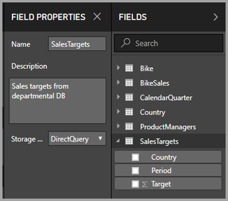
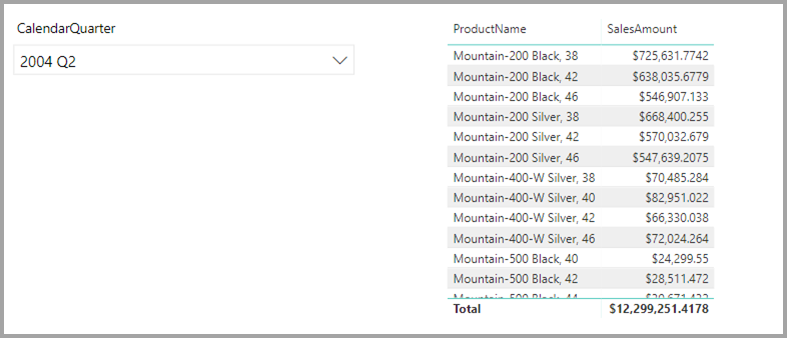
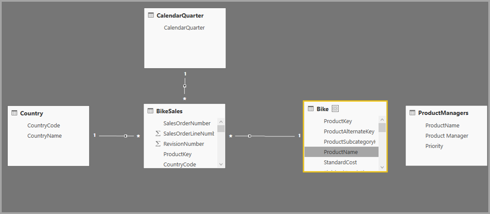
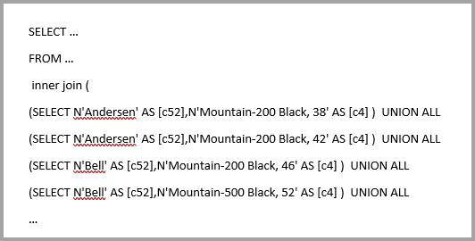

# Composite models in Power BI Desktop (preview)

Previously in Power BI Desktop, when you used a DirectQuery in a report, no other data connections, whether DirectQuery or import, were allowed for that report. With composite models, that restriction is removed, and a report can seamlessly include data connections from more than one DirectQuery or import data connection, in any combination you choose.

The composite models capability in Power BI Desktop consists of three related features:

* **Composite models**: Allows a report to have multiple data connections, including DirectQuery connections or import, in any combination. This article describes composite models in detail.

* **Many-to-many relationships**: With *composite models*, you can establish *many-to-many relationships* between tables, which removes requirements for unique values in tables and removes previous workarounds, such as introducing new tables just to establish relationships. For more information, see [Many-to-many relationships in Power BI Desktop (preview)](desktop-many-to-many-relationships.md).

* **Storage mode**: You can now specify which visuals require a query to back-end data sources. Visuals that don't require a query are imported even if they're based on DirectQuery. This feature helps improve performance and reduce back-end load. Previously, even simple visuals such as slicers initiated queries that were sent to back-end sources. For more information, see [Storage mode in Power BI Desktop (preview)](desktop-storage-mode.md).

## Enable the composite models preview feature

The composite models feature is in preview, and must be enabled in Power BI Desktop. To enable composite models, select **File** > **Options and Settings** > **Options** > Preview Features**, and then select the **Composite Models** check box. 

To enable the feature, you need to restart Power BI Desktop.

## Use composite models

With composite models, you can connect to a variety of data sources when you use Power BI Desktop or the **Power BI service**, and you can make those data connections in various ways. You can import data to Power BI, which is the most common way to get data, or you can connect directly to data in its original source repository by using DirectQuery. To learn more about DirectQuery, see [Use DirectQuery in Power BI](desktop-directquery-about.md).

When you use DirectQuery, composite models makes it possible to create a Power BI model (such as a single .pbix Power BI Desktop file) that does either or both of the following:

* Combines data from one or more DirectQuery sources.
* Combines data from DirectQuery sources and import data.

For example, by using composite models, you can build a model that combines sales data from an enterprise data warehouse with data on sales targets that is in a departmental SQL Server database, along with some data imported from a spreadsheet. A model that combines data from more than one DirectQuery source or that combines DirectQuery with imported data is referred to as a *composite model*.

> [!NOTE]
> While composite models are in preview, it is not possible to publish composite models to the Power BI service. 

You can create relationships between tables as you always have, even when those tables come from different sources, with the following restriction: any relationships that are cross-source must be defined as having a cardinality of *many-to-many*, regardless of their actual cardinality. The behavior of such relationships is then the same as normal for *many-to-many* relationships, as described in [Many-to-many relationships in Power BI Desktop (preview)](desktop-many-to-many-relationships.md). Note that within the context of composite models, all imported tables are effectively a single source, regardless of the actual underlying data source from which they are imported.   

## Example of using composite models

As an example of a *composite model*, consider a report that has connected to a corporate data warehouse (in SQL Server) by using DirectQuery, where the data warehouse contains *Sales by Country*, *Quarter*, and *Bike (Product)* data, as shown in the following image:

At this point you could build simple visuals by using fields from this source. For example, the following image shows total sales amount by *ProductName*, for a selected quarter. 

But what if you had some information about the product manager who's assigned to each product, along with the marketing priority, where that data is maintained in an Office Excel spreadsheet? You might want to view *Sales Amount* by *Product Manager*, yet having this local data added to the corporate data warehouse would likely be unfeasible, or take months at best. 

It might be possible to import that sales data from the data warehouse (instead of using DirectQuery), at which point it could be combined with data imported from the spreadsheet. However, that approach is unreasonable, given the reasons that lead to using DirectQuery in the first place. The reasons could include some combination of the security rules enforced in the underlying source, the need to be able to view the latest data, and the sheer scale of the data. 

That's where composite models come in. Composite models give you the option of connecting to the data warehouse by using DirectQuery, and then also using GetData for additional sources. In this case, we establish the DirectQuery connection to the corporate data warehouse, use GetData and choose Excel, navigate to the spreadsheet containing our local data, and then import the sheet containing the *Product Names*, the assigned *Sales Manager*, and the *Priority*.  

Now in the **Fields** list we see the original *Bike* table (from SQL Server) and a new **ProductManagers** table (with the data from imported from Excel). 

Similarly, looking at **Relationship View** in Power BI Desktop, we now see an additional table called **ProductManagers**. 

We now need to relate these tables to the other tables in the model. We do this as we always have, by creating a relationship between the *Bike* table (in SQL Server) and the **ProductManagers** table (that is imported), such as between *Bike[ProductName]* and *ProductManagers[ProductName]*. As discussed earlier in this article, all relationships that go across source must have *many-to-many* cardinality, which is the default cardinality that is selected. 

Now that we've created this relationship, it's displayed in **Relationship** view in Power BI Desktop, just as we would expect.

With those table relationships established, we can now create visuals by using any of the fields in the **Fields** list, seamlessly blending data from multiple sources. For example, the following image displays the total *SalesAmount* for each *Product Manager*. 

This example shows a common case of a *dimension* table (such as *Product* or *Customer*) that's extended with some extra data imported from somewhere else. It's also possible to have tables use DirectQuery to connect to different sources. To extend our example, imagine that *Sales Targets* per *Country* and *Period* are stored in a separate departmental database. You can use *GetData* to connect to that data as you usually would, as shown in the following image: 

Then, much as we did earlier in this example, we can create relationships between the new table and other tables in the model, and then create visuals that combine their data. Let's look again at the **Relationships** view, where we've established new relationships in our extended example scenario.

As shown in the following image, which is based on the new data and relationships we just created, the visual at the lower left shows total *Sales Amount* versus *Target*, with the variance calculation showing the difference, where *Sales Amount* and *Target* are coming from two different SQL Server databases. 

## Set the storage mode

Each table in a composite model has a storage mode that indicates whether the table is based on DirectQuery or import. The storage mode can be viewed and modified in the **Property** pane. To display the storage mode, right-click a table in the **Fields** list, and then select **Properties**. The following image shows the storage mode (shortened to **Storage ...** in the image) for the **SalesTargets** table.

The storage mode can also be viewed on the tooltip for each table.

For any Power BI Desktop file (a *.pbix* file) that contains some tables from DirectQuery and some import tables, the status bar displays a storage mode of **Mixed**. You can click that term in the status bar and easily switch all tables to import.

Details about storage mode are described in full in the [Storage mode in Power BI Desktop (preview)](desktop-storage-mode.md) article.  

## Calculated tables

Calculated tables can be added to a model that uses DirectQuery, and the Data Analysis Expressions (DAX) that define the calculated table can reference either imported or DirectQuery tables, or a combination of both. 

Calculated tables are always imported, and the data in those tables is refreshed when the table is refreshed. As such, if a calculated table references a DirectQuery table, visuals that reference the DirectQuery table always show the latest values in the underlying source, but visuals that reference the calculated table show the values at the time the calculated table was last refreshed.

## Security implications 

Composite models have some security implications. A query sent to one data source can include data values that have been retrieved from another different source. For the example described earlier in this article, the visual that shows *Sales Amount* by *Product Manager* results in a SQL query being sent to the **Sales** relational database, where that SQL query might contain the names of *Product Managers* and their associated *Products*. 

Because of this, information that is stored in the spreadsheet is now being included in a query sent to the relational database. If this information is confidential, the security implications should be considered. In particular, consider the following:

* Any administrator of the database who can view traces or audit logs would be able to view this information, even if they do not have permissions to the data in its original source (in this case, permissions to the Excel file).

* The encryption settings for each source should be considered, to avoid information being retrieved from one source using an encrypted connection, but then inadvertently having it included in a query sent to another source by using an unencrypted connection. 

Power BI Desktop displays a warning message when an action is taken to create a composite model, to allow confirmation that any security implications have been considered.  

For similar reasons, exercise care when you open a Power BI Desktop file that's sent from an untrusted source. If the file contains composite models, it means that information retrieved from one source, using the credentials of the user who opens the file, would be sent to another data source as part of the query. In this case, it could be viewed by the malicious author of the Power BI Desktop file. Therefore, when you open a Power BI Desktop file for the first time, if it contains multiple sources, a warning is displayed. This warning is similar to the warning that's displayed when you open a file that contains native SQL queries.  

## Performance implications  

When you use DirectQuery, you should always consider performance, primarily to ensure that the back-end source has sufficient resources to provide a good experience for users. A good experience means that visuals should refresh in five seconds or less. You should also adhere to the performance advice in the [Use DirectQuery in Power BI](desktop-directquery-about.md) article. 

Using composite models adds additional performance considerations. A single visual can result in sending queries to multiple sources, which often passes the results from one query across to a second source. This situation can result in the following forms of execution:

* **A SQL query that includes a large number of literal values**: For example, a visual requesting total *Sales Amount* (from the SQL database) for a set of selected *Product Managers* (from the related table that was imported from a spreadsheet) would first need to find which *Products* were managed by those product managers. This all must happen before the visual sends a SQL query that includes all of the product IDs in a *WHERE* clause.

* **A SQL query that queries at a lower level of granularity, with the data then being aggregated locally**: To continue with the preceding example, as the number of *Products* meeting the filter criteria on *Product Manager* becomes very large, at a certain point it becomes inefficient or unfeasible to include them all in a *WHERE* clause. Instead, it's necessary to query the relational source at the lower level of *Product*, and then locally aggregate the results. If the cardinality of *Products* exceeds a limit of 1 million, the query will fail.

* **Multiple SQL queries, one per group by value**: When the aggregation uses **DistinctCount** and is grouped by some column from another source, and if the external source does not support efficient passing of many literal values that define the grouping, it's necessary to send one SQL query per group by value. 

   For example, a visual that requests a distinct count of *CustomerAccountNumber* (from the SQL Server table) by *Product Manager* (from the related table that was imported from a spreadsheet) would need to pass in the details from the *Product Managers* table in the query sent to SQL Server. Over other sources (Redshift, for example), this is unfeasible. Instead, there would be one SQL query sent per *Sales Manager* (up to some practical limit, at which point the query would fail). 

Each of these cases has its own implications on performance, and the exact details vary for each data source. A good rule of thumb is that, while the cardinality of the columns used in the relationship joining the two sources remains low (a few thousand), performance should not be significantly affected. As this cardinality grows, you should pay more attention to the impact on the resulting performance. 

Additionally, the use of *many-to-many* relationships means that separate queries must be sent to the underlying source for each total or subtotal level, rather than aggregating the detailed values locally. As such, a simple table visual with totals would send two SQL queries, rather than one. 

## Limitations and considerations

There are a few limitations for this release of composite models.

The following Live Connect (multi-dimensional) sources cannot be used with composite models:

* SAP HANA
* SAP Business Warehouse
* SQL Server Analysis Services
* Power BI datasets
* Azure Analysis Services

When you connect to those multi-dimensional sources by using DirectQuery, you can neither connect to another DirectQuery source nor combine it with imported data.

The existing limitations of using DirectQuery still apply when you use composite models. Many of these limitations are now per table, depending upon the storage mode of the table. For example, a calculated column on an imported table can refer to other tables, but a calculated column on a DirectQuery table is still restricted to refer only to columns on the same table. Other limitations apply to the model as a whole, if any of the tables within the model are DirectQuery. For example, the QuickInsights and Q&A features are not available on a model if any of the tables within it has a storage mode of DirectQuery. 

## Next steps

For more information about composite models and DirectQuery, see the following articles:
* [Many-to-many relationships in Power BI Desktop (preview)](desktop-many-to-many-relationships.md)
* [Storage mode in Power BI Desktop (preview)](desktop-storage-mode.md)
* [Use DirectQuery in Power BI](desktop-directquery-about.md)
* [Data sources supported by DirectQuery in Power BI](desktop-directquery-data-sources.md)

