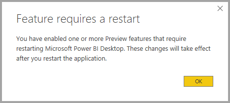
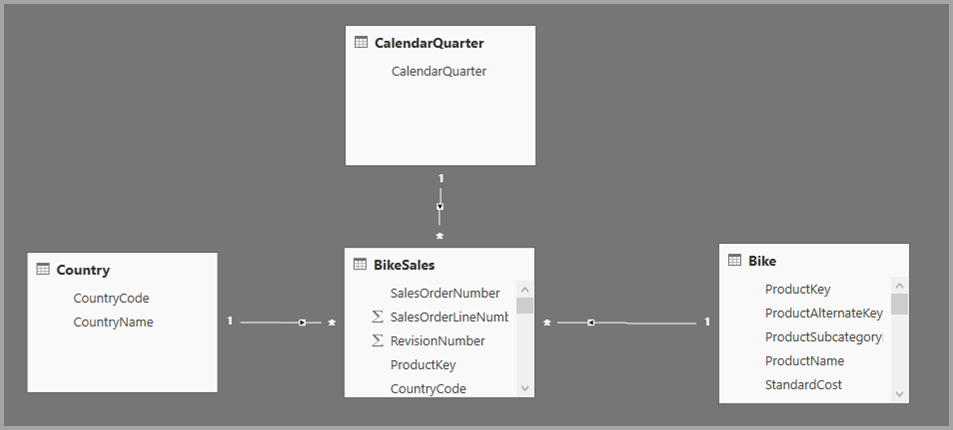
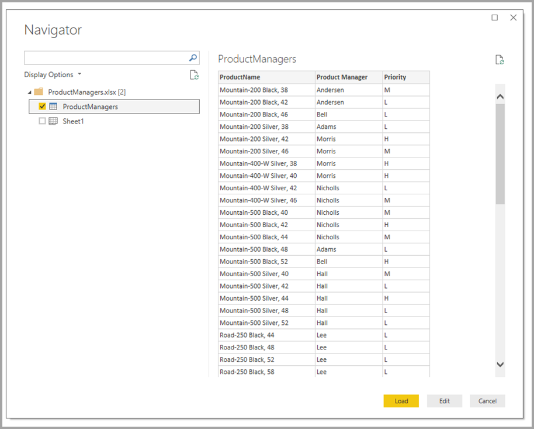
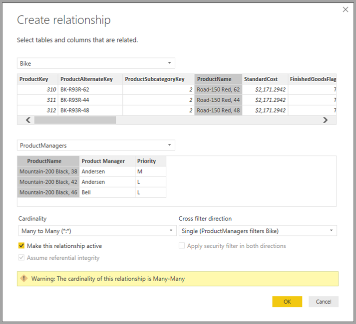

# Composite models in Power BI Desktop (preview)

Previously in Power BI Desktop, when you used a DirectQuery in a report, no other data connections - whether DirectQuery or Import - were allowed for that report. With composite models, that restriction is removed. A report can seamlessly include data connections from more than one DirectQuery or Import data connection, in any combination you choose.

The composite models capability in Power BI Desktop consists of three related features:

* **Composite models**: Allows a report to have multiple data connections, including DirectQuery connections or Import, in any combination. This article describes composite models in detail.

* **Many-to-many relationships**: With *composite models*, you can establish *many-to-many relationships* between tables. This approachh removes requirements for unique values in tables. It also removes previous workarounds, such as introducing new tables only to establish relationships. For more information, see [Many-to-many relationships in Power BI Desktop (preview)](desktop-many-to-many-relationships.md).

* **Storage mode**: You can now specify which visuals require a query to back-end data sources. Visuals that don't require a query are imported even if they're based on DirectQuery. This feature helps improve performance and reduce back-end load. Previously, even simple visuals such as slicers initiated queries that were sent to back-end sources. For more information, see [Storage mode in Power BI Desktop (preview)](desktop-storage-mode.md).

## Enable the composite models preview feature

The composite models feature is in preview, and it must be enabled in Power BI Desktop. To enable composite models, select **File** > **Options and Settings** > **Options** > **Preview Features**, and then select the **Composite Models** check box. 

To enable the feature, you need to restart Power BI Desktop.

## Use composite models

With composite models, you can connect to a variety of data sources when you use Power BI Desktop or the Power BI service. You can make those data connections in a couple of ways:

* By importing data to Power BI, which is the most common way to get data.
* By connecting directly to data in its original source repository by using DirectQuery. To learn more about DirectQuery, see [Use DirectQuery in Power BI](desktop-directquery-about.md).

When you use DirectQuery, composite models makes it possible to create a Power BI model (such as a single *.pbix* Power BI Desktop file) that does either or both of the following:

* Combines data from one or more DirectQuery sources.
* Combines data from DirectQuery sources and Import data.

For example, by using composite models, you can build a model that combines the following types of data:

* Sales data from an enterprise data warehouse.
* Sales-target data from a departmental SQL Server database.
* Data that's imported from a spreadsheet. 

A model that combines data from more than one DirectQuery source or that combines DirectQuery with Import data is called a *composite model*.

> [!NOTE]
> Beginning with the October 2018 release of Power BI Desktop, you *can* publish composite models to the Power BI service. For scheduled refresh and dashboard tile refresh, composite models in the Power BI service behave in the same way as Import models. 

You can create relationships between tables as you always have, even when those tables come from different sources, with the following restriction: any relationships that are cross-source must be defined as having a cardinality of *many-to-many*, regardless of their actual cardinality. The behavior of such relationships is then the same as normal for *many-to-many* relationships, as described in [Many-to-many relationships in Power BI Desktop (preview)](desktop-many-to-many-relationships.md). 

> [!NOTE]
> Within the context of composite models, all imported tables are effectively a single source, regardless of the actual underlying data source from which they are imported.   

## Example of a composite model

For an example of a *composite model*, consider a report that has connected to a corporate data warehouse (in SQL Server) by using DirectQuery. In this instance, the data warehouse contains *Sales by Country*, *Quarter*, and *Bike (Product)* data, as shown in the following image:

At this point, you could build simple visuals by using fields from this source. For example, the following image shows total sales by *ProductName*, for a selected quarter. 

But what if you have some information about the product manager who's assigned to each product, along with the marketing priority, where that data is maintained in an Office Excel spreadsheet? Let's say you want to view *Sales Amount* by *Product Manager*. It might not be possible to add this local data to the corporate data warehouse, or it might take months at best. 

It might be possible to import that sales data from the data warehouse, instead of using DirectQuery. And the sales data could then be combined with the data that you imported from the spreadsheet. However, that approach is unreasonable, for the reasons that lead to using DirectQuery in the first place. The reasons could include:

* Some combination of the security rules enforced in the underlying source.
* The need to be able to view the latest data.
* The sheer scale of the data. 

Here's where composite models come in. Composite models give you the option of connecting to the data warehouse by using DirectQuery and then using GetData for additional sources. In this example, we first establish the DirectQuery connection to the corporate data warehouse. We use GetData, choose Excel, and then navigate to the spreadsheet that contains our local data. Finally, we import the spreadsheet that contains the *Product Names*, the assigned *Sales Manager*, and the *Priority*.  

In the **Fields** list, you can see two tables: the original *Bike* table from SQL Server and a new **ProductManagers** table. The new table contains the data that's imported from Excel. 

Similarly, in the **Relationship** view in Power BI Desktop, we now see an additional table called **ProductManagers**. 

We now need to relate these tables to the other tables in the model. As always, we create a relationship between the **Bike** table from SQL Server and the imported **ProductManagers** table. That is, the relationship is between *Bike[ProductName]* and *ProductManagers[ProductName]*. As discussed earlier, all relationships that go across source must have the default *many-to-many* cardinality. 

Now that we've established this relationship, it's displayed in the **Relationship** view in Power BI Desktop, as we would expect.

We can now create visuals by using any of the fields in the **Fields** list. This approach seamlessly blends data from multiple sources. For example, the total *SalesAmount* for each *Product Manager* is displayed in the following image: 

The following example displays a common case of a *dimension* table (such as *Product* or *Customer*) that's extended with some extra data imported from somewhere else. It's also possible to have tables use DirectQuery to connect to various sources. To continue with our example, imagine that *Sales Targets* per *Country* and *Period* are stored in a separate departmental database. As usual, you can use *GetData* to connect to that data, as shown in the following image: 

As we did earlier, we can now create relationships between the new table and other tables in the model, and then create visuals that combine their data. Let's look again at the **Relationships** view, where we've established the new relationships:

The next image is based on the new data and relationships we created. The visual at the lower left shows total *Sales Amount* versus *Target*, and the variance calculation shows the difference. The *Sales Amount* and *Target* data come from two different SQL Server databases. 

## Set the storage mode

Each table in a composite model has a storage mode that indicates whether the table is based on DirectQuery or Import. The storage mode can be viewed and modified in the **Property** pane. To display the storage mode, right-click a table in the **Fields** list, and then select **Properties**. The following image shows the storage mode (shortened to **Storage ...** in the image) for the **SalesTargets** table.

The storage mode can also be viewed on the tooltip for each table.

For any Power BI Desktop file (a *.pbix* file) that contains some tables from DirectQuery and some Import tables, the status bar displays a storage mode called **Mixed**. You can click that term in the status bar and easily switch all tables to Import.

For more information about storage mode, see [Storage mode in Power BI Desktop (preview)](desktop-storage-mode.md).  

## Calculated tables

You can add calculated tables to a model that uses DirectQuery. The Data Analysis Expressions (DAX) that define the calculated table can reference either imported or DirectQuery tables or a combination of the two. 

Calculated tables are always imported, and their data is refreshed when the table is refreshed. If a calculated table refers to a DirectQuery table, visuals that refer to the DirectQuery table always show the latest values in the underlying source. Alternatively, visuals that refer to the calculated table show the values at the time when the calculated table was last refreshed.

## Security implications 

Composite models have some security implications. A query sent to one data source can include data values that have been retrieved from another source. In the earlier example, the visual that shows *Sales Amount* by *Product Manager* results in a SQL query being sent to the **Sales** relational database. That SQL query might contain the names of *Product Managers* and their associated *Products*. 

Consequently, information that's stored in the spreadsheet is now included in a query that's sent to the relational database. If this information is confidential, you should consider the security implications. In particular, consider the following points:

* Any administrator of the database who can view traces or audit logs would be able to view this information, even if they lack permissions to the data in its original source. In this example, the administrator would need permissions to the Excel file.

* The encryption settings for each source should be considered. You want to avoid retrieving information from one source via an encrypted connection and then inadvertently including it in a query that's sent to another source via an unencrypted connection. 

To allow confirmation that you have considered any security implications, Power BI Desktop displays a warning message when an action is taken to create a composite model.  

For similar reasons, be careful when you open a Power BI Desktop file that's sent from an untrusted source. If the file contains composite models, information that someone retrieves from one source by using the credentials of the user who opens the file would be sent to another data source as part of the query. The information could be viewed by the malicious author of the Power BI Desktop file. Therefore, when you initially open a Power BI Desktop file that contains multiple sources, Power BI Desktop displays a warning. The warning is similar to the one that's displayed when you open a file that contains native SQL queries.  

## Performance implications  

When you use DirectQuery, you should always consider performance, primarily to ensure that the back-end source has sufficient resources to provide a good experience for users. A good experience means that the visuals refresh in five seconds or less. You should also follow the performance advice in the [Use DirectQuery in Power BI](desktop-directquery-about.md) article. 

Using composite models adds additional performance considerations. A single visual can result in sending queries to multiple sources, which often passes the results from one query across to a second source. This situation can result in the following forms of execution:

* **A SQL query that includes a large number of literal values**: For example, a visual that requests total *Sales Amount* for a set of selected *Product Managers* would first need to find which *Products* were managed by those product managers. This sequence must happen before the visual sends a SQL query that includes all of the product IDs in a *WHERE* clause.

* **A SQL query that queries at a lower level of granularity, with the data then being aggregated locally**: As the number of *Products* that meet the filter criteria on *Product Manager* grows large, it can become inefficient or unfeasible to include all products in a *WHERE* clause. Instead, you can query the relational source at the lower level of *Product* and then aggregate the results locally. If the cardinality of *Products* exceeds a limit of 1 million, the query fails.

* **Multiple SQL queries, one per group by value**: When the aggregation uses **DistinctCount** and is grouped by a column from another source, and if the external source does not support efficient passing of many literal values that define the grouping, it's necessary to send one SQL query per group by value. 

   For example, a visual that requests a distinct count of *CustomerAccountNumber* (from the SQL Server table) by *Product Manager* (imported from the spreadsheet) would need to pass in the details from the *Product Managers* table in the query that's sent to SQL Server. Over other sources (Redshift, for example), this action is unfeasible. Instead, there would be one SQL query sent per *Sales Manager*&mdash;up to some practical limit, at which point the query would fail. 

Each of these cases has its own implications on performance, and the exact details vary for each data source. Although the cardinality of the columns used in the relationship that joins the two sources remains low (a few thousand), performance should not be affected. As this cardinality grows, you should pay more attention to the impact on the resulting performance. Apply this guidance as a good rule of thumb. 

Additionally, the use of *many-to-many* relationships means that separate queries must be sent to the underlying source for each total or subtotal level, rather than aggregating the detailed values locally. A simple table visual with totals would send two SQL queries, rather than one. 

## Limitations and considerations

This release of composite models presents a few limitations.

The following Live Connect (multi-dimensional) sources can't be used with composite models:

* SAP HANA
* SAP Business Warehouse
* SQL Server Analysis Services
* Power BI datasets
* Azure Analysis Services

When you connect to these multi-dimensional sources by using DirectQuery, you can't connect to another DirectQuery source or combine it with Import data.

The existing limitations of DirectQuery still apply when you use composite models. Many of these limitations are now per table, depending upon the storage mode of the table. For example, a calculated column on an Import table can refer to other tables, but a calculated column on a DirectQuery table can still refer only to columns on the same table. Other limitations apply to the model as a whole, if any of the tables within the model are DirectQuery. For example, the QuickInsights and Q&A features aren't available on a model if any of the tables within it has a storage mode of DirectQuery. 

## Next steps

For more information about composite models and DirectQuery, see the following articles:
* [Many-to-many relationships in Power BI Desktop (preview)](desktop-many-to-many-relationships.md)
* [Storage mode in Power BI Desktop (preview)](desktop-storage-mode.md)
* [Use DirectQuery in Power BI](desktop-directquery-about.md)
* [Data sources supported by DirectQuery in Power BI](desktop-directquery-data-sources.md)

