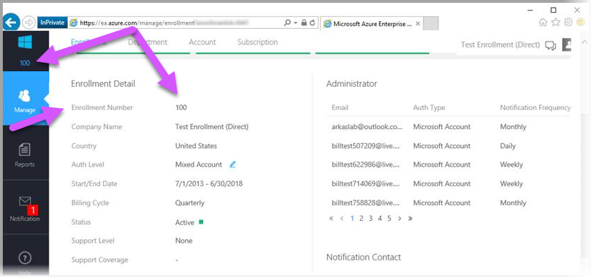
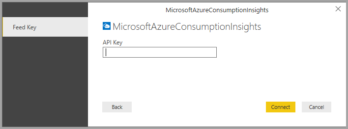
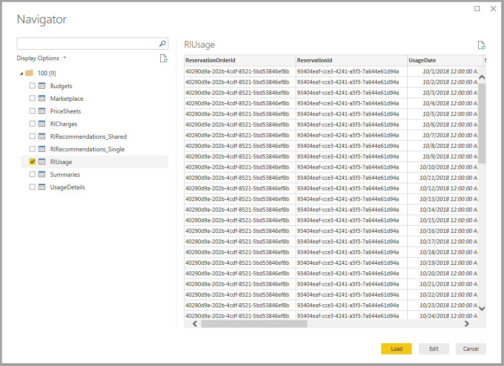
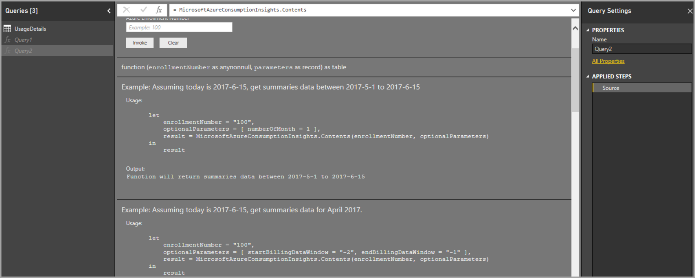
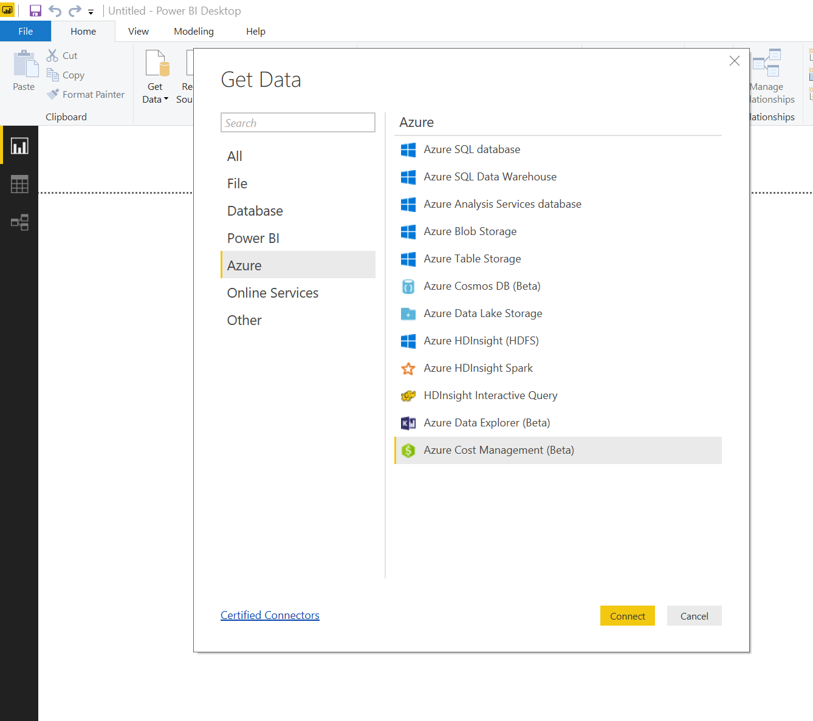
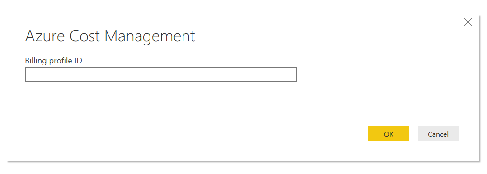
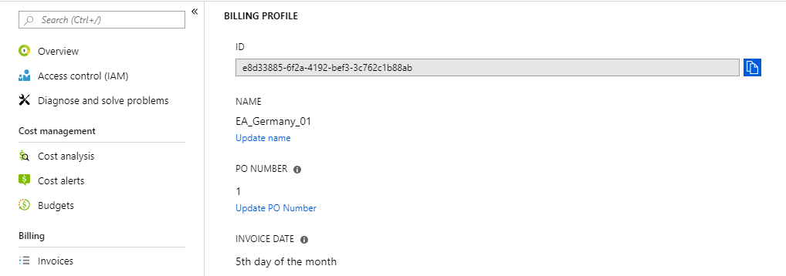
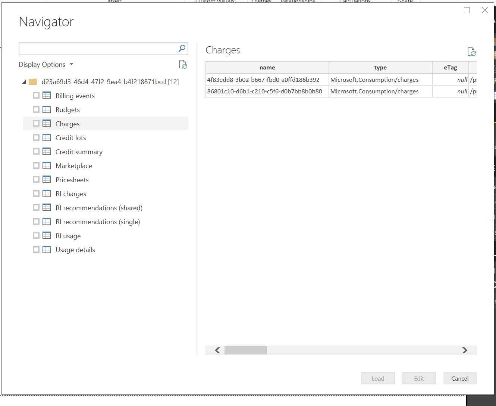
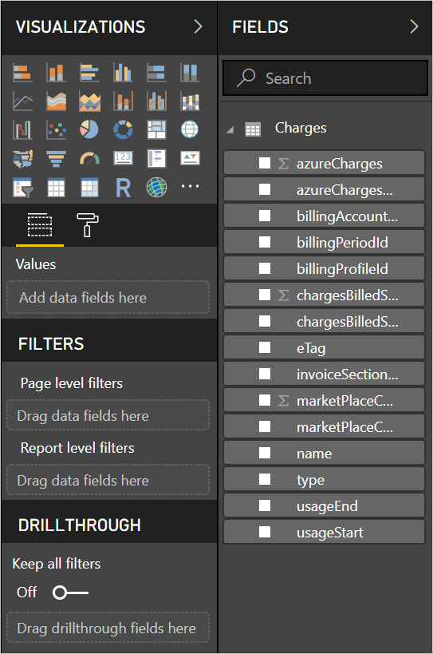

# Analyze Azure cost and usage data in Power BI desktop

You can use Power BI desktop to connect to Azure and get in-depth data about your organization's Azure service usage. With this data, you can create custom reports and measures to better understand and analyze your Azure spending.

Power BI currently supports connecting to Enterprise Agreement and Customer Agreement billing accounts.

* **Enterprise Agreement** users should connect with the **Azure Consumption Insights connector** (below).

* **Customer Agreement** users should connect with the [**Azure Cost Management connector**](#connect-with-azure-cost-management).

## Connect with Azure Consumption Insights

Azure Consumption Insights allows you to connect to Azure Enterprise Agreement billing accounts.

In this section, you learn how to get the data you need migrate using the Azure Enterprise Connector. You'll also find a *usage details columns* mapping available in the **ACI** (Azure Consumption Insights) API.

To successfully use the **Azure Consumption Insights** connector, you need access to the Azure portal Enterprise features.

To use the **Azure Consumption Insights** connector in **Power BI Desktop**: 

1. From the **Home** ribbon, select **Get Data**.

1. From the categories on the left, select **Online Services**.  

1. Select **Microsoft Azure Consumption Insights (Beta)**. 

1. Select **Connect**.

   

   In the dialog that appears, enter your **Azure Enrollment Number**.

   

   * You can get your enrollment number from the [Azure Enterprise Portal](https://ea.azure.com), in the location shown in the following image:

  

   This connector version only supports enterprise enrollments from https://ea.azure.com. China enrollments aren't currently supported.

   Next, provide your *Access key* to connect.

   

   * Your Access key for enrollment can be found on the [Azure Enterprise Portal](https://ea.azure.com).

  

Once you provide your *Access key* and select **Connect**, a **Navigator** window appears and shows nine available tables:

| Table        | Description |
|------------- | -------------------------------------------------------------|
| **Budgets** | Budget details to view actual costs or usage against existing budget targets. |
| **MarketPlace** | Usage-based Azure Marketplace charges. |
| **PriceSheets** | Applicable rates by meter for an enrollment. |
| **RICharges** | Charges associated to your Reserved Instances over the last 24 months. |
| **RIRecommendations_Single** | Reserved Instance purchase recommendations based on your single subscription usage trends over the last 7, 30, or 60 days. |
| **RIRecommendations_Shared** | Reserved Instance purchase recommendations based on your usage trends across all your subscriptions over the last 7, 30 or 60 days. |
| **RIUsage** | Consumption details for your existing Reserved Instances over the last month. |
| **Summaries** | A monthly summary for balances, new purchases, Azure Marketplace service charges, adjustments, and overage charges. |
| **UsageDetails** | A consumed quantities breakdown and estimated enrollment charges. |

You can select a checkbox beside any table to see a preview. You can select one or more tables by checking the box beside their name, then select **Load**.



> [!NOTE]
> The *Summary* and *PriceSheet* tables are only available for the enrollment-level API Key. Also, the data in these tables has, by default, the current month's data for *Usage* and *PriceSheet*. The *Summary* and *MarketPlace* tables are not constrained to the current month.
>
>

When you select **Load**, the data is loaded into **Power BI Desktop**.


Once the data you selected is loaded, the tables and fields you selected can be seen in the **Fields** pane.


## Using Azure Consumption Insights
To use the **Azure Consumption Insights** connector, you access to the Azure portal Enterprise features.

Once you successfully load data using the **Azure Consumption Insights** connector, you can create your own custom measures and columns using **Query Editor**. You can also create visuals, reports, and dashboards for sharing in the **Power BI service**.

With a blank query, you can retrieve a sample Azure custom queries collection. There are two ways you can do this retrieval: 

In **Power BI Desktop**: 

1. Select the **Home** ribbon 
2. Select **Get Data** > **Blank Query** 

Or, in **Query Editor**: 

1. Right-click in the left **Queries** pane 
2. Select **New Query > Blank Query** from the menu that appears

In the **Formula bar**, type:

    = MicrosoftAzureConsumptionInsights.Contents

The following image shows a samples collection that appears.



When working with reports and creating queries, you can:

* To define the number of months starting from the current date, use *numberOfMonth*
  * Use a value between one and 36. Represent the number of months, from the current date, you want to import. We recommend getting no more than 12 months of data. This limit avoids Power BI query import constraints and data volume thresholds.
* To define a period of months in a historical time window, use *startBillingDataWindow* and *endBillingDataWindow*
* Don't use *numberOfMonth* together with *startBillingDataWindow* or *endBillingDataWindow*

## Migrate from the Azure Enterprise Connector

Some customers created visuals using the *Azure Enterprise Connector (Beta)*. Eventually, it will be replaced with the **Azure Consumption Insights** connector. The new connector has features and enhancements that include:

* Additional data sources available for *Balance Summary* and *Marketplace Purchases*
* New and advanced parameters, such as *startBillingDataWindow* and *endBillingDataWindow*
* Better performance and responsiveness

The next steps show how to transition to the **Azure Consumption Insights** connector. These steps preserve the work you've already done in creating custom dashboards or reports.

### Step 1: Connect to Azure using the new connector
The first step is use the **Azure Consumption Insights** connector described in detail earlier in this article. In this step, select **Get Data > Blank Query** from the **Home** ribbon in **Power BI Desktop**.

### Step 2: Create a query in Advanced Editor
In **Query Editor**, select **Advanced Editor** from the **Home** ribbon's **Query** section. In the **Advanced Editor** window that appears, enter this query:

    let    
        enrollmentNumber = "100",
        optionalParameters = [ numberOfMonth = 6, dataType="DetailCharges" ],
        data = MicrosoftAzureConsumptionInsights.Contents(enrollmentNumber, optionalParameters)   
    in     
        data


You'll need to replace the *enrollmentNumber* value with your enrollment number. You can get your number from the [Azure Enterprise Portal](https://ea.azure.com). The *numberOfMonth* parameter is how many months of data you want going back, from the current dat. Use zero (0) for the current month.

Once you select **Done** in the **Advanced Editor** window, the preview refreshes and data from the specified month range appears in the table. Select **Close & Apply** and return.

### Step 3: Move measures and custom columns to the new report
Next, you'll need to move any custom columns or measures you created into the new details table. Here are the steps.

1. Open Notepad (or another text editor).
2. Select the measure you want to move, copy the text from the *Formula* field, and place it in Notepad.

   
3. Rename *Query1* to the original details table name.
4. To create new table measures and custom columns, right-click on your table, and choose **New Measure**. Then, cut and paste your stored measures and columns until they're all done.

### Step 4: Relink tables that had relationships
Many dashboards have additional tables that are used for lookup or filtering, such as date tables or tables used for custom projects. Reestablishing those relationships resolves most remaining issues. Here's how to do it.

- In the **Modeling** tab in **Power BI Desktop**, select **Manage Relationships** to bring up a window that lets you manage relationships within the model. Relink your tables, as needed.

    

### Step 5: Verify your visuals, and adjust field formatting as needed
At this point, most of your original visuals, tables, and drill-downs should be working as expected. Some minor tweaks may be necessary, however, to precisely format the look and feel. Take a bit of time to look over each of your dashboards and visuals to ensure they look how you want them.

## Using the Azure Consumption and Insights (ACI) API to get consumption data
Azure also provides the [**Azure Consumption and Insights (ACI) API**](https://azure.microsoft.com/blog/announcing-general-availability-of-consumption-and-charge-apis-for-enterprise-azure-customers/). You can create your own custom solutions to gathering, reporting, and visualizing Azure consumption information using the ACI API.

### Mapping names and usage details between the portal, the connector, and the API
The Azure portal columns and details names are similar in the API and the connector, though not always identical. To help clarify, the following table provides a mapping. Also indicated is whether the column is obsolete. For more information, and term definitions, see the [Azure billing data dictionary](https://docs.microsoft.com/azure/billing/billing-enterprise-api-usage-detail).

| ACI Connector / ContentPack ColumnName | ACI API Column Name | EA Column Name | Obsolete / Present for backward compatibility |
| --- | --- | --- | --- |
| AccountName |accountName |Account Name |No |
| AccountId |accountId | |Yes |
| AcccountOwnerId |accountOwnerEmail |AccountOwnerId |No |
| AdditionalInfo |additionalInfo |AdditionalInfo |No |
| AdditionalInfold | | |Yes |
| Consumed Quantity |consumedQuantity |Consumed Quantity |No |
| Consumed Service |consumedService |Consumed Service |No |
| ConsumedServiceId |consumedServiceId | |Yes |
| Cost |cost |ExtendedCost |No |
| Cost Center |costCenter |Cost Center |No |
| Date |date |Date |No |
| Day | |Day |No |
| DepartmentName |departmentName |Department Name |No |
| DepartmentID |departmentId | |Yes |
| Instance ID | | |Yes |
| InstanceId |instanceId |Instance ID |No |
| Location | | |Yes |
| Meter Category |meterCategory |Meter Category |No |
| Meter ID | | |Yes |
| Meter Name |meterName |Meter Name |No |
| Meter Region |meterRegion |Meter Region |No |
| Meter Sub-Category |meterSubCategory |Meter Sub-Category |No |
| MeterId |meterId |Meter ID |No |
| Month | |Month |No |
| Product |product |Product |No |
| ProductId |productId | |Yes |
| Resource Group |resourceGroup |Resource Group |No |
| Resource Location |resourceLocation |Resource Location |No |
| ResourceGroupId | | |Yes |
| ResourceLocationId |resourceLocationId | |Yes |
| ResourceRate |resourceRate |ResourceRate |No |
| ServiceAdministratorId |serviceAdministratorId |ServiceAdministratorId |No |
| ServiceInfo1 |serviceInfo1 |ServiceInfo1 |No |
| ServiceInfo1Id | | |Yes |
| ServiceInfo2 |serviceInfo2 |ServiceInfo2 |No |
| ServiceInfo2Id | | |Yes |
| Store Service Identifier |storeServiceIdentifier |Store Service Identifier |No |
| StoreServiceIdentifierId | | |Yes |
| Subscription Name |subscriptionName |Subscription Name |No |
| Tags |tags |Tags |No |
| TagsId | | |Yes |
| Unit Of Measure |unitOfMeasure |Unit Of Measure |No |
| Year | |Year |No |
| SubscriptionId |subscriptionId |SubscriptionId |Yes |
| SubscriptionGuid |subscriptionGuid |SubscriptionGuid |No |

## Connect with Azure Cost Management

In this section, you'll learn how to connect to your Customer Agreement billing account.

> [!NOTE]
> The Azure Cost Management connector currently supports customers on the **Customer Agreement**.  **Enterprise Agreement** customers should use the Microsoft Azure Consumption Insights connector.
>
>

To use the **Azure Cost Management** connector in **Power BI Desktop**:

1. From the **Home** ribbon, select **Get Data**.

1. From the categories on the left, select **Azure**.

1. Select **Azure Cost Management (Beta)** on the right.

1. Select **Connect**.


   

   In the dialog that appears, enter your **Billing profile ID**.

   

You can get your ID from the [Azure portal](https://portal.azure.com):

1. Navigate to **Cost Management + Billing**.

1. Select your billing account.

1. Select **Billing profiles** in the sidebar.

1. Select your billing profile.

1. Select **Properties** in the sidebar.

1. Copy your billing profile ID.

   

   You'll be prompted to sign in with your Azure email and password.  Once you authenticate, you'll be shown a **Navigator** window with 12 available tables:

| Table        | Description |
|-------------------- | -------------------------------------------------------------|
| **Billing events** | Event log of new invoices, credit purchases, and more. |
| **Budgets** | Budget details to view actual costs or usage against existing budget targets. |
| **Charges** | A month-level summary of Azure usage, market place charges, and charges billed separately. |
| **Credit lots** | Azure credit lot purchase details for the provided billing profile. |
| **Credit summary** | Credit summary for provided billing profile. |
| **Marketplace** | Usage-based Azure Marketplace charges. |
| **Pricesheets** | Applicable meter rates for the provided billing profile. |
| **RI charges** | Charges associated to your Reserved Instances over the last 24 months. |
| **RI recommendations (single)** | Reserved Instance purchase recommendations based on your single subscription usage trends for the last 7, 30 or 60 days. |
| **RI recommendations (shared)** | Reserved Instance purchase recommendations based on all your subscription usage trends for the last 7, 30 or 60 days. |
| **RI usage** | Consumption details for your existing Reserved Instances over the last month. |
| **Usage details** | A breakdown of consumed quantities and estimated charges for the given billing profile ID. |

You can select a table checkbox to see a preview.  You can select one or more tables by checking the box beside their name and selecting **Load**.



When you select **Load**, the data is loaded into **Power BI Desktop**.


Once the data you selected is loaded, the tables and fields you selected can be seen in the **Fields** pane.



Watch [How to analyze spending in Power BI with Azure Consumption Insights](https://www.youtube.com/watch?v=QKBMXXrlpEk). This video explains reviewing your cost data in Power BI desktop using the Azure Consumption Insights connector.

## Writing custom queries

You can create a custom [M query](/powerquery-m/power-query-m-reference) to customize the number of months, change the API version, or do more advanced logic on the returned data.

In **Power BI Desktop**:

1. Select the **Home** ribbon
2. Select **Get Data** > **Blank Query**

Or, in **Query Editor**:

1. Right-click in the left **Queries** pane
2. Select **New Query > Blank Menu** from the menu that appears

In the **Formula bar**, type the following, replacing `billingProfileId` with your actual ID, and "charges" with any valid table name (list above).

```
let
    Source = AzureCostManagement.Tables(billingProfileId, [ numberOfMonths = 3 ]),
    charges = Source{[Key="charges"]}[Data]
in
    charges
```

Besides modifying the `numberOfMonths` to any value between 1 and 36, you can also provide:

* `apiVersion` to customize which API version the query calls.
* `lookbackWindow`, for RI recommendations (single or shared), to modify the window in which to generate recommendations from (valid options: 7, 30, or 60 days).

## Next steps

You can connect to many different data sources using Power BI Desktop. For more information, see the following articles:

* [What is Power BI Desktop?](desktop-what-is-desktop.md)
* [Data Sources in Power BI Desktop](desktop-data-sources.md)
* [Shape and Combine Data with Power BI Desktop](desktop-shape-and-combine-data.md)
* [Connect to Excel workbooks in Power BI Desktop](desktop-connect-excel.md)   
* [Enter data directly into Power BI Desktop](desktop-enter-data-directly-into-desktop.md)   
