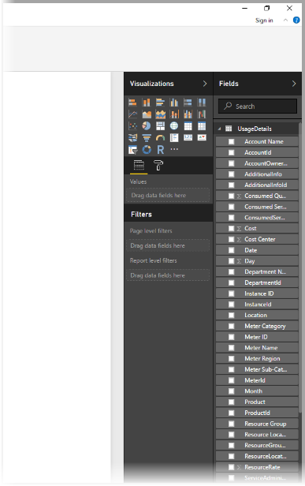
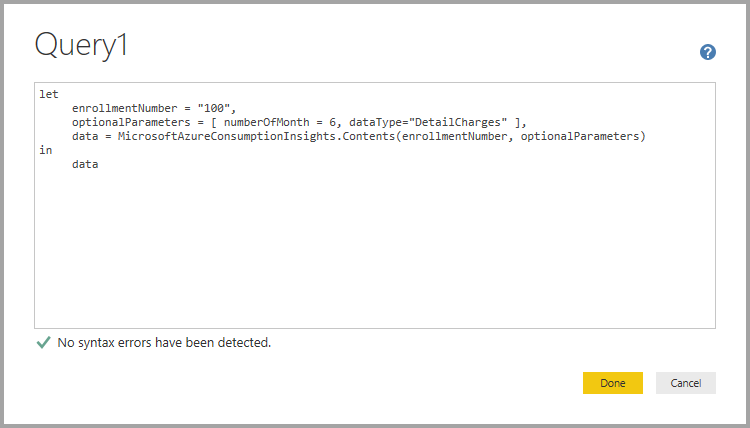

# Connect to Azure Consumption Insights in Power BI Desktop (Beta)
With the **Azure Consumption Insights** connector, you can use **Power BI Desktop** to connect to Azure and get in-depth data and information about your organization's Azure services usage. You can also create measures, custom columns, and visuals to report and share about your organization's Azure usage. This release of the **Azure Consumption and Insights** connector is in Beta, and is subject to change.

In this article you learn how to connect using the **Azure Consumption Insights** connector and get the data you need, how to migrate from using the Azure Enterprise Connector, and you'll find a mapping of *usage details columns* available in the **ACI** (Azure Consumption Insights) API.

## Connect to Azure Consumption Insights
To successfully connect using the **Azure Consumption Insights** connector, you need to have access to the Enterprise features within the Azure portal.

To connect to using the **Azure Consumption Insights** connector, select **Get Data** from the **Home** ribbon in **Power BI Desktop**. Select **Online Services** from the categories on the left, and you see **Microsoft Azure Consumption Insights (Beta)**. Select **Connect**.

In the dialog that appears, provide your *Enrollment Number*.

* You can get your enrollment number from the [Azure Enterprise Portal](https://ea.azure.com), in the location shown in the following image.
  
  
  
  This version of the connector only supports enterprise enrollments from https://ea.azure.com. China enrollments are not currently supported.

Next, provide your *Access key* to connect.

* Your Access key for enrollment can be found on the [Azure Enterprise Portal](https://ea.azure.com).
  
  

Once you provide your *Access key* and select **Connect**, a **Navigator** window appears and shows the four tables available to you: *Summary*, *Usage*, *PriceSheet*, and *MarketPlace*. You can select a checkbox beside any table to see a preview. You can select one or more tables by checking the box beside their name, then select **Load**.

> **Note:** The *Summary and *PriceSheet* tables are only available for the enrollment-level API Key. Also, the data in these tables has, by default, the current month's data for *Usage* and *PriceSheet*. The *Summary* and *MarketPlace* tables are not constrained to the current month.
> 
> 

When you select **Load** the data is loaded into **Power BI Desktop**.

Once the data you selected is loaded, the tables and fields you selected can be seen in the **Fields** pane.

## Using Azure Consumption Insights
To use the **Azure Consumption Insights** connector, you need to have access to the Enterprise features within the Azure portal.

Once you successfully load data using the **Azure Consumption Insights** connector, you can create your own custom measures and columns using **Query Editor**, and you can create visuals, reports, and dashboards that you can share in the **Power BI service**.

Azure also includes a collection of sample custom queries that you can retrieve using a blank query. To do so, in the **Home** ribbon of **Power BI Desktop**, select the drop down arrow in **Get Data** and then select **Blank Query**. You can also do this in **Query Editor** by right-clicking in the **Queries** pane along the left, and selecting **New Query > Blank Query** from the menu that appears.

In the **Formula bar** type the following:

    = MicrosoftAzureConsumptionInsights.Contents

A collection of samples appear, as shown in the following image.

When working with reports and creating queries, use the following:

* To define the number of months starting from the current date, use *noOfMonths*
  * Use a value between one and 36 to represent the number of months, from the current date, you want to import. We recommend getting no more than 12 months of data to avoid thresholds with import constraints and the volume of data allowed for queries in Power BI.
* To define a period of months in a historical time window, use *startBillingDataWindow* and *endBillingDataWindow*
* Do *not* use *noOfMonths* together with *startBillingDataWindow* or *endBillingDataWindow*

## Migrating from the Azure Enterprise Connector
Some customers created visuals using the *Azure Enterprise Connector (Beta)*, which will eventually be discontinued, and is being replaced by the **Azure Consumption Insights** connector. The **Azure Consumption Insights** connector has features and enhancements that include the following:

* Additional data sources available for *Balance Summary* and *Marketplace Purchases*
* New and advanced parameters, such as *startBillingDataWindow* and *endBillingDataWindow*
* Better performance and responsiveness

To help customers transition to the newer **Azure Consumption Insights** connector, and to preserve the work they've done in creating custom dashboards or reports, the following steps show how to move to the new connector.

### Step 1: Connect to Azure using the new connector
The first step is to connect using the **Azure Consumption Insights** connector, which was described earlier in this article in detail. In this step, select **Get Data > Blank Query** from the **Home** ribbon in **Power BI Desktop**.

### Step 2: Use the Advanced Editor to create a query
In **Query Editor**, select **Advanced Editor** from the **Query** section of the **Home** ribbon. In the **Advanced Editor** window that appears, enter the following query.

    let    
        enrollmentNumber = "100",
        optionalParameters = [ numberOfMonth = 6, dataType="DetailCharges" ],
        data = MicrosoftAzureConsumptionInsights.Contents(enrollmentNumber, optionalParameters)   
    in     
        data

Of course, you'll need to replace the value of *enrollmentNumber* with your own enrollment number, which you can get from the [Azure Enterprise Portal](https://ea.azure.com). The *numberOfMonth* parameter is how many months of data you want going back, from the current data. Use zero (0) for the current month.

Once you select **Done** in the **Advanced Editor** window, the preview refreshes and you'll see data from the secified month range in the table. Select **Close & Apply** and return.

### Step 3: Move measures and custom columns to the new report
Next you'll need to move any custom columns or measures you created into the new details table. Here are the steps.

1. Open Notepad (or another text editor).
2. Select the measure you want to move, and copy the text from the *Formula* field, and place it in Notepad.
   
   
3. Rename *Query1* to the original details table name.
4. Create new measures and custom columns in your table by right-clicking on your table, and choosing **New Measure**, then cut and paste your store measures and columns until they're all done.

### Step 4: Re-link tables that had relationships
Many dashboards have additional tables that are used for lookup or filtering, such date tables or tables used for custom projects. Reestablishing those relationships resolves most remaining issues. Here's how to do it.

1. In the **Modeling** tab in **Power BI Desktop**, select **Manage Relationships** to bring up a window that lets you manage relationships within the model. Re-link your tables, as needed.
   
    

### Step 5: Verify your visuals, and adjust field formatting as needed
Once you get this far, most of your original visuals, tables, and drill-downs should be working as expected. However, there may be some minor tweaks necessary for formatting, to get things looking just how you want them. Take a bit of time to look over each of your dashboards and visuals, to ensure they look how you want them.

## Using the Azure Consumption and Insights (ACI) API to get consumption data
Azure also provides the [**Azure Consumption and Insights (ACI) API**](https://azure.microsoft.com/blog/announcing-general-availability-of-consumption-and-charge-apis-for-enterprise-azure-customers/). You can create your own custom solutions to gathering, reporting, and visualizing Azure consumption information using the ACI API.

### Mapping names and usage details between the portal, the connector, and the API
The columns and names of details in the Azure Portal are similar in the API and the connector, but they're not always identical. To help clarify, the following table provides a mapping between the API, the connector, and columns you see in the Azure Portal. Also indicated is whether the column is obsolete. For more information and definitions of these terms, take a look at the [Azure billing data dictionary](https://docs.microsoft.com/azure/billing/billing-enterprise-api-usage-detail).

| ACI Connector / ContentPack ColumnName | ACI API Column Name | EA Column Name | Obsolete / Present for backward compatiblity |
| --- | --- | --- | --- |
| AccountName |accountName |Account Name |No |
| AccountId |accountId | |Yes |
| AcccountOwnerId |accountOwnerEmail |AccountOwnerId |No |
| AdditionalInfo |additionalInfo |AdditionalInfo |No |
| AdditionalInfold | | |Yes |
| Consumed Quantity |consumedQuantity |Consumed Quantity |No |
| Consumed Service |consumedService |Consumed Service |No |
| ConsumedServiceId |consumedServiceId | |Yes |
| Cost |cost |ExtendedCost |No |
| Cost Center |costCenter |Cost Center |No |
| Date |date |Date |No |
| Day | |Day |No |
| DepartmentName |departmentName |Department Name |No |
| DepartmentID |departmentId | |Yes |
| Instance ID | | |Yes |
| InstanceId |instanceId |Instance ID |No |
| Location | | |Yes |
| Meter Category |meterCategory |Meter Category |No |
| Meter ID | | |Yes |
| Meter Name |meterName |Meter Name |No |
| Meter Region |meterRegion |Meter Region |No |
| Meter Sub-Category |meterSubCategory |Meter Sub-Category |No |
| MeterId |meterId |Meter ID |No |
| Month | |Month |No |
| Product |product |Product |No |
| ProductId |productId | |Yes |
| Resource Group |resourceGroup |Resource Group |No |
| Resource Location |resourceLocation |Resource Location |No |
| ResourceGroupId | | |Yes |
| ResourceLocationId |resourceLocationId | |Yes |
| ResourceRate |resourceRate |ResourceRate |No |
| ServiceAdministratorId |serviceAdministratorId |ServiceAdministratorId |No |
| ServiceInfo1 |serviceInfo1 |ServiceInfo1 |No |
| ServiceInfo1Id | | |Yes |
| ServiceInfo2 |serviceInfo2 |ServiceInfo2 |No |
| ServiceInfo2Id | | |Yes |
| Store Service Identifier |storeServiceIdentifier |Store Service Identifier |No |
| StoreServiceIdentifierId | | |Yes |
| Subscription Name |subscriptionName |Subscription Name |No |
| Tags |tags |Tags |No |
| TagsId | | |Yes |
| Unit Of Measure |unitOfMeasure |Unit Of Measure |No |
| Year | |Year |No |
| SubscriptionId |subscriptionId |SubscriptionId |Yes |
| SubscriptionGuid |subscriptionGuid |SubscriptionGuid |No |

## More Information
There are all sorts of data you can connect to using Power BI Desktop. For more information on data sources, check out the following resources:

* [Getting Started with Power BI Desktop](desktop-getting-started.md)
* [Data Sources in Power BI Desktop](desktop-data-sources.md)
* [Shape and Combine Data with Power BI Desktop](powerbi-desktop-shape-and-combine-data.md)
* [Connect to Excel workbooks in Power BI Desktop](desktop-connect-excel.md)   
* [Enter data directly into Power BI Desktop](desktop-enter-data-directly-into-desktop.md)   

