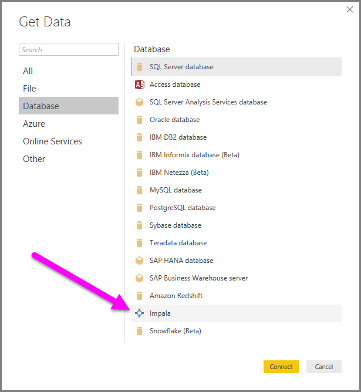
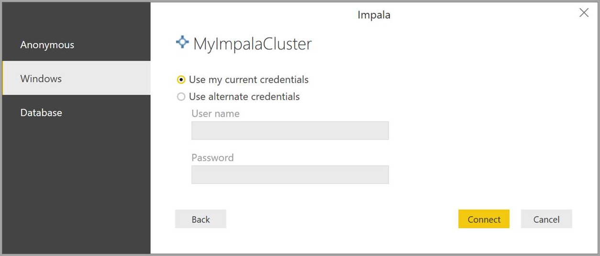
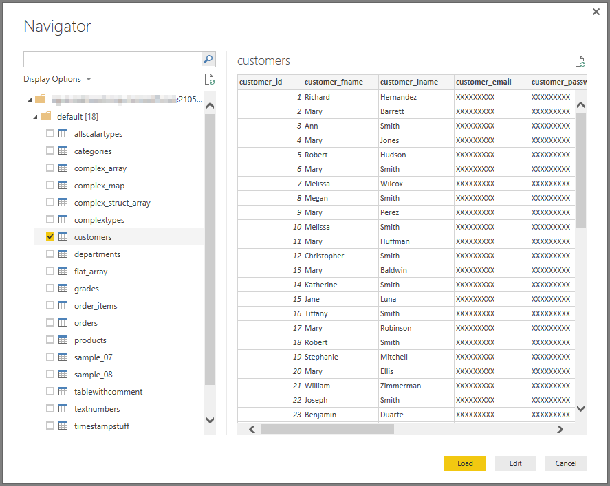

# Connect to an Impala database in Power BI Desktop
In Power BI Desktop, you can connect to an **Impala** database and use the underlying data just like any other data source in Power BI Desktop.

## Connect to an Impala database
To connect to an **Impala** database select **Get Data** from the **Home** ribbon in Power BI Desktop. Select **Database** from the categories on the left, and you see **Impala**.

In the **Impala** window that appears, type or paste the name of your Impala server into the box, and select **OK**. Note that you can choose to **Import** data directly into Power BI, or you can use **DirectQuery**. You can learn more about [using DirectQuery](desktop-use-directquery.md).

When prompted, put in your username and password, or connect anonymously - either is supported.

> **Note:** Once you put in your username and password for a particular **Impala** server, Power BI Desktop uses those same credentials in subsequent connection attempts. You can modify those credentials by going to **File > Options and settings > Data source settings**.
> 
> 

Once you successfully connect, a **Navigator** window appears and displays the data available on the server, from which you can select one or multiple elements to import and use in **Power BI Desktop**.

## Considerations and Limitations
There are a few limits and considerations to keep in mind with the **Impala** connector:

* Future plans include enabling refresh support using the **Power BI Gateway**.

## More Information
There are all sorts of data you can connect to using Power BI Desktop. For more information on data sources, check out the following resources:

* [Getting Started with Power BI Desktop](desktop-getting-started.md)
* [Data Sources in Power BI Desktop](desktop-data-sources.md)
* [Shape and Combine Data with Power BI Desktop](desktop-shape-and-combine-data.md)
* [Connect to Excel workbooks in Power BI Desktop](desktop-connect-excel.md)   
* [Enter data directly into Power BI Desktop](desktop-enter-data-directly-into-desktop.md)   

